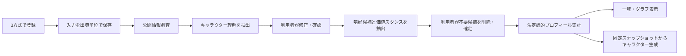

# 好きなキャラクター分析器 詳細資料

- 調査・確認日: 2026-08-30
- 対象commit: `3324f82c8e66c6ca12ecab6775f863c7f5c5e4f6`
- 対象システム: キャラ嗜好ラボ
- 調査方針: 設計上の予定ではなく、実装コード、実行時schema、DDL、画面、テストを現状の正本として確認

## この資料の結論

現行システムは、好きなキャラクター名から利用者の性格を診断するものではない。利用者が登録したキャラクターについて、次を分けて保存・確認・累積表示する、**個人内の探索的な嗜好整理ツール**である。

- キャラクターにどのような特徴があると理解したか
- その特徴のどこに惹かれる、または何を避けたいと感じるか
- 人物としての好感、同一化、共感、興味、憧れ、親近感、道徳的支持など、どの反応経路で惹かれるか
- 善悪・逸脱・改心などを、人物への好意や現実での支持とどう区別して捉えるか
- その判断が利用者入力、公開情報、モデル知識のどれに基づくか
- 複数登録にまたがって、どの傾向がどの程度繰り返されているか

プロダクトとしては、構成概念の分離、根拠追跡、人間による確認、同一キャラクター・同一作品の重複補正、現実人格を推測しない方針が優れている。一方、心理尺度としての妥当性・信頼性、LLM抽出精度、数値の統計的校正はまだ実証されていない。したがって、現時点で「心理診断」「科学的に証明された好み」「好みの確率」として扱うことはできない。

## 文書一覧

| 文書 | 内容 |
|---|---|
| [01_現状機能・実装詳細.md](01_現状機能・実装詳細.md) | 入力、調査、2段階LLM分析、確認、集計式、グラフ、生成、API、非同期処理、テスト、未実装境界 |
| [02_学術的評価・改善提案.md](02_学術的評価・改善提案.md) | 心理測定・メディア研究・AIラベリング・選好測定の観点からの評価と改善優先順位 |
| [03_語彙・反応経路一覧.md](03_語彙・反応経路一覧.md) | 現行Ontology v1.0の統制属性94件と反応経路44種類の全件一覧 |

関連する既存資料:

- [キャラクター嗜好の分析・解析手法に関する調査](../character-preference-analysis-research.md)
- [詳細設計書](../詳細設計/README.md)
- [実装アルファ監査](../実装アルファ/README.md)

## 現行データフロー

この流れでは、LLMがキャラクター理解と嗜好候補を作るが、累積プロフィールのスコア計算自体にはLLMを使わない。確認済みassertionを、固定された式 `profile/v1.1.0` で集計する。

## 確認した現行値

| 項目 | 現行値 |
|---|---:|
| 登録方式 | 3方式 |
| 統制属性 | 94件、14カテゴリ |
| 反応経路 | 44種類 |
| 価値orientation | 7種類 |
| 利用者stance | 6種類 |
| プロフィール計算版 | `profile/v1.1.0` |
| 単体・結合テスト | 15ファイル、102テスト成功 |
| グラフ標準上限 | 1,000ノード、5,000エッジ |
| 分析・生成Workflow再試行 | 同一step最大3 attempt |

テストは2026-08-30に `npm test -- --reporter=dot` を実行し、15ファイル・102テストの成功を確認した。これはソフトウェア契約の確認であり、心理測定上の妥当性や実LLMの分析精度を証明する試験ではない。

## 読み方

本資料では、次の語を区別する。

- **キャラクター理解**: キャラクターの設定、行動、役割、表現などについての候補
- **嗜好assertion**: 特定属性に、どの反応経路で、正・負・混合のどの反応を示したかという候補
- **価値スタンス**: 対象の価値傾向と、それを利用者が肯定・受容・無関心・両価的・拒否のどれで捉えるか
- **スコア**: 現行の独自集計式による根拠寄与の累積値。確率、偏差値、母集団推定値ではない
- **確信度**: 現行UIで使われる名称。実態はスコア、根拠追跡性、登録の多様性から作る独自指標であり、統計的に校正されたconfidenceではない
- **分析器**: LLM抽出だけでなく、確認、保存、集計、表示までを含むシステム全体

