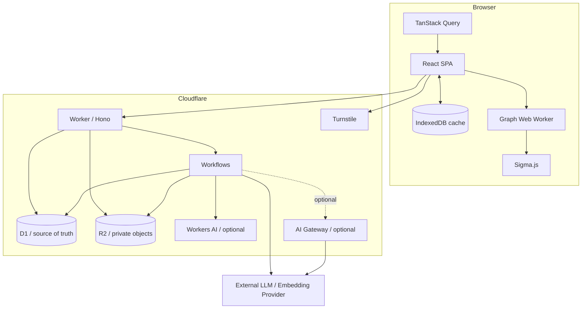
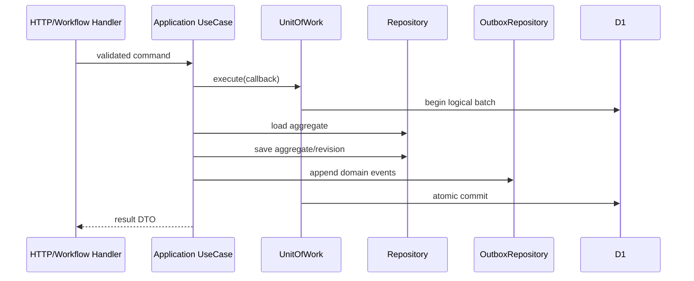

# DD-01 アーキテクチャ詳細設計

## 1. 実行構成



現行は1 Worker、1 D1、export用R2 bucket、Workflow classのモジュラーモノリスとする。非同期処理はWorkflowとD1のJob／Outboxで追跡する。

## 2. レイヤー

```text
Presentation
  React / Hono route / OpenAPI request mapper
        ↓
Application
  UseCase / Command / Query / Port / UnitOfWork boundary
        ↓
Domain
  Aggregate / Entity / ValueObject / DomainService / DomainEvent
        ↑
Infrastructure
  D1 / R2 / Workflow / LLM / Embedding / Turnstile adapters
```

依存規則:

- DomainはApplication、Presentation、Infrastructureをimportしない
- ApplicationはInfrastructure実装をimportせずPortだけを参照する
- PresentationはDB rowを直接responseにしない
- InfrastructureはDomain/ApplicationのPortを実装する
- モジュール跨ぎ更新はApplication UseCaseとUnitOfWorkを通す
- モジュール間の遅延実行はOutboxからDomain Eventを配送する

## 3. 論理モジュールと所有aggregate

| モジュール | 所有aggregate | 公開Port |
|---|---|---|
| IdentityAccess | User, Credential, Session | `IdentityAccessRepository`, `SessionService` |
| CharacterCatalog | Work, CharacterIdentity, CharacterRepresentation | `CharacterRepository` |
| SourceManagement | SourceDocument, SourceSet | `SourceRepository`, `ObjectStoragePort`, `EmbeddingPort` |
| CharacterEntry | UserCharacterEntry | `EntryRepository` |
| CharacterUnderstanding | CharacterUnderstandingSnapshot | `CharacterUnderstandingRepository`, `StructuredLlmPort` |
| PreferenceAnalysis | AnalysisRun, PreferenceAssertion | `PreferenceRepository` |
| AttributeOntology | AttributeSchemaVersion, AttributeDefinition | `AttributeRepository` |
| Profile | ProfileProjection, ProfileSnapshot | `ProfileRepository`, `ProfileCalculator` |
| GraphProjection | GraphProjectionSnapshot | `GraphProjectionRepository`, `GraphProjectionProviderPort` |
| Generation | GenerationRequest, GeneratedCharacter | `GenerationRepository`, `GenerationService` |
| Feedback | FeedbackEvent | `FeedbackRepository` |
| JobOrchestration | Job, OutboxEvent | `JobRepository`, `OutboxRepository` |
| DataManagement | ExportJob, DeletionJob | 上記PortをorchestrateするUseCase |

モジュールは他モジュールのRepository実装を直接参照しない。同期照会が必要な場合はQuery Port、状態変更はApplication UseCaseまたはDomain Eventを使う。

## 4. 推奨source構成

```text
src/
├─ app/
│  ├─ bootstrap.tsx
│  ├─ routes.tsx
│  └─ providers/
├─ features/
│  ├─ identity-access/
│  ├─ character-entry/
│  ├─ preference-profile/
│  ├─ graph/
│  ├─ generation/
│  └─ settings/
├─ shared/
│  ├─ api/
│  ├─ ui/
│  ├─ validation/
│  └─ types/
└─ workers/
   └─ graph.worker.ts

worker/
├─ entrypoints/
│  ├─ http.ts
│  ├─ queue.ts
│  └─ workflows.ts
├─ presentation/http/
├─ application/
│  ├─ commands/
│  ├─ queries/
│  ├─ ports/
│  └─ dto/
├─ domain/
│  ├─ identity-access/
│  ├─ character/
│  ├─ preference/
│  ├─ profile/
│  └─ generation/
├─ infrastructure/
│  ├─ d1/
│  ├─ r2/
│  ├─ vectorize/
│  ├─ llm/
│  ├─ turnstile/
│  └─ capacity/
└─ schemas/

contracts/
├─ openapi/
├─ json-schema/
└─ events/
```

上記は設計時の推奨構成であり、現行実装のHTTP境界は次の構成を使用する。

### 4.1 現行HTTP構成

| ファイル | 責務 |
|---|---|
| `worker/index.ts` | Workerのfetch・scheduled入口、Workflow classの公開 |
| `worker/app.ts` | Honoの組み立てとmiddleware順序、通常版／ダーク版のmount |
| `worker/routes/health.ts`、`auth.ts`、`account.ts` | ヘルスチェック、登録・認証、エクスポート・全削除 |
| `worker/routes/entries.ts` | ドメイン別の登録・再分析・レビュー・アーカイブ |
| `worker/routes/profile.ts`、`generation.ts`、`jobs.ts` | プロフィール・グラフ、生成、ジョブ照会・再試行 |
| `worker/http.ts` | Zod検証、応答envelope、冪等キー検証、commit後のOutbox配送 |
| `worker/middleware.ts`、`worker/error-handler.ts` | request ID・共通ヘッダー・body制限、エラー変換 |

ドメイン別ルートは`AnalysisDomain`を引数に取り、`shared/analysis-domain.ts`のprefixへmountする。入力スキーマは通常版／ダーク版ごとに選び、DataStore Strategyには認証済みownerとmount時のdomainを渡す。ダーク版のみのscope review、生成履歴URL、グラフ応答の差を維持する。

`worker/app.ts`はCloudflareのWorkflow classをimportしないため、VitestからHonoの実ルートと共通middlewareを検証できる。OpenAPIとの一致はファイルの正規表現走査ではなく、Honoの登録済みルートを使って確認する。

## 5. HTTP request pipeline

```text
Request ID
→ Security headers
→ Body size / content type
→ Session resolution and rolling renewal
→ Origin validation
→ CSRF validation for authenticated mutations
→ Rate limit
→ Turnstile for registration/login
→ OpenAPI/Zod validation
→ Authorization and ownership check
→ PlatformCapacityPolicy for controlled operations
→ Idempotency lookup
→ UseCase
→ Response mapping / idempotency persistence
→ Structured access log
```

- errorは中央middlewareでDD-00のenvelopeへ変換する
- session renewalとドメイン更新が同時に起き得るが、session renewal失敗だけでドメイン更新を再実行しない
- idempotency hitはUseCaseを再実行せず保存済み応答を返す

## 6. Command transaction



D1 Adapterはtransaction callbackの代わりに、実行するstatementをUnitOfWorkに蓄積し、D1 batchで原子的に確定する。自動採番値に依存せず、IDは事前生成する。

## 7. Query path

- Query Serviceは読取専用DTOを返し、aggregateの復元が不要な一覧ではprojection queryを使う
- 全個人データqueryは`owner_user_id = ?`または親エンティティ経由の所有者条件を必須とする
- 一覧はkeyset paginationとし、`OFFSET`は管理用の小規模query以外で使わない
- Profile、Graph、生成物は不変Snapshot IDを明示的に指定できるようにする

## 8. Cloudflare bindings

| Binding | 型 | 用途 |
|---|---|---|
| `DB` | D1Database | 正本RDB |
| `EXPORTS` | R2Bucket | private account export |
| `AI` | AiBinding | Workers AI Provider選択時のみ |
| `CHARACTER_ANALYSIS_WORKFLOW` | Workflow | 基本像・嗜好解析 |
| `GENERATION_WORKFLOW` | Workflow | キャラクター生成 |
| `PROFILE_REBUILD_WORKFLOW` | Workflow | Profile／Graph再構築 |
| `ACCOUNT_EXPORT_WORKFLOW` | Workflow | account export |

OpenAI Adapterは初期必須の実装対象とし、Worker secretの`OPENAI_API_KEY`を使う。Workers AI Adapterも選択可能な実装対象とし、ローカル手動開発の既定Providerとする。`AI` bindingは`LLM_PROVIDER=workers_ai`または`EMBEDDING_PROVIDER=workers_ai`の環境に追加する。AI GatewayはProviderではなく全live Provider共通の必須通信経路とする。OpenAIはProvider Native endpoint、Workers AIはGateway ID付き`AI` bindingで経由する。

Workers AIのAI modelはローカルにemulateされない。ローカル手動開発でもWorker/UI/D1/R2/Workflowはローカル実行し、`AI` bindingだけがCloudflare accountのWorkers AIへ接続するhybrid構成とする。WranglerのAI bindingに`remote: true`を明示し、productionと別のdevelopment用設定・利用量管理を使う。

## 9. 環境分離

| 環境 | データ | 外部LLM | Turnstile | 用途 |
|---|---|---|---|---|
| local-manual | local emulator / fixture | LLM/EmbeddingともWorkers AI既定。AI bindingだけremote | test key | ブラウザでの手動開発・確認 |
| local-test/CI | local emulator / fixture | `fake`または`replay` | test key | 自動テスト・回帰試験 |
| preview | productionと別resource | OpenAI sandbox/小quotaまたはWorkers AI | preview widget | migration・E2E |
| production | production resource | 固定評価とdata policyを通過したOpenAIまたはWorkers AI | production widget | 少人数検証 |

previewとproductionは同一accountのCloudflare無料枠を共有する。負荷試験は本番利用を圧迫しない上限をDD-14で設ける。

`local-manual`と`local-test/CI`はどちらも`ENVIRONMENT=local`とし、Provider、bindingのremote性、test runnerの有無を実行profileで分ける。

## 10. フロントエンド状態

- server state: TanStack Query
- 複数stepにまたがる登録draft: serverのUserCharacterEntry draft payloadを正本とし、ブラウザは未送信入力だけを一時保持。submit時にだけ不変EntryRevisionへ変換する
- form state: 画面内のReact stateまたはform library。特定libraryへドメイン型を依存させない
- GraphProjection cache: IndexedDB、任意、user IDとprojection versionでnamespace分離
- CSRF token: memoryのみ。localStorage、sessionStorage、IndexedDBへ保存しない
- access key: 登録・回転画面で一度表示するがApplication storageへ保存しない

## 11. パフォーマンス境界

- Worker内で資料全文をbufferしない
- JSON API bodyは1MiB以下、LLM構造化出力は512KiB以下とする
- 同期request内のD1 queryは原則8回以下、外部subrequestは5回以下を目標とする
- APIでの大規模集計を禁止し、ProfileProjectionを事前計算する
- Graphレイアウト・探索はWeb Workerで行う
- D1 query planで、小規模の固定master以外のfull scanをrelease gateで拒否する

## 12. 将来の物理分割条件

次のいずれかが成立するまで、モジュラーモノリスを維持する。

- 独立デプロイが必要な異なるSLAまたはsecurity boundaryが生じる
- 1モジュールの負荷が他モジュールを継続的に阻害する
- 個別のscalingでコストまたは可用性が有意に改善する
- 異なるチーム所有境界が必要になる

分割前にPort、event schema、trace ID、冪等性を安定させる。
