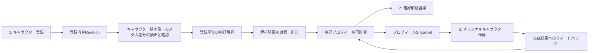
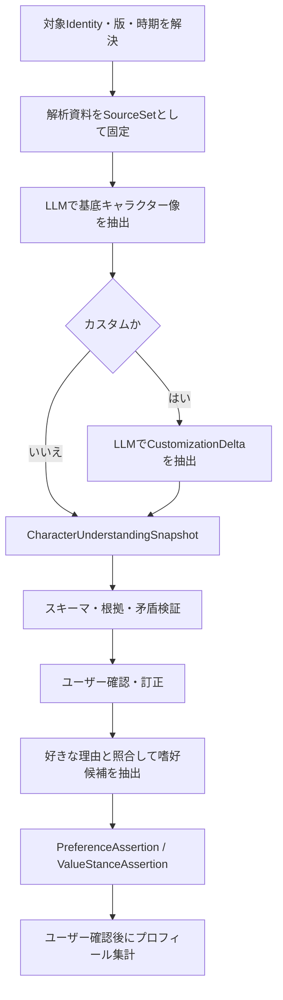
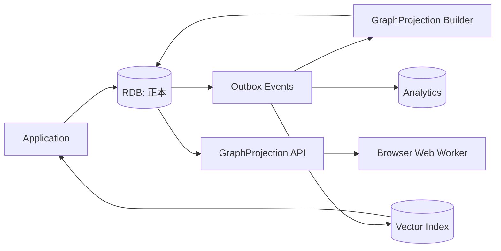
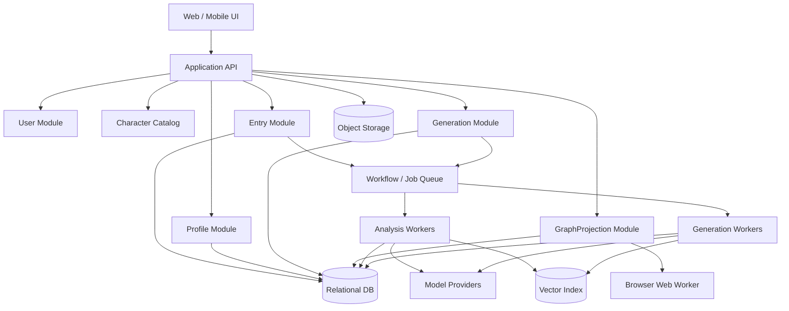

# キャラ嗜好ラボ 基本設計アルファ

- 文書種別: 基本設計（アルファ版）
- 作成日: 2026-08-29
- 対象範囲: キャラクター登録、嗜好解析結果表示、オリジナルキャラクター作成、およびそれらを支える機能・データストア
- 前提: 特定のフレームワークやクラウドサービスに限定しない、理想的な実行環境を想定する
- 初期配置方針: Cloudflare Workersと単一D1を利用する。ただし、正本RDBは将来ほかのRDBへ切替可能な境界を設ける
- 関連資料: [キャラクター嗜好の分析・解析手法に関する調査](../character-preference-analysis-research.md)

## 1. 設計概要

本システムは、次の3画面を中核とする。

1. キャラクター登録画面
2. 嗜好解析結果画面
3. オリジナルキャラクター作成画面

3画面は独立した機能に見えるが、内部では次の1本のデータパイプラインとして設計する。



設計上の原則は次のとおりとする。

- 登録原文を正本として残す
- 解析結果には必ず根拠を持たせる
- 解析結果をユーザーが訂正できる
- 累積プロフィールは再計算可能な派生データとする
- 生成時にはプロフィールをSnapshotとして固定する
- 生成しただけでは嗜好に反映せず、明示的な評価だけを反映する
- 既成、既成カスタム、オリジナルを同じ土台で扱う
- ヒーロー、ヴィラン、アンチヒーロー、脇役、端役を同じ第一級の分析対象として扱う
- フィクションに対する内面の自由を尊重し、悪、非道徳、規範からの逸脱、善への無関心などへの好意・肯定も、矯正や美化をせず記録できるようにする
- 物語上の役割、作中行為への評価、キャラクターへの好意、現実社会における価値判断を相互に自動推論しない
- RDBを証拠・履歴の正本とし、初期構成では嗜好グラフをユーザー単位の投影データとしてブラウザで処理する
- 正本RDBやグラフ処理方式を、ドメイン・ユースケースから分離したStrategy／Portとして交換可能にする

## 2. 画面全体の情報設計

メインナビゲーションは次の3項目とする。

```text
┌──────────────────────────────────────────────────────┐
│ キャラ嗜好ラボ                                        │
│                                                      │
│ [キャラクター登録] [嗜好プロフィール] [キャラクター作成] │
└──────────────────────────────────────────────────────┘
```

補助的に以下の導線を用意する。

- 登録履歴
- 解析待ち・失敗ジョブ
- プロフィール履歴
- 生成履歴
- データエクスポート・削除
- 設定・プライバシー

これらは独立した大画面にせず、各画面の履歴タブや設定メニューとして提供できる。

## 3. キャラクターを表すドメインモデル

### 3.1 CharacterIdentity

キャラクターが「誰であるか」を表す。

例:

- 作品AのキャラクターX
- ユーザーが作ったオリジナルキャラクターY

主な属性は以下とする。

| 項目 | 内容 |
|---|---|
| `id` | キャラクター本体ID |
| `origin_type` | `existing` / `original` |
| `name` | キャラクター名 |
| `work_id` | 所属作品。オリジナルでは任意 |
| `owner_user_id` | ユーザー所有のオリジナルの場合 |
| `catalog_status` | 確定、ユーザー登録、要確認など |
| `visibility` | 非公開、限定共有、公開 |
| `created_at` | 作成日時 |

二面性の片方、第5話時点、二次創作版などはCharacterIdentityへ直接入れず、CharacterRepresentationで表現する。

### 3.2 CharacterRepresentation

ユーザーが実際に好きだと言っている「キャラクター像」を表す中心的なエンティティとする。

同じキャラクターXであっても、以下は別の表現として扱う。

- 原作全体のキャラクターX
- アニメ版のキャラクターX
- 第5話の事件直後のキャラクターX
- 表向きの人格だけのキャラクターX
- 裏人格のキャラクターX
- 二次創作で教師になったキャラクターX
- ユーザー独自解釈のキャラクターX

主な属性は以下とする。

| 項目 | 内容 |
|---|---|
| `id` | 表現ID |
| `character_identity_id` | キャラクター本体 |
| `representation_type` | 表現種別 |
| `base_representation_id` | 派生元の表現 |
| `canonicality` | 公式、半公式、二次創作、ユーザー解釈 |
| `scope_type` | 全体、一側面、人格、場面、期間、別媒体、改変 |
| `scope_description` | 「第5話の対決直後」など |
| `transformation_summary` | 元から何が追加・変更されたか |
| `source_description` | 作品、エピソード、二次創作等の出典 |
| `owner_user_id` | 個人的解釈・二次創作・オリジナルの所有者 |
| `visibility` | 原則として非公開 |
| `content_version` | 内容の版 |

`representation_type` の候補は以下とする。

- `canonical_whole`: 公式キャラクター全体
- `media_adaptation`: アニメ版、映画版、ゲーム版など
- `facet`: 性格・人格・立場の一側面
- `scene_state`: 特定場面・時点
- `alternate_setting`: IF、別世界、役割変更
- `transformative`: 二次創作による改変
- `user_interpretation`: ユーザー独自解釈
- `original`: オリジナルキャラクター

追加要素のある既存キャラクターを新しい無関係なキャラクターとして扱わず、基底表現から派生した表現として管理する。

### 3.3 CharacterUnderstandingSnapshot

既成キャラクターおよび既成キャラクター（カスタム）について、嗜好解析より先にLLMが構築する「この解析時点でのキャラクター理解」を表す不変データとする。

単なるLLMの要約ではなく、次を含む根拠付きの構造化成果物とする。

- 対象となる作品、媒体、版、話数、時期
- 性格、価値観、欲求、目的、恐れ
- 能力、主体性、意思決定、代表的行為
- 道徳的方向性と、道徳への関心の有無
- 対人関係と相手ごとの態度
- 物語上の役割、陣営、物語機能
- 外見、声、口調、演技、演出
- 葛藤、二面性、変化
- 各主張の出典、根拠箇所、明示／解釈、信頼度
- 未確定事項、資料間の矛盾、情報不足

主な属性は以下とする。

| 項目 | 内容 |
|---|---|
| `id` | 理解Snapshot ID |
| `representation_id` | 対象のCharacterRepresentation |
| `base_snapshot_id` | カスタムの場合の基底Snapshot |
| `source_set_version_id` | 使用した資料集合の版 |
| `known_scope` | ユーザーが知っている話数・時期。ネタバレ範囲制御にも使う |
| `understanding_status` | 処理中、要確認、確認済み、資料不足、失敗 |
| `overall_confidence` | 全体信頼度 |
| `model_run_metadata_id` | モデル、プロンプト、抽出器の版 |
| `created_at` | 作成日時 |

Snapshot内の各 `CharacterAssertion` は次を保持する。

| 項目 | 内容 |
|---|---|
| `attribute_definition_id` | 性格、価値観、行動、関係性等の属性 |
| `value` | 構造化した属性値 |
| `scope` | 媒体、時期、人格、場面、相手、条件 |
| `assertion_kind` | 明示された設定、観察可能な行為、資料からの解釈、ユーザー解釈 |
| `source_fragment_id` | 根拠資料の該当箇所 |
| `source_authority` | 公式、半公式、二次資料、二次創作、ユーザー記述、モデル知識 |
| `confidence` | 個別主張の信頼度 |
| `conflicts_with` | 矛盾する別主張への参照 |
| `status` | 提案、確認、訂正、却下、未確定 |

嗜好解析は必ず特定の `CharacterUnderstandingSnapshot` を参照し、後からキャラクター理解が更新されても過去の解析根拠が変わらないようにする。

### 3.4 CustomizationDelta

既成キャラクター（カスタム）は、基底となる `CharacterUnderstandingSnapshot` と、カスタム表現との差分を `CustomizationDelta` として保持する。

差分操作は次を区別する。

- `INHERIT`: 基本像からそのまま継承する
- `ADD`: 基本像にない設定・性質を追加する
- `MODIFY`: 値や現れ方を変更する
- `REMOVE`: 基本像の要素を対象外にする
- `INVERT`: 基本像と逆方向へ反転する
- `NARROW_SCOPE`: 人格、時期、場面など一部だけに範囲を絞る
- `EMPHASIZE`: 性質自体は変えず、カスタム表現で強調する
- `UNSPECIFIED`: 継承するか判断できない

`facet` や `scene_state` は、必ずしも基本像の改変ではない。範囲を絞った結果として見える性質と、実際に追加・変更された性質を分ける。カスタム側でユーザーが明示した内容は、そのカスタム表現内ではLLMの推測より優先するが、基底キャラクターの基本像自体は書き換えない。

## 4. 画面1: キャラクター登録画面

### 4.1 目的

以下の3種類のキャラクターを登録し、「そのキャラクターの何を、どのように好きなのか」を解析する。

- 既成キャラクター
- 既成キャラクター（カスタム）
- オリジナルキャラクター

単なるキャラクター情報入力ではなく、次の2種類の情報を分けて入力する。

1. 対象キャラクターはどのような存在か
2. ユーザーはその何に惹かれているか

### 4.2 画面構成

```text
┌─────────────────────────────────────────────────────────┐
│ キャラクター登録                                         │
├─────────────────────────────────────────────────────────┤
│ [1.登録方法] ─ [2.対象・資料] ─ [3.キャラクター像]              │
│              ─ [4.好きな理由] ─ [5.嗜好解析]                  │
├─────────────────────────────────────────────────────────┤
│                                                         │
│ ○ 既成キャラクター                                       │
│ ○ 既成キャラクター（カスタム）                            │
│ ○ オリジナルキャラクター                                  │
│                                                         │
│                                       [下書き保存] [次へ] │
└─────────────────────────────────────────────────────────┘
```

5段階のウィザード形式とし、途中保存に対応する。第3段階では、嗜好を解析する前にLLMが抽出したキャラクター基本像またはカスタム差分を確認できるようにする。

### 4.3 既成キャラクター登録

#### 基本情報

```text
作品名             [検索・入力                             ]
キャラクター名      [検索・入力                             ]
媒体・版            [原作▼] [アニメ▼] [ゲーム▼] [実写▼]
知っている範囲      [第○話まで／全編／一部のみ              ]
親しみの程度        [初見 ───────── 長年のファン]
```

共有カタログに存在する場合は選択し、存在しない場合はユーザー登録データとして作成する。

解析資料として、システムが管理する出典付き資料の選択、ユーザーによる説明・引用・ファイル添付、参照範囲の指定を可能にする。LLMの学習済み知識だけを根拠に確定的な基本像を作らない。

補足として、次を入力できるようにする。

- どのようなキャラクターだと思うか
- 代表的な性格
- 印象的な関係性
- 重要な背景
- 解析に必要な補足

キャラクター名からシステムが一般知識を補う場合でも、ユーザーの認識と混同しない。

入力後、LLMが `CharacterUnderstandingSnapshot` の候補を構築する。ユーザーには、少なくとも主要な性格、価値観、目的、行動、関係性、物語上の役割、道徳的方向性、未確定事項を表示し、「おおむね正しい」「一部修正」「別の版・時期を選び直す」「資料を追加」を選べるようにする。

### 4.4 既成キャラクター（カスタム）登録

#### 基底キャラクター

```text
元の作品           [検索・入力]
元のキャラクター    [検索・入力]
元にする媒体・版    [選択]
```

#### カスタム種別

- 一側面だけ
- 別人格・二面性の片方
- 特定場面・特定時点
- 別媒体版
- IF・別世界設定
- 二次創作での改変
- ユーザー独自解釈
- その他

#### 対象範囲と差分

```text
このキャラクター像の名称
[例：第5話の事件直後のX                               ]

対象にする部分
[裏人格だけ／教師として振る舞う場面だけ、など             ]

元のキャラクターから保持する要素
[性格、口調、価値観、関係性など                           ]

追加・変更された要素
[職業、年齢、立場、性格、関係性など                       ]

対象外にする要素
[表人格、後半の展開、公式の恋愛関係など                   ]
```

出典・由来として、公式、半公式、二次創作、自作二次創作、ユーザー独自解釈を区別する。

二次創作の場合は、内容要約、作者、作品名、公開範囲などを任意で保存し、非公開を既定とする。

解析時には次を区別する。

- 元のキャラクター由来の魅力
- 派生で追加された魅力
- 特定場面だけに成立する魅力
- ユーザー解釈による魅力

LLMは最初に派生元の `CharacterUnderstandingSnapshot` を確定し、次にカスタム入力を基底像と比較して `CustomizationDelta` を抽出する。カスタム像は、基底像へ確認済み差分を適用して構築する。

確認画面では次のように並べて表示する。

```text
基本像                         カスタムでの扱い
────────────────────────────────────────────────
冷静で感情を表に出さない       継承
主人公とは敵対関係             対象外
目的のためには手段を選ばない   より強く強調
他者への密かな執着             特定人物への明示的な執着へ変更
教師という立場                 新規追加
```

各差分について、継承、追加、変更、削除、反転、範囲限定、強調、未指定をユーザーが訂正できるようにする。

同一人物の派生版を複数登録しても、累積集計では同じキャラクター系列として扱い、嗜好根拠を過剰に重複計上しない。

### 4.5 オリジナルキャラクター登録

#### キャラクターシート

- 名前・呼称
- 世界観・作品
- 年齢・外見
- 立場・役割
- 性格
- 価値観
- 欲求・目標
- 恐れ・弱点
- 能力・長所
- 欠点
- 矛盾・二面性
- 過去・転機
- 他者との関係
- 口調・話し方

#### 行動例

設定上の性格だけでなく、最低1つは行動例を入力できるようにする。

```text
代表的な選択・行動
[このキャラクターが困難な状況で何を選ぶか                ]

サンプル台詞
[                                                        ]

サンプル場面
[                                                        ]
```

設定と実際の行動が異なるキャラクターを扱えるように、両方を保存する。

### 4.6 3種類共通の「好きな理由」

#### 好きな対象

- 外見・デザイン
- 声・口調
- 性格
- 価値観
- 能力・有能さ
- 弱さ・脆さ
- 過去・境遇
- 行動・選択
- 他者との関係
- 成長・変化
- 二面性・矛盾
- 物語上の役割
- 悪・非道徳・規範からの逸脱
- 善悪に関与しない姿勢・善への無関心
- 敵役としての機能・物語にもたらす脅威
- 面白さ・予測不能さ
- その他

#### 自由記述

```text
特に好きな点
[                                                        ]

好きになった場面・きっかけ
[                                                        ]

印象的な行動・台詞
[                                                        ]

苦手・惜しいと感じる点
[                                                        ]

このキャラクターに求める関係
[友人／仲間／守りたい／尊敬／恋愛／観察したい／その他      ]
```

#### 「好き」の種類

任意で本人に選択してもらう。

- 人物として好き
- 見た目が好き
- 共感する
- 自分に似ている
- この人のようになりたい
- 尊敬する
- 守りたい
- 応援したい
- 友人のように親しく感じる
- 恋愛的に惹かれる
- 性的に惹かれる
- 道徳的には支持しないが面白い
- 悪や非道徳性そのものに惹かれる
- 善悪に縛られない姿勢が好き
- 善を選ばない、または善に関心を向けない姿勢が好き
- 禁忌・規範を越えるところが好き
- ヴィランとして応援したい、または勝ってほしい
- 改心・救済されず、そのままでいてほしい
- 理解・分析したい
- うまく説明できない

自己申告は解析結果より優先する。

#### 任意の価値スタンス入力

道徳的な弁明を入力の前提にせず、ユーザーが必要な場合だけ、好きな対象に対する価値スタンスを追加できるようにする。

- 作中行為には反対だが、キャラクターや表現は好き
- フィクション内では、その価値観や行為を肯定している
- 悪・非道徳・善への無関心そのものを好んでいる
- 善悪で評価すること自体に関心がない
- 肯定と拒否が混在している
- 判断していない、または説明したくない

この入力は任意とし、「好きだが行動には賛同しない」といった免責的な回答を強制しない。未回答を、否定、肯定、現実での支持のいずれにも推定しない。

### 4.7 確認・解析開始

確認画面では次を分けて表示する。

```text
登録対象
  作品A／キャラクターX／アニメ版／第5話時点

キャラクター説明
  冷静で有能だが、重要な感情を言葉にしない

好きな理由
  他者を助けても恩を着せないところ

苦手な理由
  本人の判断で相手を危険から遠ざけようとするところ
```

登録後、非同期解析を開始する。

状態は次のように管理する。

```text
draft
→ submitted
→ analyzing
→ needs_review
→ active
→ archived
```

### 4.8 解析結果の確認

解析完了後、同じ画面内または右側ドロワーで確認する。

```text
┌──────────────────────────────────────────┐
│ 解析された嗜好                            │
├──────────────────────────────────────────┤
│ ✓ 行動で示される優しさが好き              │
│   反応：人物としての好感                   │
│   根拠：「他者を助けても恩を着せない」       │
│                                          │
│ ? 高い自律性を好む可能性                   │
│   推測・信頼度：低                         │
│                                          │
│ ! 保護を理由に他者の意思を制限する行動は苦手 │
│   根拠：「本人の判断で相手を…」             │
│                                          │
│ [正しい] [条件付き] [修正] [却下]           │
└──────────────────────────────────────────┘
```

確認・訂正された嗜好主張のみ、高信頼データとしてプロフィールへ反映する。

### 4.9 支援機能

- 作品・キャラクター検索
- カタログにない作品・人物の仮登録
- 既成カスタムの派生元管理
- 下書き保存
- 入力Revision管理
- 添付ファイル管理
- 重複候補の提示
- 非同期解析
- 解析根拠の抽出
- 解析結果の確認・訂正
- 再解析
- 登録のアーカイブ・削除
- プロフィール再計算

## 5. 登録単位の解析設計

1件の登録から、いきなり「ユーザーは優しいキャラクターが好き」と結論づけない。先に対象キャラクターの理解を構築し、その後にユーザーの反応と嗜好を解析する。

### 5.1 LLM解析パイプライン

既成キャラクターと既成キャラクター（カスタム）は、次の順序を必須とする。



各工程の責務は次のとおりとする。

1. 対象解決
   - 同名キャラクター、媒体、リメイク、成長時期、人格、ユーザーの既読範囲を特定する。
2. 資料固定
   - 使用する出典と版を `SourceSetVersion` として固定する。
3. 基本像抽出
   - LLMが資料から根拠付き `CharacterAssertion` を抽出する。
4. カスタム差分抽出
   - カスタムの場合だけ、基底Snapshotとの継承・追加・変更・除外等を抽出する。
5. 検証
   - JSON Schema、属性辞書、根拠の存在、適用範囲、相互矛盾を機械的に検査する。
6. キャラクター像確認
   - ユーザーが基本像と差分を確認・訂正する。
7. 嗜好抽出
   - 確認済みのキャラクター理解と、ユーザーの好きな理由を照合して嗜好候補を作る。

原則として、利用可能な資料の優先順位は次のとおりとする。

1. ユーザーが今回明示した説明、範囲、訂正
2. 適法に利用できる公式・一次資料または出典付きの管理資料
3. 出典と適用範囲を確認できる二次資料
4. LLMの学習済み知識

LLMの学習済み知識だけに依存する結果は `provisional` とし、出典付きの確定情報と同じ信頼度にしない。資料が足りない場合は空欄や `unknown` を許容し、もっともらしい設定を補完しない。

`CharacterUnderstandingSnapshot` が `confirmed`、またはユーザーが資料不足を理解した上で `provisional_accepted` になるまで、累積プロフィールへ反映される嗜好解析を確定しない。

基本像は、ユーザーが好きな理由として挙げた箇所だけに絞らず、対象範囲内の人物像を広く抽出する。ただし、基本像に含まれる全属性を「ユーザーが好き」とはみなさない。嗜好への結び付きは次の証拠水準で区別する。

| 証拠水準 | 扱い |
|---|---|
| ユーザーが好きな理由として明示 | 強い嗜好根拠候補 |
| 解析候補をユーザーが確認 | 確認済み嗜好根拠 |
| 複数の好きなキャラクターで反復 | 累積的な推測候補 |
| 一人のキャラクターに存在するだけ | 未確認の関連候補。嗜好として確定しない |

これにより、「あるヴィランが好きだから、その人物の全行為や全属性を好きなはず」という過剰推論を防ぎながら、ユーザーがまだ言語化していない共通傾向も候補として提示できる。

### 5.2 キャラクター像

ユーザーの記述から、その人がキャラクターをどう認識しているかを抽出する。

- 外見・デザイン
- 声・口調
- 性格
- 温かさ・信頼性
- 有能さ・知性
- 主体性・行動力
- 支配性
- 脆弱性
- 価値観
- 道徳性
- 欲求・目標
- 葛藤・二面性
- 他者との関係
- 物語上の役割
- 成長・変化
- 面白さ・複雑性

これはキャラクターの真の性格ではなく、原則としてユーザーが認識しているキャラクター像とする。

物語上の役割、道徳的な方向性、具体的な行為、表現トーンは独立した軸にする。たとえば「敵対者だが倫理的には正しい」「主人公だが残酷」「悪を選ぶがコミカル」「善悪に無関心な端役」を表現できるものとし、`HERO` と `VILLAIN` を善悪の両端として扱わない。

### 5.3 ユーザーの反応

「好き」の種類を分けて解析する。

- 美的好感
- 人物としての好感
- 尊敬・称賛
- 共感
- 自己との類似
- 願望的同一化
- 物語中の同一化
- 友人のような親近感
- 守りたい・世話をしたい
- 恋愛的魅力
- 性的魅力
- 好奇心・観察欲求
- 物語上の面白さ
- 道徳的支持
- 悪・非道徳への価値的な肯定
- 道徳判断の留保・善悪への無関心
- 禁忌や危険を安全な物語内で味わう魅力
- 敵役としての成功・勝利を望む気持ち
- 改心や救済を望まず、現在のあり方を維持してほしい気持ち
- 応援・成功を望む気持ち
- 嫌悪を含む魅力

恋愛・性的項目は任意かつセンシティブ項目として分離する。

### 5.4 嗜好主張

キャラクター像とユーザー反応を組み合わせ、嗜好根拠を生成する。

```yaml
attribute: competence.strategic_thinking
polarity: positive
response_channel: admiration
condition: 感情的には不器用だが、危機では冷静に判断する
evidence: 普段は人付き合いが苦手なのに、戦闘では誰よりも周囲を見ているところが好き
explicitness: explicit
confidence: high
```

次を一つの数値へまとめない。

- 好きである
- 嫌いである
- 興味深い
- 自分に似ている
- なりたい
- 道徳的に支持する

また、`polarity: positive` は「その要素を好む」という嗜好方向だけを表し、その属性や行為が道徳的に善であることを意味しない。

### 5.5 根拠データ

`EvidenceFragment` に登録原文のどこを根拠にしたかを保存する。

| 項目 | 内容 |
|---|---|
| `entry_revision_id` | どの登録版か |
| `source_field` | 好きな点、苦手な点、サンプル場面など |
| `start_offset` / `end_offset` | 原文位置 |
| `quote` | 根拠テキスト |
| `context` | 場面、対象、条件 |
| `evidence_type` | 明示、間接、行動例 |

`PreferenceAssertion` は次を保持する。

| 項目 | 内容 |
|---|---|
| `attribute_definition_id` | 嗜好属性 |
| `polarity` | 好き、苦手、混合 |
| `response_channel` | 尊敬、共感、憧れ等 |
| `strength` | 強度 |
| `explicitness` | 明示／推測 |
| `confidence` | 解析上の信頼度 |
| `context_condition` | 条件 |
| `evidence_fragment_id` | 根拠 |
| `analysis_run_id` | 生成した解析 |
| `status` | 提案、確認、訂正、却下 |
| `superseded_by` | 後の訂正 |

一つの嗜好主張が複数の価値スタンスを持てるよう、`PreferenceAssertion` と `ValueStanceAssertion` は `preference_value_stance_links` による0対多の関係にする。

### 5.6 ユーザー訂正

解析結果には以下の操作を用意する。

- 正しい
- 少し違う
- 間違っている
- この条件のときだけ正しい
- 好きではなく、面白いだけ
- 自分に似ているが、なりたくはない
- この属性は好きだが、このキャラクターでの表現方法は苦手
- 悪以外の理由へ言い換えず、「悪であることが好き」として扱う
- 行為への賛否は判断していないので、勝手に補わない

### 5.7 内面の自由と非ヒーロー中心の嗜好

#### 基本方針

本システムは、フィクションに対するユーザーの内面の自由を尊重する。悪、非道徳、残酷さ、利己性、支配、破壊、規範からの逸脱、善への無関心、改心しないこと、ヴィランの勝利などを好き・肯定的と表明すること自体を、有効な嗜好データとして扱う。

次を禁止する。

- 「悪が好き」という明示を、知性、悲劇的過去、ユーモア、外見などの社会的に受け入れられやすい理由だけへ置換する
- 悪への好意を、未熟さ、病理、トラウマ、攻撃性、反社会性、現実の加害意図として自動解釈する
- ヴィランへの好意から、現実の行為への賛同を推定する
- 道徳的な但し書き、否認、罪悪感または改心願望をユーザーへ要求する
- 善性、共感性、救済可能性を、キャラクター価値の既定値または上位概念として重み付けする
- 脇役や端役について、情報不足を理由に主要人物より価値の低い嗜好データとして扱う

ただし、悪以外の魅力を併せて述べている場合は、それらも独立した根拠として保存する。「悪そのものが好き」と「知略も好き」は併存でき、一方でもう一方を上書きしない。

#### 価値スタンスの構造化

`ValueStanceAssertion` を、通常の `PreferenceAssertion` と関連付く第一級データとして保持する。

| 項目 | 内容 |
|---|---|
| `target_type` | 属性、価値観、具体的行為、物語上の役割、結末、表現のいずれへのスタンスか |
| `target_ref` | 対象となる属性・行為・表現等への参照 |
| `stance` | `affirm`、`accept`、`indifferent`、`ambivalent`、`reject`、`unspecified` |
| `orientation` | 悪志向、非道徳、善への無関心、規範逸脱、自己規範、善志向、混合等 |
| `scope` | 作品全体、特定表現、特定場面、フィクション内の価値観、想像上の自己同一化等 |
| `explicitness` | ユーザー明示か、解析上の候補か |
| `confidence` | 解析上の信頼度 |
| `evidence_fragment_id` | 根拠原文 |
| `status` | 提案、確認、訂正、却下 |

`stance: indifferent` は `reject` の弱い値ではなく、ユーザーが対象を道徳的に肯定も拒否もしていない独立した状態とする。また、キャラクター側の `orientation: 善への無関心` とは別項目であり、両者を混同しない。「善への無関心」「善の拒絶」「悪の積極的肯定」「規範に依存しない自己規範」も別概念として保持する。

現実社会への一般化は属性として自動付与しない。ユーザーが明示していない限り、値は `unspecified` のままにし、フィクション内の嗜好から現実の人格・信条・危険性を導出しない。

#### 非ヒーローの解釈

ヴィラン、アンチヒーロー、敵対者、脇役、端役については、少なくとも次を分離して抽出する。

- 物語上の役割と陣営
- 道徳的方向性と、道徳への関心の有無
- 具体的な行為・選択
- 外見、声、演技、演出
- 主体性、能力、欲望、執念
- 主人公や他者との関係
- 脅威、対比、笑い、世界観補強などの物語機能
- 登場の少なさ、説明されなさ、想像の余地
- 公式設定、ユーザー解釈、ファン解釈、二次創作設定の別

端役は証拠量が少ないため信頼度を調整するが、好意の強さは減点しない。「一場面だけの強い印象」や「設定されていない余白」も、明示された嗜好として保存する。

#### 解析結果の表現

解析結果は、ユーザーの語彙を可能な限り保ち、価値判断を勝手に穏当化しない。十分な根拠がある場合は、たとえば次のように表示する。

> あなたは、悪を別の目的のための手段としてではなく、悪を自ら選び取る姿勢そのものに魅力を感じています。

> この人物が善悪を判断基準にせず、善に関心を向けないこと自体を好む傾向があります。

表示には根拠、対象範囲、明示／推測、信頼度を併記する。一方、ユーザーが述べていない道徳的弁明や現実行動に関する注意書きを、個別分析結果へ機械的に付加しない。
- 解析に足りない説明を追加する

訂正は元データを書き換えず、`UserCorrectionEvent` として保存する。解析モデルを変更して再解析しても、ユーザー訂正を優先して再適用する。

## 6. 画面2: 嗜好解析結果画面

### 6.1 目的

これまでの登録・解析・訂正・フィードバックを統合して、現在のユーザー嗜好を説明可能な形で表示する。

単一の診断結果ではなく、次を表示する。

- 好む属性
- 苦手な属性
- 条件付き嗜好
- 好きになる心理的経路
- 嗜好の組み合わせ
- 根拠
- 信頼度
- データの偏り

### 6.2 画面構成

```text
┌──────────────────────────────────────────────────────────┐
│ あなたのキャラクター嗜好                                  │
│ 登録12件・8作品・最終更新 2026/08/29                       │
├──────────────────────────────────────────────────────────┤
│ [概要] [属性詳細] [嗜好グラフ] [キャラクター別] [履歴・根拠] │
├──────────────────────────────────────────────────────────┤
│ 安定して好む傾向                                          │
│ 1. 行動で示される優しさ              信頼度 █████░         │
│ 2. 危機で発揮される高い判断能力       信頼度 ████░░         │
│ 3. 内面的な矛盾・二面性               信頼度 ████░░         │
│                                                          │
│ 条件付き嗜好                                              │
│ ・冷酷さは「守る目的」が明確な場合に好む                    │
│                                                          │
│ 苦手な傾向                                                │
│ ・他者の意思を無視する保護行動                             │
└──────────────────────────────────────────────────────────┘
```

### 6.3 概要タブ

属性ごとに次を表示する。

- 属性名
- 説明
- 好意スコア
- 苦手スコア
- 信頼度
- 独立キャラクター数
- 独立作品数
- 明示根拠数
- 推測根拠数
- 反例数

好きと苦手を相殺せず、別々の値として表示する。

```text
行動で示される優しさ

好む     █████████░  0.86
苦手     █░░░░░░░░░  0.08
信頼度   高
根拠     5キャラクター／4作品
```

好きになる経路は、人物としての好感、尊敬・称賛、願望的同一化、共感、守りたい、好奇心・面白さなどに分けて表示する。

条件付き嗜好は、属性の好きな条件と苦手な条件を分けて表示する。

単独属性だけでなく、次のような複合パターンを表示する。

```text
高い有能さ
＋ 感情表現の不器用さ
＋ 特定人物への献身
− 他者の自律性を奪う行動
```

価値スタンスが確認されている場合は、属性の道徳的なラベルとは別に表示する。

```text
対象：悪を自ら選び取る姿勢
好意：強い
価値スタンス：フィクション内で肯定
好きになる経路：人物としての好感／応援
現実社会への一般化：未指定
```

### 6.4 属性詳細タブ

カテゴリは以下とする。

- 外見・デザイン
- 声・口調
- 性格
- 価値観・道徳
- 能力・有能さ
- 弱さ・脆弱性
- 二面性・複雑性
- 関係性
- 物語上の役割
- 成長・変化
- 好きになる経路

フィルターは以下を用意する。

- 好き／苦手／混合
- 明示／推測
- 確認済み／未確認
- 信頼度
- 作品
- キャラクター
- 登録種別
- 時期
- 反応経路

### 6.5 嗜好グラフタブ

Cloudflare側の正本データから生成したユーザー専用 `GraphProjection` を取得し、ブラウザ上のWeb Workerでグラフを構築・探索・レイアウトする。初期構成では専用グラフDBを使用しない。

```text
                    ┌→ 高い判断能力
ユーザー → 尊敬 ───┤
                    └→ 危機での冷静さ

ユーザー → 好感 ───→ 行動で示す優しさ
                         └→ 感情表現の不器用さ

ユーザー → 苦手 ───→ 他者の自律性を奪う
```

表示対象を属性だけ、反応経路込み、キャラクター込み、根拠込み、生成キャラクターとの関係込みから選べるようにする。初期表示は上位属性のみに限定する。

ブラウザ側では、隣接ノード展開、経路表示、条件フィルター、局所クラスタリング、表示レイアウトを実行する。累積嗜好スコア、信頼度、アクセス権、生成に使うプロフィールはサーバー側で確定し、ブラウザ計算結果を正本として扱わない。

### 6.6 キャラクター別タブ

登録キャラクターを、共感型、憧憬・尊敬型、守りたい型、好奇心・観察型など、嗜好上の役割で整理する。同じキャラクターが複数に属してもよい。

既成カスタムの場合は、派生元との違いも表示する。

### 6.7 履歴・根拠タブ

属性を選択すると、導出経路を確認できるようにする。

```text
属性：行動で示される優しさ

プロフィールSnapshot
  ↓
確認済みPreferenceAssertion 5件
  ↓
キャラクターA
  「何も言わずに帰り道を確保していたところが好き」

キャラクターB
  「相手が気づかない形で助けるところ」
```

可能な操作は以下とする。

- 根拠を確認
- 解析を修正
- 条件を追加
- プロフィールから除外
- 再解析
- 以前のプロフィールと比較
- Snapshotを作成

### 6.8 データ品質表示

プロフィールにはデータ範囲と限界を表示する。

```text
データ範囲

登録キャラクター       12
独立作品                8
既成                     7
既成カスタム             3
オリジナル               2

偏り
・男性キャラクターが多い
・戦闘作品が多い
・外見に関する記述が少ない
・恋愛的魅力は未回答
```

「データがない」と「嫌い」を区別する。

### 6.9 支援機能

- プロフィール集計
- 属性階層の展開
- 嗜好グラフ探索
- 条件付き嗜好の表示
- 反例・矛盾の検出
- キャラクタークラスタリング
- 根拠ドリルダウン
- 訂正の再適用
- プロフィール履歴
- Snapshot作成
- データ偏り・カバレッジ計算
- CSV／JSON／文書エクスポート

## 7. 累積嗜好プロフィール

プロフィールは固定された診断結果ではなく、根拠から計算される「現在の射影」とする。

### 7.1 表示内容

#### 安定して好む傾向

複数の独立したキャラクターから繰り返し確認された属性を表示する。

#### 苦手な傾向

好きの反対ではなく独立して持たせる。同じ「強い支配性」でも、有能さとしては好きだが他者を軽視する態度は苦手、という両立を許容する。

#### 条件付き嗜好

例:

- 冷酷さは、守る対象や合理的理由がある場合に限り好き
- 天然さは、有能さと両立している場合に好き
- 執着は、相手の自律性を侵害しない範囲なら好き

これらは例示であり、善性や他者配慮を条件として強制しない。次のような無条件または別種の条件も同等に表現できるものとする。

- 悪であること自体を好む
- 善悪に関心を示さず自己目的を遂行する人物を好む
- 改心や罰を受けず、ヴィランとして目的を達成する展開を好む
- 残酷さは、悲劇的理由や正当化がない場合にも好む

#### 魅力を感じる経路

- 自分と似ている
- 理想の自分に近い
- 自分にないものを補完する
- 守りたい
- 尊敬したい
- 理解・分析したい
- 恋愛対象として惹かれる
- 物語上面白い

#### 嗜好の緊張・矛盾

矛盾をエラー扱いせず、異なる反応経路や条件の違いとして分析する。

### 7.2 集計原則

- ユーザーが明示した嗜好を最優先する
- 推測された嗜好は弱く扱う
- ユーザー訂正は解析結果より優先する
- 同じ登録内の言い換えを重複計上しない
- 同じキャラクターの派生版を過剰計上しない
- 同一作品からの大量登録による偏りを抑える
- 好きと苦手を相殺せず、別々に保持する
- 文脈付きの嗜好を無条件の嗜好に変換しない
- 無条件に明示された悪・非道徳への嗜好へ、救済、悲劇的理由、善性などの条件を勝手に追加しない
- 属性の道徳的望ましさを、嗜好スコアや信頼度の重みとして使用しない
- キャラクター数だけでなく、作品・系統の独立性を見る
- 時間変化を残す

### 7.3 ProfileProjectionとProfileSnapshot

`ProfileProjection` は現在の最新プロフィールであり、登録・訂正のたびに再計算できるものとする。

`ProfileSnapshot` はオリジナルキャラクター生成などに利用した時点の、不変なプロフィールとする。

これにより、どの時点のどの嗜好プロフィールからキャラクターを生成したかを追跡できる。

## 8. 画面3: オリジナルキャラクター作成画面

### 8.1 目的

累積プロフィールをそのままコピーするのではなく、次をユーザーが調整してオリジナルキャラクターを作成する。

- 今回採用する嗜好
- 今回使わない嗜好
- 避ける要素
- 世界観・役割
- 忠実度と探索性

### 8.2 画面構成

```text
┌──────────────────────────────────────────────────────────┐
│ オリジナルキャラクター作成                                │
├──────────────────────────────────────────────────────────┤
│ [1.作成方針] ─ [2.嗜好選択] ─ [3.条件設定] ─ [4.生成・調整] │
├──────────────────────────────────────────────────────────┤
│                                                          │
│ 生成モード                                                │
│ ○ 忠実  ○ バランス  ○ 探索                               │
│                                                          │
│ 使用プロフィール：2026/08/29 Snapshot                      │
│                                                          │
│                                       [下書き保存] [次へ] │
└──────────────────────────────────────────────────────────┘
```

### 8.3 作成方針

生成モードは以下とする。

- 忠実: 高信頼の嗜好を中心に構成する
- バランス: 中核嗜好と補助嗜好を組み合わせる
- 探索: 未確認要素や意外な組み合わせも入れる

キャラクターの用途は、主人公、仲間、ライバル、敵、ヴィラン、アンチヒーロー、脇役、端役、恋愛対象、保護者・師匠、相棒、観察対象、その他から選択できるようにする。役割の選択によって、善性、改心、敗北などを自動的に付与しない。

### 8.4 嗜好選択

プロフィール上の属性を今回どう使うか指定する。

```text
属性                         今回の扱い
────────────────────────────────────────
行動で示す優しさ             [必須▼]
高い判断能力                 [必須▼]
感情表現の不器用さ           [採用▼]
特定人物への献身             [採用▼]
低い自己評価                 [使わない▼]
予測不能さ                   [探索▼]
他者の自律性を奪う           [禁止▼]
```

選択肢は次とする。

- 必須
- 採用
- 弱く採用
- 探索
- 使わない
- 禁止

嗜好属性だけでなく、今回は尊敬できる人物を重視する、守りたい人物を重視する、恋愛的魅力は使わない、などの反応経路も選択できるようにする。

### 8.5 条件設定

#### 世界観・基本条件

- ジャンル
- 時代・舞台
- 年齢
- 性別・ジェンダー
- 種族
- 職業・立場
- 物語上の役割
- 外見方向
- 能力
- 他者との関係
- 成人向け・暴力表現の範囲

#### 差別化条件

- 特に似せたくない登録キャラクター
- 避けたい外見
- 避けたい設定
- 避けたい口調
- 既存作品との類似許容度
- 王道／変化球

#### 価値観・物語上の扱い

悪・非道徳・善への無関心を採用する場合、必要に応じて次を指定できるようにする。

- 道徳的方向性: 善志向、悪志向、非道徳、善悪への無関心、自己規範、混合
- 悪や逸脱の強度と、具体的に含める／含めない行為
- 行為や価値観を物語内で肯定的、中立的、批判的のどれに描くか
- 悲劇的過去や正当化理由を付けるか、付けないか
- 隠れた善性を持たせるか、持たせないか
- 改心・救済・贖罪を行うか、行わないか
- 勝利、敗北、未決着のどれを望むか
- 道徳的教訓を物語に持たせるか、持たせないか

未指定の場合、生成モデルが「好ましい人物にするため」という理由で、善性、悲しい事情、改心、処罰、コミカルな弱体化を自動追加しない。プロフィールの確認済みスタンスと作成目的から判断し、判断できない場合だけ生成案を複数提示する。

### 8.6 GenerationBrief

生成前に、人間が読める中間仕様を表示する。

```text
中核として採用
・行動で示す不器用な優しさ
・危機で発揮される高い判断能力

補助的に採用
・特定人物への献身
・重要な感情だけを隠す

探索
・普段は社交的だが、重要な場面だけ寡黙になる

避ける
・他者の意思を無視する保護行動
・登録済みキャラクターの外見や設定の直接的模倣
```

悪・非道徳を中核にする場合は、次のような生成上の非要件も明記する。

```text
中核として採用
・善悪に関心を向けず、自分の美学だけで行動する
・目的達成のための非道徳的手段をためらわない

自動追加しない
・行為を正当化する悲劇的過去
・実は優しいという反転
・改心、贖罪、道徳的な敗北
```

ユーザーは生成前に修正できるものとする。

### 8.7 生成結果

```text
┌──────────────────────────────────────────────────────────┐
│ 生成キャラクター：リオナ                                  │
├──────────────────────────────────────────────────────────┤
│ 核となる人物像                                            │
│ 普段は交渉役として社交的に振る舞うが、最も大切な相手には… │
│                                                          │
│ [外見] [性格] [価値観] [過去] [関係性] [口調] [物語案]      │
│                                                          │
│ 嗜好との対応                                              │
│ ・行動で示す優しさ ← 高信頼嗜好                           │
│ ・高い判断能力     ← 4キャラクターから確認                 │
│ ・社交性           ← 探索要素                              │
│                                                          │
│ [採用] [部分修正] [別案] [作り直す]                        │
└──────────────────────────────────────────────────────────┘
```

生成結果は次の構造で保存する。

- 名前・呼称
- 核となる人物像
- 外見
- 性格
- 価値観
- 道徳的方向性・道徳への関心
- 欲求・目標
- 恐れ
- 長所・能力
- 欠点
- 矛盾・二面性
- 過去
- 関係性
- 話し方
- 物語上の役割
- 成長可能性
- 改心・救済・贖罪を必須とするか否か
- 代表的な選択
- サンプル台詞
- サンプル場面
- 嗜好との対応
- 探索的に追加した要素
- 類似性・独自性の検査結果

### 8.8 部分修正

全体再生成だけでなく、次の部分修正を可能にする。

- 外見だけ変更
- 性格だけ調整
- 欠点を強める
- 有能すぎるので弱める
- 関係性を変更
- 口調を変更
- 過去を再生成
- 特定の嗜好属性を追加・削除
- 探索要素だけ差し替える

各修正は `GeneratedCharacterRevision` として保存する。

### 8.9 フィードバック

```text
総合評価                  [1 2 3 4 5]
外見                      [1 2 3 4 5]
性格                      [1 2 3 4 5]
関係性                    [1 2 3 4 5]
口調                      [1 2 3 4 5]

特に好きな要素
[                                                        ]

苦手・修正したい要素
[                                                        ]

プロフィールへ反映する
□ この評価を今後の嗜好解析に利用する
```

生成しただけではプロフィールに反映しない。ユーザーがプロフィールへの反映を選び、具体的に評価した属性だけを新しい嗜好根拠候補にする。

### 8.10 支援機能

- プロフィールSnapshot作成
- 使用嗜好の選択
- 生成制約管理
- GenerationBrief作成
- 構造化キャラクター生成
- 生成結果のスキーマ検証
- 登録済みキャラクターとの類似度検査
- 部分再生成
- Revision管理
- 生成根拠の表示
- フィードバック
- フィードバックのプロフィール反映確認
- キャラクターのエクスポート

## 9. データストア全体設計

### 9.1 RDB: 正本

RDBには、原文、Revision、解析履歴、訂正、プロフィールSnapshot、生成履歴を保存する。

初期実装では一つのCloudflare D1を使用してよい。ただし、D1をドメイン層やユースケース層から直接参照せず、Ports and Adapters、Repository、Unit of Work、Strategyを組み合わせて永続化方式を交換可能にする。

#### RDB交換境界

アプリケーション層から参照する主なPortは次とする。

```text
RelationalStoreStrategy
├─ UnitOfWork
├─ CharacterRepository
├─ EntryRepository
├─ CharacterUnderstandingRepository
├─ PreferenceRepository
├─ ProfileRepository
├─ GenerationRepository
├─ JobRepository
└─ OutboxRepository
```

初期・将来のAdapterは次を想定する。

```text
RelationalStoreStrategy
├─ D1RelationalStoreStrategy          # 初期
└─ PostgreSqlRelationalStoreStrategy  # 将来候補
```

Strategyはデプロイ設定で一つを選択し、リクエストごとまたはユーザーごとに無秩序に切り替えない。移行期間に二重書きが必要な場合は、通常Strategyとは別の移行専用Adapterと照合ジョブを用意する。

交換可能性を維持するため、次を必須とする。

- ドメインモデルへ `D1Database`、D1結果型、SQLiteの `rowid`、D1 binding名を露出しない
- SQL、プレースホルダー、UPSERT構文、ページング差異をAdapter内へ閉じ込める
- アプリケーション側でUUID等の安定IDを発行し、DB固有の自動採番へ依存しない
- トランザクション境界を `UnitOfWork` で表し、D1のbatchとPostgreSQL transactionを各Adapterで実装する
- 本体更新とOutbox追加を同じRDBトランザクション境界に含める
- JSON保存形式にはスキーマバージョンを持たせ、DB移行時に再解釈できるようにする
- D1用とPostgreSQL用のmigrationを分離する
- Repository契約テストを作り、すべてのAdapterへ同じテストケースを適用する
- DB固有の性能最適化は許容するが、得られるドメイン上の結果と整合性規則は同一にする

単一D1の容量や性能は当面の許容事項とし、基本設計段階ではシャーディングを要求しない。切替判断に必要なDB容量、クエリ時間、書込待ち、失敗率は運用メトリクスとして取得する。

#### ユーザー

```text
users
user_settings
consents
```

#### 作品・キャラクター

```text
works
work_versions
character_identities
character_representations
representation_relations
```

#### キャラクター解析資料

```text
source_documents
source_document_revisions
source_fragments
source_sets
source_set_versions
source_set_items
```

#### 登録

```text
user_character_entries
entry_revisions
entry_assets
```

#### 解析

```text
character_understanding_runs
character_understanding_snapshots
analysis_runs
evidence_fragments
character_assertions
customization_deltas
understanding_reviews
preference_assertions
value_stance_assertions
preference_value_stance_links
assertion_reviews
user_correction_events
```

#### 属性辞書

```text
attribute_definitions
attribute_relations
attribute_schema_versions
```

#### プロフィール

```text
profile_projections
profile_dimensions
profile_patterns
profile_snapshots
profile_snapshot_items
graph_projection_snapshots
graph_projection_nodes
graph_projection_edges
```

`graph_projection_snapshots` には版・対象ProfileSnapshot・生成状態等のメタデータを保存し、ノードとエッジは別表へ正規化する。大きな直列化Projectionをキャッシュする場合はRDBの単一行へ詰め込まず、オブジェクトストレージへ保存してRDBから参照する。

#### 生成

```text
generation_requests
generation_request_preferences
generation_briefs
generated_characters
generated_character_revisions
generation_basis_links
similarity_check_results
```

#### フィードバック・処理管理

```text
feedback_events
feedback_attribute_ratings
jobs
job_attempts
outbox_events
audit_events
model_run_metadata
```

### 9.2 嗜好知識グラフ: ブラウザ処理を既定とする

分析データの正本はCloudflare上のRDBに保持する。APIは認証済みユーザーが閲覧可能なデータだけをRDBから読み、ユーザー単位の `GraphProjection` に変換して返す。ブラウザは受け取ったノードとエッジをWeb Workerへ渡し、探索・クラスタリング・レイアウトを行う。

専用グラフDBへの複製は初期構成に含めない。論理的なノード・エッジモデルは維持し、将来サーバー側グラフDBへ移行してもAPIと画面を変えずに済むようにする。

#### 主なノード

- User
- Work
- CharacterIdentity
- CharacterRepresentation
- CharacterUnderstandingSnapshot
- CharacterAssertion
- CustomizationDelta
- SourceFragment
- Entry
- AnalysisRun
- EvidenceFragment
- PreferenceAssertion
- ValueStanceAssertion
- Attribute
- ResponseChannel
- Context
- ProfileSnapshot
- GeneratedCharacter

#### 主なエッジ

```text
(User)-[:REGISTERED]->(Entry)
(Entry)-[:TARGETS]->(CharacterRepresentation)
(CharacterRepresentation)-[:INSTANCE_OF]->(CharacterIdentity)
(CharacterRepresentation)-[:DERIVED_FROM]->(CharacterRepresentation)
(CharacterRepresentation)-[:HAS_UNDERSTANDING]->(CharacterUnderstandingSnapshot)
(CharacterUnderstandingSnapshot)-[:CONTAINS]->(CharacterAssertion)
(CharacterUnderstandingSnapshot)-[:BASED_ON]->(SourceFragment)
(CharacterAssertion)-[:SUPPORTED_BY]->(SourceFragment)
(CharacterUnderstandingSnapshot)-[:HAS_DELTA]->(CustomizationDelta)
(CustomizationDelta)-[:FROM_BASE]->(CharacterUnderstandingSnapshot)

(AnalysisRun)-[:PRODUCED]->(PreferenceAssertion)
(AnalysisRun)-[:USED_UNDERSTANDING]->(CharacterUnderstandingSnapshot)
(PreferenceAssertion)-[:SUPPORTED_BY]->(EvidenceFragment)
(PreferenceAssertion)-[:ABOUT]->(Attribute)
(PreferenceAssertion)-[:THROUGH]->(ResponseChannel)
(PreferenceAssertion)-[:CONDITIONED_BY]->(Context)
(PreferenceAssertion)-[:HAS_VALUE_STANCE]->(ValueStanceAssertion)
(ValueStanceAssertion)-[:ABOUT]->(Attribute)
(ValueStanceAssertion)-[:SCOPED_TO]->(Context)

(Attribute)-[:IS_A]->(Attribute)
(Attribute)-[:RELATED_TO]->(Attribute)
(Attribute)-[:OPPOSES]->(Attribute)

(ProfileSnapshot)-[:INCLUDES]->(Attribute)
(ProfileSnapshot)-[:SUPPORTED_BY]->(PreferenceAssertion)

(GeneratedCharacter)-[:BASED_ON]->(ProfileSnapshot)
(GeneratedCharacter)-[:REALIZES]->(Attribute)
```

#### GraphProjectionデータ契約

```yaml
projectionVersion: string
profileSnapshotId: string
generatedAt: datetime
scope: user_profile
nodes:
  - id: string
    type: Attribute | Character | ResponseChannel | Context | Evidence | GeneratedCharacter
    label: string
    weight: number | null
    confidence: number | null
    flags: string[]
edges:
  - id: string
    from: string
    to: string
    type: string
    weight: number | null
    evidenceCount: number
nextCursor: string | null
```

原文やセンシティブな詳細は初期Projectionへ含めず、ユーザーが根拠を開いたときだけ権限確認済みAPIから取得する。Projectionには `profileSnapshotId` と `projectionVersion` を持たせ、プロフィール更新前後のデータを混ぜない。

#### ブラウザ側の責務

- ノード・エッジのインメモリインデックス構築
- 隣接ノード、指定深度の探索、最短経路などの対話的処理
- 属性種別、反応経路、信頼度、作品等によるフィルター
- 小規模なコミュニティ検出・クラスタリング
- 力学レイアウト、階層レイアウト等の表示座標計算
- CanvasまたはWebGLによる描画

グラフ計算とレイアウトはUIメインスレッドではなくWeb Workerで行う。データが大きい場合は、上位ノードだけの初期Projection、カーソルページング、隣接ノードの遅延取得、詳細度切替を使い、全グラフを一度にブラウザへ送らない。

IndexedDBへのキャッシュは任意とし、既定では原文を保存しない。ログアウト、アカウント削除、Projection失効時にユーザー単位キャッシュを消去する。

#### サーバー側に残す責務

- ユーザー認証と行・ノード単位のアクセス制御
- 嗜好スコア、信頼度、ProfileProjection、ProfileSnapshotの確定
- 根拠とRevisionの整合性検証
- 生成処理へ渡す属性の決定
- GraphProjectionの構築、版管理、上限設定
- ブラウザから返された操作結果の再検証

ブラウザへ送信したデータはユーザーが閲覧・改変できるため、秘密情報を含めない。また、ブラウザ計算結果をそのまま嗜好プロフィール、推薦、生成、権限制御の正本として採用しない。

#### グラフ処理Strategy

サーバーとクライアントに次の交換境界を設ける。

```text
Server: GraphProjectionProviderPort
├─ D1GraphProjectionProvider       # 初期。RDBから投影を生成
└─ RemoteGraphProjectionProvider   # 将来。専用グラフDBから生成

Client: GraphEngineStrategy
├─ BrowserGraphEngine              # インターフェース
│  └─ GraphologyBrowserGraphEngine # 初期。Web Workerで処理
└─ RemoteGraphEngine               # 将来。サーバーのグラフAPIを使用

Client: GraphRendererStrategy
├─ SigmaGraphRenderer              # 初期。Sigma.jsによるWebGL描画
└─ AlternativeGraphRenderer        # 将来の差替え先
```

両Strategyは同じ `GraphProjection` と検索結果契約を使用する。将来の専用グラフDB導入は、バックグラウンド同期とProvider差替えとして実施し、RDB正本、画面、ユーザー操作を変更しない。

#### 初期BrowserGraphEngineの具体実装

初期実装は次の構成とする。

| 役割 | 採用技術 | 内容 |
|---|---|---|
| グラフデータモデル | Graphology | ノード、エッジ、属性、mixed／directed graphの保持 |
| 基本探索 | Graphology standard library | BFS／DFS、連結成分、最短経路等 |
| クラスタリング | Graphology standard library | Louvain法等による表示補助クラスタ |
| レイアウト | Graphology layout packages | ForceAtlas2、円形、階層表示用の座標計算 |
| バックグラウンド処理 | Web Worker | GraphProjectionの取込、探索、クラスタ、重いレイアウト計算 |
| 描画 | Sigma.js | Graphologyを直接入力とするWebGL描画、ズーム、パン、選択、ホバー |

`BrowserGraphEngine` はライブラリ名ではなく、アプリケーションが定義するTypeScriptインターフェースとする。初期Adapterである `GraphologyBrowserGraphEngine` は概念的に次を提供する。

```typescript
interface BrowserGraphEngine {
  load(projection: GraphProjection): Promise<void>;
  neighbors(nodeId: string, depth?: number): Promise<string[]>;
  shortestPath(from: string, to: string): Promise<string[] | null>;
  filter(condition: GraphFilter): Promise<GraphSelection>;
  detectCommunities(): Promise<CommunityResult>;
  calculateLayout(layout: LayoutRequest): Promise<NodePositions>;
  dispose(): Promise<void>;
}
```

APIの `GraphProjection` はGraphologyの内部形式へMapperで変換する。Web Workerとの受け渡しには直列化したノード・エッジ配列を使用し、GraphologyインスタンスそのものをUIスレッドとの間で共有しない。計算結果はノードID、選択集合、クラスタID、座標だけをUIへ返し、Sigma.jsは描画と入力操作に専念させる。

Sigma.jsは描画ライブラリであり、嗜好解析や正本データの計算を担当しない。クラスタリング結果も表示補助として扱い、ProfileProjectionへ反映する場合はサーバー側で別途検証する。

嗜好知識グラフは以下に使用する。

- 嗜好グラフ画面
- 属性階層
- 複合嗜好の発見
- 根拠経路の説明
- キャラクタークラスタ
- 将来的な推薦
- 生成キャラクターと嗜好属性の対応表示

ブラウザ方式で対応しないものは、全ユーザーを横断するグラフ探索、非公開データを含むサーバー推薦、大規模な定期グラフ分析である。これらが必要になった時点で `RemoteGraphProjectionProvider` と専用グラフDBを導入する。

### 9.3 オブジェクトストレージ

- キャラクター画像
- キャラクターシート
- PDF・長文資料
- 音声・動画
- エクスポートファイル

を保存する。RDBには所有者、権限、ハッシュ、MIMEタイプ、サイズ、保存先を記録する。

### 9.4 ベクトルストア

以下に使用する。

- 自由記述の意味的類似
- キャラクター説明のクラスタリング
- 重複登録候補
- 生成物の模倣・類似検査
- 長文資料の関連部分検索

嗜好プロフィールの正本にはしない。

### 9.5 ジョブキュー／ワークフロー

以下を非同期実行する。

- 登録解析
- 再解析
- プロフィール再計算
- GraphProjection Snapshot更新
- Snapshot作成
- キャラクター生成
- 部分再生成
- 類似度検査
- エクスポート
- アカウント削除

### 9.6 キャッシュ

最新プロフィール、作品・キャラクター検索、登録一覧、生成履歴、ジョブ状態などの読み取りを高速化する。キャッシュは正本にしない。

### 9.7 データ同期

RDBへの書き込みとGraphProjection Snapshot・ベクトルストアへの書き込みをアプリケーションから同時に直接実行せず、OutboxまたはCDCで派生データを更新する。初期構成のグラフProjectionはRDBから再構築可能とし、ブラウザへはAPI経由で配信する。



## 10. 主要エンティティの関係

```text
User
├─ UserCharacterEntry
│  ├─ EntryRevision
│  │  └─ AnalysisRun
│  │     ├─ EvidenceFragment
│  │     ├─ CharacterAssertion
│  │     └─ PreferenceAssertion
│  └─ UserCorrectionEvent
│
├─ ProfileProjection
│  └─ ProfileDimension
│
├─ ProfileSnapshot
│  └─ ProfileSnapshotItem
│
└─ GenerationRequest
   ├─ GenerationBrief
   └─ GeneratedCharacter
      ├─ GeneratedCharacterRevision
      ├─ GenerationBasisLink
      └─ FeedbackEvent

Work
└─ CharacterIdentity
   └─ CharacterRepresentation
      └─ CharacterRepresentation（派生表現）
```

## 11. 論理アーキテクチャ

理想環境でも、最初から全機能を独立マイクロサービスにしない。論理的には以下へ分割しつつ、初期はモジュラーモノリスと非同期ワーカーで構成できる。

- ユーザー・認証モジュール
- 作品・キャラクターカタログ
- 解析資料・SourceSet管理
- キャラクター登録モジュール
- 解析オーケストレーター
- キャラクター基本像・カスタム差分抽出
- 嗜好根拠・属性解析
- プロフィール集計
- オリジナルキャラクター生成
- フィードバック
- 検索・類似度
- データ管理・削除・エクスポート
- 永続化Strategy・Repository Adapter
- GraphProjection API・ブラウザGraph Engine



## 12. 画面・機能・データストアの対応

| 画面 | 主な機能 | RDB | グラフ処理 | その他 |
|---|---|---|---|---|
| キャラクター登録 | 登録、Revision、基本像抽出、カスタム差分、嗜好解析、訂正 | 正本・原文・SourceSet・理解Snapshot・解析結果 | RDBへ関係を保存 | オブジェクト、LLM、ジョブ |
| 嗜好解析結果 | 集計、根拠表示、グラフ、履歴 | プロフィール、Snapshot、GraphProjection | ブラウザで探索・クラスタリング・描画 | Web Worker、キャッシュ |
| オリジナル作成 | 嗜好選択、生成、修正、評価 | 生成履歴、Brief、Feedback | サーバー確定データを使用し、ブラウザ計算へ依存しない | モデル、ベクトル、ジョブ |

## 13. 主要API

### 13.1 キャラクター登録

```text
POST   /entries/drafts
PATCH  /entries/{entryId}/draft
POST   /entries/{entryId}/submit
POST   /entries/{entryId}/revisions
POST   /entries/{entryId}/character-understanding-runs
GET    /entries/{entryId}/character-understanding-runs/{runId}
POST   /character-understanding-snapshots/{snapshotId}/review
POST   /customization-deltas/{deltaId}/review
POST   /entries/{entryId}/analysis-runs
GET    /entries/{entryId}/analysis-runs/{runId}
POST   /preference-assertions/{assertionId}/review
POST   /value-stance-assertions/{assertionId}/review
```

### 13.2 嗜好解析結果

```text
GET    /profile
GET    /profile/dimensions
GET    /profile/patterns
GET    /profile/graph?profileSnapshotId={id}&detail={level}&cursor={cursor}
GET    /profile/graph/nodes/{nodeId}/neighbors?profileSnapshotId={id}
GET    /profile/evidence
GET    /profile/history
POST   /profile/snapshots
```

### 13.3 オリジナルキャラクター作成

```text
POST   /generation-requests
GET    /generation-requests/{requestId}
PATCH  /generation-requests/{requestId}
POST   /generation-requests/{requestId}/generate
POST   /generated-characters/{characterId}/revisions
POST   /generated-characters/{characterId}/feedback
```

### 13.4 共通

```text
GET    /jobs/{jobId}
POST   /jobs/{jobId}/retry
POST   /exports
DELETE /account
```

登録や生成には冪等性キーを持たせ、通信再送で同じデータが重複作成されないようにする。

解析中に登録内容が編集された場合、古いRevisionの解析結果を最新プロフィールへ混ぜない。

## 14. イベント設計

主要なドメインイベントは以下とする。

- `EntryDraftCreated`
- `EntryRevisionCreated`
- `EntrySubmitted`
- `CharacterUnderstandingRequested`
- `CharacterUnderstandingCompleted`
- `CharacterUnderstandingReviewed`
- `CustomizationDeltaReviewed`
- `AnalysisRequested`
- `AnalysisCompleted`
- `AssertionReviewed`
- `ValueStanceAssertionReviewed`
- `CorrectionRecorded`
- `ProfileRecalculationRequested`
- `ProfileProjectionUpdated`
- `ProfileSnapshotCreated`
- `GraphProjectionBuildRequested`
- `GraphProjectionSnapshotCreated`
- `GenerationRequested`
- `GenerationCompleted`
- `GeneratedCharacterRevised`
- `FeedbackRecorded`
- `FeedbackAcceptedAsPreferenceEvidence`
- `UserDataDeletionRequested`

Outboxへ保存されたイベントを使い、ジョブ開始、GraphProjection Snapshot更新、ベクトル更新、キャッシュ無効化を行う。

## 15. 必須の整合性ルール

- 解析結果は必ず特定の `EntryRevision` に紐づける
- 既成・既成カスタムの嗜好解析は必ず特定の `CharacterUnderstandingSnapshot` を参照する
- `CharacterUnderstandingSnapshot` は、対象のIdentity、Representation、媒体・時期・既読範囲、`SourceSetVersion` を固定する
- 出典を確認できないLLM学習済み知識による主張を、確定済み公式情報と同じ信頼度にしない
- 資料不足をLLMの推測で埋めず、`unknown` または `provisional` として保持する
- カスタム表現は基底Snapshotを直接変更せず、確認済み `CustomizationDelta` を適用する
- カスタム入力で明示された差分を、基底像やLLM推測で上書きしない
- Revision更新後、古い解析結果を最新プロフィールへ混ぜない
- 根拠のない嗜好主張は高信頼にしない
- ユーザー訂正をモデル推測より優先する
- 悪・非道徳・善への無関心への明示的な好意を、別の穏当な属性だけへ置換しない
- 物語上の役割、作中行為への評価、フィクション内の価値スタンス、現実の信条を自動的に相互継承しない
- `polarity` を道徳的な善悪として解釈しない
- 道徳的に望ましい属性を、集計上有利に重み付けしない
- 同じキャラクター系列の派生登録を過剰計上しない
- 好きと苦手を単一スコアで相殺しない
- `ProfileSnapshot` は作成後に変更しない
- 生成結果は使用したSnapshotを必ず参照する
- 生成しただけでは嗜好プロフィールを変更しない
- フィードバック反映には明示的な同意を必要とする
- GraphProjection・ベクトルインデックスはRDBから再構築可能にする
- ブラウザ計算結果を嗜好プロフィール、生成条件、アクセス制御の正本にしない
- GraphProjectionは認証済みユーザーが閲覧可能なノードとエッジだけを含める
- `profileSnapshotId` と `projectionVersion` が一致しないグラフデータを混在させない
- RDB Adapterを変更してもRepository契約とドメイン上の整合性を変えない
- ユーザー削除時は派生ストアも追随削除する

## 16. プライバシーと安全性

キャラクター嗜好からは、価値観、性的嗜好、孤独感、トラウマ、自己像などが推測される可能性があるため、以下を原則とする。

- 診断や断定をしない
- 性的指向・精神状態・トラウマを自動推定しない
- ヴィラン、悪、非道徳、残酷さ、善への無関心などへの嗜好から、反社会性、犯罪傾向、危険性または現実の加害意図を自動推定しない
- 内面上の嗜好に、道徳的否認、弁明、罪悪感または矯正を要求しない
- 実際の生成・公開・外部行為に法令や安全上の制約が必要な場合は、その操作の可否判定として分離し、保存済みの嗜好プロフィールを善性的に改変しない
- 恋愛・性的項目は任意かつ分離保存する
- オリジナル・二次創作は非公開を既定にする
- ユーザーごとの厳格なデータ分離を行う
- 保存データ、通信、バックアップを暗号化する
- モデル提供者による学習・長期保存を無効化する
- 原文を必要以上にモデルへ送らない
- モデルの思考過程を保存しない
- モデル、プロンプト、属性辞書のバージョンを保存する
- ユーザーが全データをエクスポート・削除できるようにする
- ブラウザのIndexedDB等へ保存したGraphProjectionもログアウト・削除・失効時に消去する
- 二次創作や添付資料の権利・出典を管理する
- 生成物が登録キャラクターへ過度に類似していないか確認する

## 17. 最低限必要な補助機能

要求された3画面を正しく成立させるため、以下も必須とする。

- 解析結果の確認・訂正
- LLMによるキャラクター基本像の根拠付き抽出
- 基本像の確認・訂正
- カスタム表現と基底像の差分抽出・確認
- 解析資料とSourceSetの版管理
- 登録内容のRevision管理
- 解析根拠の表示
- 再解析
- プロフィールの再構築
- 生成時プロフィールのSnapshot
- 生成物へのフィードバック
- データのエクスポート・削除
- センシティブ項目の入力制御
- 非同期ジョブの失敗・再実行管理

特に訂正と根拠表示がない場合、誤解析が累積してプロフィールと生成結果を汚染するため、必須機能として扱う。

## 18. 最低限の完成条件

### 18.1 キャラクター登録画面

- 3種類すべてを登録できる
- 既成カスタムは派生元と差分を保存できる
- 既成キャラクターは、嗜好解析前にLLMが基本像を根拠付きで抽出できる
- 既成カスタムは、基底の基本像とカスタム差分を別々に抽出・表示できる
- 継承、追加、変更、削除、反転、範囲限定、強調、未指定を区別できる
- 抽出した基本像とカスタム差分をユーザーが確認・訂正できる
- 資料不足や未確定事項を捏造せず表示できる
- 下書きとRevisionを持てる
- 好きな理由と根拠場面を入力できる
- 解析結果を確認・訂正できる
- 訂正後にプロフィールが更新される

### 18.2 嗜好解析結果画面

- 好き、苦手、条件付きを分けて表示する
- 反応経路を表示する
- 信頼度とデータ偏りを表示する
- 属性から登録原文まで根拠をたどれる
- 嗜好グラフを表示できる
- グラフの探索・レイアウトをWeb Workerで実行し、UI操作をブロックしない
- 大きなグラフを段階取得し、原文を初期Projectionへ含めない
- 過去プロフィールと比較できる
- 生成用Snapshotを作成できる

### 18.3 オリジナルキャラクター作成画面

- 使用するプロフィールSnapshotを固定できる
- 嗜好属性ごとに採用・禁止を指定できる
- 忠実・バランス・探索を選べる
- 生成前にGenerationBriefを確認できる
- 構造化キャラクターを生成できる
- 部分修正とRevision管理ができる
- 生成根拠を確認できる
- 評価を任意でプロフィールへ反映できる

### 18.4 非ヒーロー・内面の自由への対応

- ヴィラン、アンチヒーロー、脇役、端役を主要人物と同じ手順で登録・解析できる
- 「悪そのものが好き」「善悪に関心がない人物が好き」を確認済み嗜好として保持できる
- 好意、物語上の役割、作中行為への賛否、現実の価値判断を分離できる
- 道徳的な弁明を未入力のまま登録・解析を完了できる
- 悪への嗜好が、知性、悲劇性、ユーモア、外見などだけへ置換されない
- 端役の少ない証拠量を信頼度へ反映しつつ、好意の強さは減点しない
- 生成時に、隠れた善性、正当化、改心、贖罪、敗北または処罰を「自動追加しない」と指定できる
- 次の評価ケースを継続的な回帰テストに含める
  - 正統派ヒーローと純粋悪のヴィランを同じ属性粒度で扱える
  - 敵対者だが倫理的には正しい人物を、悪と誤分類しない
  - 行為には反対だがヴィランとして好きなケースを保持できる
  - 行為・価値観をフィクション内で積極的に肯定するケースを穏当化しない
  - 善悪への無関心を、悪、善、判断不能のいずれにも潰さない
  - 一場面だけの端役や二次創作版を、適切なスコープと信頼度で扱える

### 18.5 データストア・グラフ処理の交換可能性

- 初期実装を単一D1で動作させられる
- ドメイン層とユースケース層がD1固有型・binding・SQLへ依存しない
- D1 AdapterへRepository契約テストを適用できる
- Unit of Work内で本体更新とOutbox追加を原子的に扱える
- `GraphProjectionProviderPort` からユーザー単位のノード・エッジを取得できる
- ブラウザの `GraphologyBrowserGraphEngine` で探索、フィルター、クラスタリング、レイアウトを行える
- `SigmaGraphRenderer` でGraphologyグラフをWebGL描画できる
- 将来のPostgreSQL AdapterおよびRemote Graph Providerを、画面・ユースケース・ドメインモデルを変更せず追加できる

## 19. 初期実装範囲

### 19.1 必須

- 3種類のキャラクター登録
- 登録内容のRevision
- 出典付き資料からのキャラクター基本像抽出
- 既成カスタムの基底像・差分抽出
- CharacterUnderstandingSnapshotの確認・Revision
- 登録単位の嗜好解析
- 根拠付き嗜好主張
- 価値スタンスを伴う嗜好主張
- ユーザー確認・訂正
- 累積プロフィール
- プロフィールSnapshot
- オリジナルキャラクター生成
- 生成物フィードバック
- エクスポート・削除
- 非同期ジョブ管理
- RDB Repository／Unit of Work／Strategy境界
- D1RelationalStoreStrategy
- D1GraphProjectionProvider
- GraphologyBrowserGraphEngineとWeb Worker
- SigmaGraphRenderer

### 19.2 初期には不要

- 巨大な公式キャラクターカタログ
- 他ユーザーとの嗜好比較
- 協調フィルタリング
- SNS機能
- 公開ランキング
- 自動Web収集
- マイクロサービス分割
- 高度な因果推論
- 専用グラフDB
- RemoteGraphProjectionProvider
- PostgreSQL Adapterの本番運用。ただし契約と差替え境界は初期から用意する

初期データストアは単一D1、オブジェクトストレージ、耐久性のあるジョブキュー／ワークフローを中心に構成する。Vectorizeは必要な意味検索に使用し、嗜好知識グラフはD1から作るGraphProjectionとブラウザWeb Workerで処理する。専用グラフDBは初期構成に含めない。

## 20. 結論

本システムの本質的なデータ単位は、次である。

> ユーザーが、特定のキャラクター表現の、どの要素に、どの種類の魅力を感じたか。その根拠は何か。

ここでいう魅力には、善や社会的望ましさだけでなく、悪、非道徳、善への無関心、規範からの逸脱への肯定的な魅力も含む。システムはそれを別の理由へ矯正せず、ユーザーが示した範囲と語彙に忠実に扱う。

設計の中心は次の分離に置く。

- `CharacterIdentity`: 誰か
- `CharacterRepresentation`: どの版・側面・場面・改変か
- `CharacterUnderstandingSnapshot`: その解析時点で、どの資料から対象をどう理解したか
- `CustomizationDelta`: 基本像の何を継承・追加・変更・除外したか
- `UserCharacterEntry`: ユーザーが何を登録したか
- `EvidenceFragment`: 何を根拠にしたか
- `PreferenceAssertion`: 何をどのように好きか
- `ValueStanceAssertion`: その対象の価値・行為・道徳性へどのようなスタンスを取るか
- `ProfileProjection`: 累積するとどのような傾向か
- `ProfileSnapshot`: 生成に使った時点の嗜好
- `GraphProjection`: ブラウザへ渡すユーザー単位・版固定のノードとエッジ
- `GeneratedCharacter`: その嗜好から何を作ったか
- `FeedbackEvent`: 生成結果の何を実際に好きだったか

初期配置では `D1RelationalStoreStrategy` と `D1GraphProjectionProvider`／`BrowserGraphEngine` を使用する。これらは実装方式であり、上記ドメインモデルの意味には含めない。将来のRDB・グラフエンジン移行はPortのAdapter差替えとデータ移行として行う。

この構造により、既成キャラクター、場面限定・二次創作版、オリジナルキャラクターを同じ土台で扱いながら、解析の説明可能性、訂正可能性、再計算可能性を維持する。
