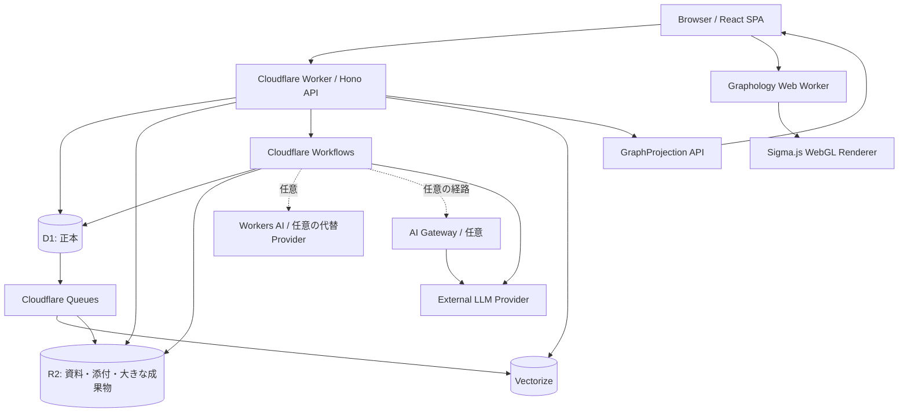
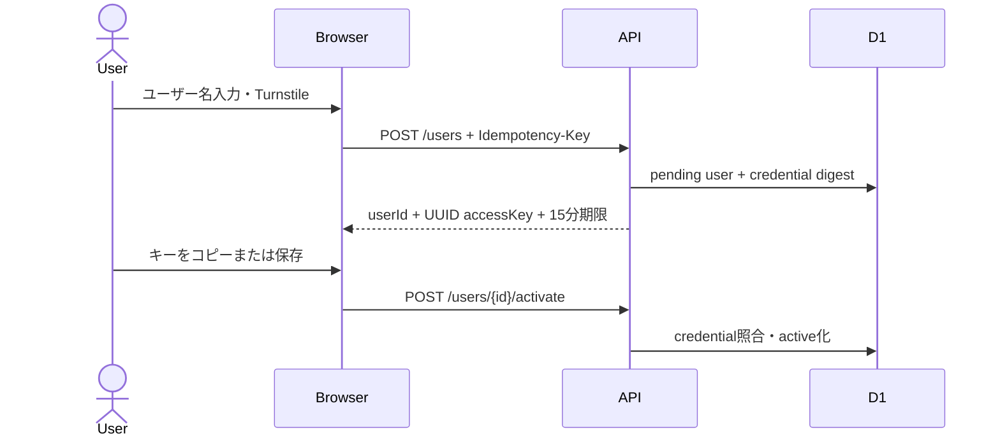
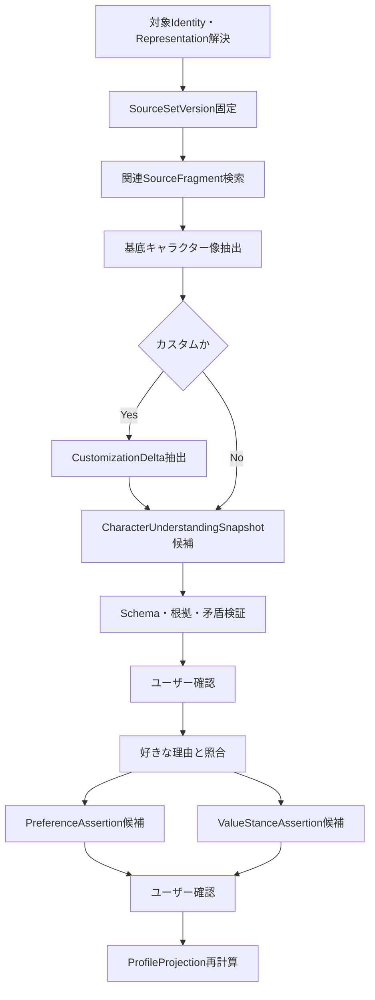
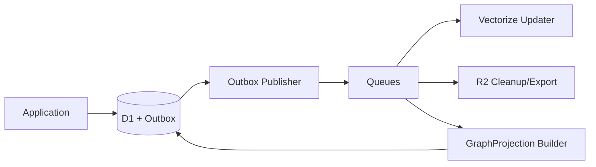
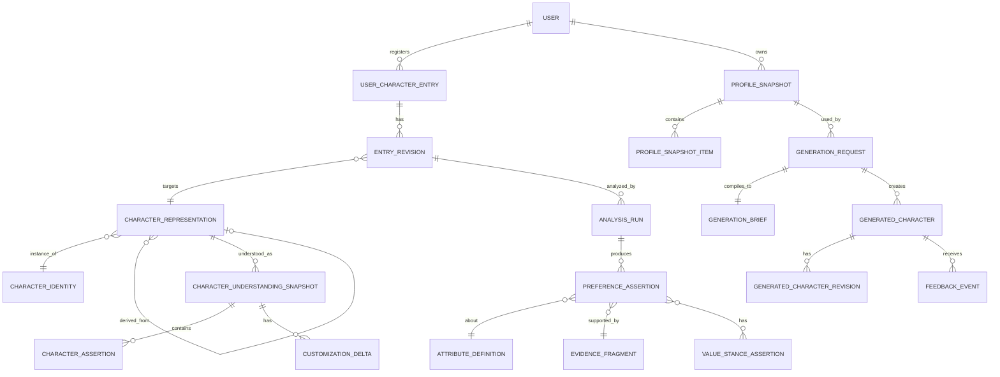

# キャラ嗜好ラボ 基本設計ベータ

- 文書種別: 基本設計（ベータ版）
- 作成日: 2026-08-29
- 対象: キャラクター登録、キャラクター理解、嗜好解析、嗜好プロフィール、嗜好グラフ、オリジナルキャラクター生成、認証・データ管理
- 初期配置: Cloudflare
- 初期運用プロファイル: Cloudflare Workers Freeによる個人開発・デモ・少人数検証
- 初期正本DB: 単一Cloudflare D1
- LLM: 必要なタイミングで外部Providerを利用し、外部LLMの料金・利用枠はCloudflare無料枠判定の対象外とする
- 後続文書: 本書を入力として、API、DB、画面、Workflow、LLM、セキュリティの詳細設計書を作成する
- 関連資料:
  - [基本設計アルファ](../基本設計アルファ/README.md)
  - [キャラクター嗜好の分析・解析手法に関する調査](../character-preference-analysis-research.md)

## 0. 文書の位置付け

本書は、これまでの検討結果を統合した、キャラ嗜好ラボの新規構築用基本設計である。現行実装の内部構造は前提とせず、一から再作成する。

例外として、ユーザー登録、ログイン、セッション、アクセスキー変更、ログアウト、アカウント削除に関する方式は、現行システムの方式を踏襲する。

初期はCloudflareの無料枠だけで基盤を運用する。対象は個人開発、デモ、少人数の検証運用であり、不特定多数への無制限な公開やSLA付き運用は前提としない。外部LLMは必要な時点で別途利用するため、その料金・quota・契約はCloudflare無料枠設計から切り離す。

本書で確定するものは次のとおりである。

- システム境界と主要ユースケース
- 画面と画面遷移
- ドメインモデル
- LLM解析の工程と責務
- データストアの役割分担
- 技術スタック
- API群と非同期Workflow
- 主要な状態遷移・整合性規則
- セキュリティ・プライバシー原則
- 詳細設計で定義すべき成果物と受入条件

本書では、SQL全文、全APIのJSON Schema、コンポーネント単位のUI仕様、プロンプト全文、アルゴリズム係数の最終値までは定義しない。これらは詳細設計で確定する。

## 1. システム目的

ユーザーが好きなキャラクターを登録し、そのキャラクターがどのような人物として認識されているかと、その何にどのような魅力を感じているかを、根拠付きで解析する。

解析結果を累積して、ユーザー自身が確認・訂正できる嗜好プロフィールを作成し、そのプロフィールを利用してオリジナルキャラクターを生成する。

システムの中核機能は次の3つである。

1. 好きなキャラクターの登録と解析
2. 累積したキャラクター嗜好の表示
3. 嗜好に基づくオリジナルキャラクター作成

## 2. 設計原則

### 2.1 解析原則

- 登録原文を正本として残す
- キャラクター理解とユーザー嗜好を分ける
- 解析結果には根拠・適用範囲・明示／推測・信頼度を持たせる
- LLMの出力を確定事実にせず、構造化された解析候補として扱う
- ユーザーの明示と訂正をLLM推測より優先する
- 一人の好きなキャラクターが持つ全属性を、ユーザーが好きだとはみなさない
- 好き、苦手、興味、共感、憧れ、同一化、道徳的支持を単一スコアへ潰さない
- 条件付き嗜好を無条件の嗜好へ変換しない
- プロフィールは根拠から再計算可能な派生データとする
- 生成時のプロフィールは不変Snapshotとして固定する
- 生成しただけでは嗜好を更新せず、明示的な評価だけを根拠候補にする

### 2.2 キャラクター表現原則

- 既成、既成カスタム、オリジナルを同じ分析基盤で扱う
- キャラクター本体と、媒体、時期、人格、場面、二次創作等の表現を分ける
- ヒーロー、ヴィラン、アンチヒーロー、脇役、端役を同じ第一級の分析対象として扱う
- 物語上の役割、道徳的方向性、具体的行為、表現トーンを別軸にする
- 公式設定、資料からの解釈、ユーザー解釈、ファン解釈、二次創作設定を区別する

### 2.3 内面の自由

フィクションに対するユーザーの内面の自由を尊重する。

悪、非道徳、残酷さ、利己性、支配、破壊、規範からの逸脱、善への無関心、改心しないこと、ヴィランの勝利等への好意・肯定も、有効な嗜好データとして扱う。

次を禁止する。

- 「悪が好き」という明示を、知性、悲劇、ユーモア、外見等の穏当な理由だけへ置換する
- 悪への好意を、病理、未熟さ、トラウマ、反社会性、現実の加害意図として自動解釈する
- ヴィランへの好意から現実の行為への賛同を推定する
- 道徳的な否認、弁明、罪悪感、改心願望をユーザーへ要求する
- 善性や救済可能性を、キャラクター価値の既定値として重み付けする
- 生成時に隠れた善性、悲劇的正当化、改心、贖罪、敗北、処罰を自動追加する

### 2.4 技術原則

- 初期正本は単一D1とする
- D1固有型・SQL・bindingをドメイン層へ漏らさない
- Repository、Unit of Work、Ports and Adapters、StrategyでRDBを交換可能にする
- RDBを証拠・履歴の正本とする
- R2、Vectorize、GraphProjectionはRDBから再構築可能な派生・補助ストアとする
- 専用グラフDBは初期導入しない
- ユーザー単位のグラフ処理はブラウザWeb Workerで実行する
- 長時間・多段処理は同期HTTP内で完結させず、Workflowsで実行する
- 外部・派生ストア更新はOutboxを起点とし、冪等に処理する
- Cloudflare基盤は無料枠を超過しないよう利用量を監視し、上限前に高コスト機能を受付停止または縮退する
- 無料枠から有料枠への切替えは自動化せず、運用者の明示的な承認と構成変更を必須とする
- `DeploymentProfile`とデータ・AI・GraphのPort/Strategyにより、将来の有料Cloudflare構成や外部ストアへ移行可能にする

## 3. 対象範囲

### 3.1 対象機能

- 公開ユーザー一覧
- ユーザー作成・有効化
- UUIDアクセスキーによるログイン
- セッション管理・ログアウト
- アクセスキー変更
- データエクスポート・アカウント削除
- 既成キャラクター登録
- 既成キャラクター（カスタム）登録
- オリジナルキャラクター登録
- 解析資料管理
- LLMによるキャラクター基本像抽出
- カスタム差分抽出
- ユーザーによる基本像・差分確認
- 根拠付き嗜好解析
- 解析結果の確認・訂正
- 累積嗜好プロフィール
- 嗜好グラフ表示・ブラウザ探索
- プロフィールSnapshot
- オリジナルキャラクター生成・部分修正
- 生成結果フィードバック
- 非同期ジョブ状態表示・再実行

### 3.2 初期対象外

- 巨大な公式キャラクターカタログ
- 無許可の作品全文収集
- 自動Webクロール
- 他ユーザーとの嗜好比較
- 全ユーザー横断グラフ分析
- 協調フィルタリング
- SNS・公開ランキング
- 専用グラフDB
- PostgreSQL Adapterの本番運用
- マイクロサービス分割
- 高度な因果推論
- 医学的・心理学的診断

ただし、PostgreSQLおよび専用グラフDBへ切り替えるためのPortと契約は初期から定義する。

## 4. 利用者と主要ユースケース

### 4.1 利用者

初期システムの利用者ロールは一般ユーザーのみとする。運用管理者の管理画面は初期対象外とし、Cloudflare Dashboard、ログ、CLI、管理スクリプトを利用する。

### 4.2 主要ユースケース

| ID | ユースケース |
|---|---|
| UC-01 | ユーザー名を登録し、アクセスキーを保存して有効化する |
| UC-02 | 公開一覧からユーザーを選び、アクセスキーでログインする |
| UC-03 | 既成キャラクターを登録し、基本像と嗜好を解析する |
| UC-04 | 既成キャラクターの特定人格・場面・二次創作版を登録する |
| UC-05 | オリジナルキャラクターを登録して嗜好を解析する |
| UC-06 | LLMが抽出した基本像、カスタム差分、嗜好候補を訂正する |
| UC-07 | 累積嗜好プロフィールと根拠を閲覧する |
| UC-08 | 嗜好グラフを探索する |
| UC-09 | プロフィールからオリジナルキャラクターを生成する |
| UC-10 | 生成結果を部分修正・評価する |
| UC-11 | データをエクスポート・削除する |
| UC-12 | アクセスキーを変更し、既存セッションを失効させる |

## 5. システム全体構成



### 5.1 配置単位

- React SPAとHono APIは一つのCloudflare Workerから配信してよい
- 非同期処理は同一リポジトリ内のWorkflowクラスとして分離する
- D1、R2、Vectorize、Queues、Workflowsはstagingとproductionで別リソースにする
- stagingとproductionの別リソースは同一Cloudflare accountの無料枠を共有する前提で容量計画する
- LLM Providerはアプリケーション境界で抽象化する
- 初期はモジュラーモノリスとし、サービス分割は論理境界に留める

## 6. 技術スタック

### 6.1 フロントエンド

| 分類 | 採用技術 | 用途 |
|---|---|---|
| 言語 | TypeScript | 型安全な画面・API契約・Web Worker実装 |
| UI | React | SPA画面構築 |
| Build | Vite | 開発・ビルド |
| Routing | React Router | 認証前後・3主要画面・設定画面の遷移 |
| Server state | TanStack Query | APIキャッシュ、ポーリング、失効管理 |
| Validation | Zod | フォームとAPIレスポンスの実行時検証 |
| Graph model | Graphology | ノード・エッジ、探索、クラスタ、レイアウト |
| Graph render | Sigma.js | WebGLによるグラフ描画 |
| Background compute | Web Worker | グラフ探索・クラスタ・レイアウト |
| Local cache | IndexedDB | GraphProjectionの任意キャッシュ。原文は既定で保存しない |

Sigma.jsは実装開始時点の安定版`sigma`パッケージを使用し、正確なバージョンは詳細設計時に固定する。

### 6.2 バックエンド・Cloudflare

| 分類 | 採用技術 | 用途 |
|---|---|---|
| Runtime | Cloudflare Workers Free | API、SPA配信、認証、軽量集計 |
| HTTP framework | Hono | Routing、Middleware、API |
| 正本RDB | Cloudflare D1 | ユーザー、Revision、根拠、解析、Snapshot、Outbox |
| Object store | Cloudflare R2 | 資料原本、添付、画像、エクスポート、大きな成果物 |
| Durable orchestration | Cloudflare Workflows | 多段LLM解析、生成、削除、再構築 |
| Messaging | Cloudflare Queues | Outbox配送、Vectorize同期、後処理、DLQ |
| Vector search | Cloudflare Vectorize | 資料RAG、類似検索、重複候補 |
| Cloudflare LLM | Workers AI〈任意〉 | 初期容量の前提にしない代替Provider |
| External LLM gateway | AI Gateway〈任意〉 | 外部LLMの経路・メタデータ観測。Provider料金は本書の無料枠対象外 |
| Bot protection | Cloudflare Turnstile | ユーザー登録・ログイン保護 |
| Secrets | Wrangler Secrets | AUTH_PEPPER、LLM APIキー、Turnstile secret |

### 6.3 LLM・Embedding

- `StructuredLlmProvider`を定義する
- `EmbeddingProvider`を`StructuredLlmProvider`と分離して定義する
- 本番主系は詳細設計時の固定評価で最も基準を満たすProviderとする
- 必要なタイミングで外部LLM Providerを使用する
- 外部LLMはAI Gateway経由またはProviderへの直接接続をAdapterで選択可能にする
- Workers AIは任意の代替Providerとし、初期Cloudflare無料枠の容量計画に組み込まない
- 構造化出力はJSON Schemaで要求し、Zodで再検証する
- Embeddingは外部ProviderまたはWorkers AIから詳細設計時に選定する
- Vectorizeのindex dimensionsはEmbeddingモデルと一致させる
- モデル名、prompt version、schema version、ontology versionをすべて記録する

モデルの具体名は構成値とし、ドメインコードへハードコードしない。外部LLMの料金、token quota、Provider契約は別途管理し、Cloudflare無料枠判定に含めない。

### 6.4 開発・品質

| 分類 | 採用技術 |
|---|---|
| Format/Lint | Biome |
| Unit/Integration | Vitest |
| UI test | Testing Library |
| E2E | Playwright |
| Schema | Zod、JSON Schema |
| Deploy | Wrangler |
| CI | GitHub Actions等。リポジトリ環境に合わせ詳細設計で確定 |
| Observability | Workers Observability、構造化ログ、Cloudflare Analytics |

### 6.5 初期Cloudflare無料枠運用プロファイル

初期構成名を`free_validation`とする。2026-08-29時点の無料枠を基準とするが、Cloudflareの仕様・上限・課金は変更され得るため、実装開始時とリリース前に公式資料を再確認する。

初期容量計画は、個人開発とデモを主用途とし、検証利用者は数十名以下、同時操作は1〜5名程度を負荷試験の暫定モデルとする。これはCloudflareが保証する収容数ではなく、実際の処理量に基づき詳細設計で補正する。

| Cloudflare機能 | 2026-08-29時点の主な無料枠 | 初期設計での対応 | 備考・将来拡張 |
|---|---|---|---|
| Workers | 100,000 requests/日、CPU 10ms/呼出、外部subrequest 50/呼出 | SPA静的assetと軽量APIに限定し、重いグラフ処理はブラウザ、多段処理はWorkflowへ分離する | CPU超過、request枠の継続的接近、subrequest不足でWorkers Paidを検討 |
| D1 | 5,000,000 rows read/日、100,000 rows written/日、5GB/account | 全表scanを避けるindex、cursor paging、user単位query、Snapshot再利用を行う | まずD1の有料枠を検討し、それでも不足する場合にRDB StrategyでPostgreSQL等へ移行 |
| R2 Standard | 10GB-month、Class A 1,000,000 operations/月、Class B 10,000,000 operations/月 | 資料と大きな成果物に限定し、lifecycleとサイズ上限を設ける | 容量超過時はR2有料利用への移行で対応でき、原則としてAdapter変更は不要 |
| Workflows | Workersと共有の100,000 requests/日、3,000 steps/日、state 1GB、CPU 10ms/step、完了state保持3日 | 1工程を小さなstepにし、業務状態と大きな成果物はD1/R2に保存する | step数、CPU、保持日数、subrequest数が不足する場合はWorkers Paidへ移行 |
| Queues | 10,000 operations/日、保持24時間 | messageにはIDと最小metadataだけを入れ、正本のOutboxから未配送を再送できるようにする | 通常1messageの配送にwrite/read/deleteの3 operationsを要する。保持延長や処理量増加時はPaidを検討 |
| Vectorize | 30,000,000 queried vector dimensions/月、5,000,000 stored vector dimensions | 派生インデックスとし、active revisionと必要なSourceFragmentだけを格納する | 上限接近時は新規indexingを停止し、D1検索・明示的資料選択へ縮退。将来はPaidまたは外部Vector Store Adapterへ移行 |
| AI Gateway〈任意〉 | core機能は無料、Freeの保存logはaccount合計100,000件 | prompt/response payloadは既定で保存せず、技術metadataだけを記録する | 外部Providerの推論料金とquotaは本表の対象外 |
| Turnstile | 20 widgets/account、challenge数無制限 | ユーザー作成とログインを同一環境用widgetで保護する | 大規模・複雑なドメイン管理が必要になったときにEnterprise機能を再評価 |

Workers AIは初期の必須依存にせず、外部LLMを必要なタイミングで使用する。Graphology、Sigma.js、Web Workerのブラウザ処理はCloudflareのサーバー計算枠を消費しない。

### 6.6 無料枠ガードと将来拡張

環境構成は次のプロファイルを持つ。初期は`free_validation`だけを有効にする。

```typescript
type DeploymentProfile = "free_validation" | "scaled_production";

interface PlatformCapacityPolicy {
  canStart(operation: CapacityControlledOperation): Promise<CapacityDecision>;
  recordUsage(usage: ApplicationUsage): Promise<void>;
  degradationMode(): Promise<DegradationMode>;
}

class FreeValidationCapacityPolicy implements PlatformCapacityPolicy {}
class ScaledProductionCapacityPolicy implements PlatformCapacityPolicy {}
```

Cloudflareの課金メトリクスは厳密な即時カウンタとして利用できない場合がある。そのため、アプリケーション内の操作量カウンタ、Cloudflare Analytics、各製品のusageを併用し、余裕を持って制御する。

- 警戒基準は日次または月次枠の70%を初期値とする
- 縮退開始基準は90%を初期値とする
- 利用量の一部をログイン、参照、エクスポート、削除用に予約する
- 縮退時はVectorize再構築、バッチ再解析、新規生成、新規解析、大容量upload、新規ユーザー作成の順に停止する
- 参照、ユーザーデータのexport、account削除、credential変更はできる限り最後まで維持する
- 受付停止時は上限到達を一般errorとして隠さず、理由と再開見込みを画面に表示する
- `free_validation`から`scaled_production`への変更は手動承認、費用見積り、負荷試験、rollback手順の確認後に行う

将来拡張の判定は、単発のスパイクではなく、上限への継続的な接近、CPU上限error、Queue遅延、Workflowのstep不足、必要なデータ保持期間、運用SLAを根拠に行う。それぞれの移行は次の優先順とする。

1. 同じCloudflare製品の有料枠へ切り替える
2. query、index、paging、cache、保持期間を改善する
3. 既存のPort/Strategyから外部RDB、Vector Store、Graph Engineへ切り替える
4. 負荷と組織境界が必要な場合にのみサービスを物理分割する

### 6.7 選定根拠とする公式資料

正確な制限値、課金、安定版バージョンは実装開始時に再確認する。技術選定の前提とする一次資料は次のとおりである。

- [Cloudflare Workers pricing](https://developers.cloudflare.com/workers/platform/pricing/)
- [Cloudflare Workers limits](https://developers.cloudflare.com/workers/platform/limits/)
- [Cloudflare D1 pricing](https://developers.cloudflare.com/d1/platform/pricing/)
- [Cloudflare R2 pricing](https://developers.cloudflare.com/r2/pricing/)
- [Cloudflare Workflows pricing](https://developers.cloudflare.com/workflows/reference/pricing/)
- [Cloudflare Workflows limits](https://developers.cloudflare.com/workflows/reference/limits/)
- [Cloudflare Queues pricing](https://developers.cloudflare.com/queues/platform/pricing/)
- [Cloudflare Vectorize pricing](https://developers.cloudflare.com/vectorize/platform/pricing/)
- [Cloudflare AI Gateway pricing](https://developers.cloudflare.com/ai-gateway/reference/pricing/)
- [Cloudflare Turnstile plans](https://developers.cloudflare.com/turnstile/plans/)
- [Hono for Cloudflare Workers](https://hono.dev/docs/getting-started/cloudflare-workers)
- [Graphology](https://graphology.github.io/)
- [Sigma.js](https://www.sigmajs.org/docs/)

## 7. 論理モジュール

| モジュール | 主責務 |
|---|---|
| IdentityAccess | 現行方式を踏襲したユーザー・アクセスキー・セッション管理 |
| CharacterCatalog | Work、CharacterIdentity、既成表現の識別 |
| SourceManagement | 資料、Revision、断片、出典、権利情報 |
| CharacterEntry | 3種類の登録、下書き、Revision |
| CharacterUnderstanding | 基本像抽出、根拠、Snapshot、カスタム差分 |
| PreferenceAnalysis | 反応・嗜好・価値スタンス抽出、確認・訂正 |
| AttributeOntology | 固定コア、拡張属性、別名、関係、版管理 |
| Profile | 決定論的集計、パターン、Snapshot、履歴 |
| GraphProjection | ユーザー単位ノード・エッジ投影、版管理、API |
| Generation | GenerationBrief、生成、Revision、類似検査 |
| Feedback | 生成物評価と嗜好根拠候補化 |
| JobOrchestration | Workflow、Queue、再試行、進捗、DLQ |
| DataManagement | エクスポート、削除、監査、派生ストア追随 |

モジュール間はドメインサービスを直接参照せず、Application PortまたはDomain Eventを使用する。

## 8. 画面構成

### 8.1 画面一覧

| 画面ID | 画面 |
|---|---|
| SCR-00 | トップ・公開ユーザー一覧 |
| SCR-01 | ユーザー作成・アクセスキー保存・有効化 |
| SCR-02 | ログイン |
| SCR-10 | キャラクター登録・一覧 |
| SCR-20 | 嗜好解析結果・嗜好グラフ |
| SCR-30 | オリジナルキャラクター作成 |
| SCR-40 | 設定・エクスポート・キー変更・削除 |

認証後の主ナビゲーションは次とする。

```text
[嗜好プロフィール] [キャラクター登録] [キャラクター作成] [設定]
```

### 8.2 SCR-10 キャラクター登録画面

登録方式を次の3種類から選択する。

1. 既成キャラクター
2. 既成キャラクター（カスタム）
3. オリジナルキャラクター

ウィザードは次の5段階とする。

```text
1. 登録方式
2. 対象・資料
3. キャラクター像確認
4. 好きな理由
5. 嗜好解析確認
```

#### 既成キャラクター

入力項目:

- 作品名
- キャラクター名
- 媒体・版
- 知っている範囲・話数
- 親しみの程度
- ユーザーが認識する人物像
- 参照資料・引用・添付
- 好きな点、苦手な点、場面、台詞
- 好きの種類・価値スタンス

対象・資料確定後、LLMが基本像を抽出する。基本像確認が完了するまで、累積プロフィールへ反映する嗜好解析を確定しない。

#### 既成キャラクター（カスタム）

追加入力項目:

- 派生元のCharacterRepresentation
- カスタム種別
- 対象人格、場面、時期、媒体
- 継承する要素
- 追加・変更する要素
- 対象外にする要素
- 公式、半公式、二次創作、ユーザー解釈の区別

基本像とカスタム像を左右比較し、差分操作を訂正できるようにする。

```text
INHERIT / ADD / MODIFY / REMOVE / INVERT
NARROW_SCOPE / EMPHASIZE / UNSPECIFIED
```

#### オリジナルキャラクター

キャラクターシートとして、名前、世界観、役割、外見、性格、価値観、欲求、恐れ、能力、欠点、関係、口調、行動例、台詞、場面を入力する。

設定と実際の行動が異なる人物を扱えるよう、設定説明と行動例を別フィールドにする。

#### 解析確認

基本像・差分・嗜好候補ごとに、次を操作できるようにする。

- 正しい
- 少し違う
- 間違っている
- 条件付きで正しい
- 好きではなく面白いだけ
- 属性は好きだが、この表現は苦手
- 悪であることが好きとして扱う
- 行為への賛否は未指定のままにする

### 8.3 SCR-20 嗜好解析結果画面

タブ構成:

- 概要
- 属性詳細
- 嗜好グラフ
- キャラクター別
- 履歴・根拠
- データ品質

表示項目:

- 好む属性
- 苦手な属性
- 条件付き嗜好
- 好きになる反応経路
- 価値スタンス
- 複合パターン
- 根拠数、独立キャラクター数、独立作品数
- 明示／推測
- 信頼度
- 反例・矛盾
- 時間変化
- データの偏り・未回答

「データがない」と「嫌い」を区別する。好きと苦手を相殺せず別の値で表示する。

嗜好グラフは、GraphProjectionを取得してGraphology Web Workerで処理し、Sigma.jsで描画する。根拠原文は初期Projectionへ含めず、ユーザーが展開したときだけ取得する。

### 8.4 SCR-30 オリジナルキャラクター作成画面

4段階とする。

```text
1. 作成方針
2. 嗜好選択
3. 条件設定・GenerationBrief
4. 生成・調整・評価
```

生成モード:

- 忠実
- バランス
- 探索

嗜好属性の扱い:

- 必須
- 採用
- 弱く採用
- 探索
- 使わない
- 禁止

価値観・物語上の設定として次を指定できる。

- 善志向、悪志向、非道徳、善悪への無関心、自己規範、混合
- 悲劇的過去・正当化理由の有無
- 隠れた善性の有無
- 改心・救済・贖罪の有無
- 勝利、敗北、未決着
- 道徳的教訓の有無
- 暴力・成人向け表現の範囲

生成前に、人間可読かつ構造化されたGenerationBriefを確認・修正できるようにする。

生成結果は、人物像、外見、性格、価値観、道徳的方向性、欲求、恐れ、能力、欠点、過去、関係、口調、役割、代表的選択、台詞、場面、嗜好との対応、探索要素を含む。

部分修正はGeneratedCharacterRevisionとして保存する。

### 8.5 SCR-40 設定画面

- ユーザーID・ユーザー名表示
- アクセスキー変更
- JSONエクスポート
- アカウント削除
- 任意のセンシティブ項目設定
- GraphProjectionローカルキャッシュ削除

## 9. 認証・ログイン基本設計

本章は現行方式を踏襲する必須仕様である。

### 9.1 公開ユーザー一覧

- `active`ユーザーのIDとユーザー名を公開一覧へ表示する
- ユーザー名検索とカーソルページングを提供する
- ログイン時は一覧からユーザーを選択し、アクセスキーを入力する
- メールアドレスは使用しない

### 9.2 ユーザー名

- 1文字以上32文字以下
- 制御文字を禁止する
- 表示名はNFKC正規化、前後空白除去、連続空白圧縮を行う
- 一意性判定用には日本語ロケールで小文字化した`username_normalized`を使用する
- `pending`と`active`を含め、削除処理中以外の同名登録を禁止する

### 9.3 ユーザー作成・有効化



- ユーザーIDとアクセスキーはUUID形式とする
- 作成要求のIdempotency-KeyとAUTH_PEPPERから決定論的に導出し、同じ作成要求の再送で同じ結果を返せるようにする
- アクセスキーは作成時に一度だけ平文表示する
- サーバーはアクセスキー平文を保存しない
- 資格情報は`HMAC-SHA-256(AUTH_PEPPER, userId + canonicalAccessKey)`のダイジェストを保存する
- pending有効期限は15分とする
- 期限内に有効化されなければ利用不可とし、期限切れpendingは削除対象とする
- ユーザーは保存確認後に有効化する
- キー紛失時の再発行・復旧機能は提供しない

### 9.4 ログイン

- 入力はユーザーID、UUIDアクセスキー、Turnstile tokenとする
- activeユーザーとactive credentialだけを認証対象とする
- ダイジェスト比較は定時間比較とする
- ログインを含む更新系要求はIdempotency-Keyを必須とする
- 認証失敗時はユーザー不存在とキー不一致を同じエラーにする

### 9.5 セッション

- セッション期間は30日を既定とする
- 残存期間が7日以下になった有効セッションは30日へ更新する
- セッショントークン平文はブラウザCookieだけに保持する
- D1にはSHA-256ダイジェストを保存する
- Cookie名は`__Host-session`とする
- Cookie属性は`HttpOnly; Secure; SameSite=Strict; Path=/`とする
- CSRF tokenはセッショントークンからHMACで導出する
- D1にはCSRF tokenのSHA-256ダイジェストを保存する
- CSRF tokenはログイン応答と`GET /me`で返し、ブラウザのメモリへ保持する
- 認証済み更新要求は`X-CSRF-Token`を必須とする
- APIはCookie、期限、ユーザー状態、失効状態、CSRF整合性を毎回確認する

### 9.6 Origin・CSRF・レート制限

- GET、HEAD、OPTIONS以外はOriginを検証する
- 認証済み更新要求はOriginとCSRFの両方を検証する
- 公開ユーザー作成・ログインもOriginを検証する
- ユーザー作成とログインはTurnstileで保護する
- 未認証書込みはIP単位10分窓で制限する
- 認証済み書込みはIP単位・ユーザー単位1分窓で制限する
- rate limitのsubjectはAUTH_PEPPERによるHMACダイジェストで保存する
- 分析、生成等にはユーザー単位日次quotaを設ける

### 9.7 ログアウト

- 現在のセッション行へ`revoked_at`を設定する
- Cookieを即時削除する
- ブラウザのCSRF token、Query cache、GraphProjection cacheを削除する

### 9.8 アクセスキー変更

- 現在のアクセスキーを再入力する
- 新しいUUIDアクセスキーを一度だけ表示する
- 現在のactive credentialをすべてrevokeする
- versionを増やした新credentialを作成する
- 当該ユーザーの全セッションをrevokeする
- Cookieを削除し、再ログインを要求する
- 同一Idempotency-Keyの再送で同じ新キーを再現できるようにする

### 9.9 アカウント削除

- 認証済み、CSRF検証済み、Idempotency-Key付き要求とする
- ユーザーを`deleting`へ遷移させる
- D1のユーザーデータを外部キーcascadeまたは削除Workflowで削除する
- R2、Vectorize、GraphProjection cache等の派生データを追随削除する
- セッションCookieとブラウザキャッシュを削除する
- 派生ストア削除失敗は再試行し、DLQと監査ログで追跡する

## 10. キャラクタードメイン

### 10.1 CharacterIdentity

キャラクターが誰であるかを表す。

主要項目:

- `id`
- `origin_type`: existing / original
- `name`
- `work_id`
- `owner_user_id`
- `catalog_status`
- `visibility`

### 10.2 CharacterRepresentation

ユーザーが登録・分析する具体的な版、側面、場面、改変を表す。

`representation_type`:

- `canonical_whole`
- `media_adaptation`
- `facet`
- `scene_state`
- `alternate_setting`
- `transformative`
- `user_interpretation`
- `original`

主要項目:

- `character_identity_id`
- `base_representation_id`
- `canonicality`
- `scope_type`
- `scope_description`
- `transformation_summary`
- `source_description`
- `owner_user_id`
- `content_version`

### 10.3 CharacterUnderstandingSnapshot

特定の資料集合と対象範囲から、LLMとユーザー確認によって構築された不変のキャラクター理解である。

主要項目:

- `representation_id`
- `base_snapshot_id`
- `source_set_version_id`
- `known_scope`
- `understanding_status`
- `overall_confidence`
- `model_run_metadata_id`
- `ontology_version`
- `created_at`

### 10.4 CharacterAssertion

Snapshot内の個別の人物像主張である。

- 属性IDと値
- 媒体、時期、人格、場面、相手、条件
- 設定、観察可能な行動、資料解釈、ユーザー解釈の区別
- 根拠資料断片
- 公式、半公式、二次資料、二次創作、ユーザー記述、モデル知識の区別
- 明示／解釈
- 信頼度
- 矛盾する主張
- 提案、確認、訂正、却下、未確定

### 10.5 CustomizationDelta

カスタム表現と基底Snapshotの差分である。

```text
INHERIT      基本像から継承
ADD          新規追加
MODIFY       変更
REMOVE       対象外・削除
INVERT       反転
NARROW_SCOPE 人格・時期・場面等へ限定
EMPHASIZE    性質を変更せず強調
UNSPECIFIED  継承状態不明
```

カスタムの明示内容はカスタム表現内でLLM推測より優先するが、基底Snapshotを書き換えない。

## 11. 解析資料

### 11.1 SourceDocument

資料原本の論理メタデータをD1へ、ファイル実体をR2へ保存する。

保持項目:

- 所有者
- 作品・媒体・版
- 出典種別
- URLまたはR2 object key
- 著者・権利者・利用根拠
- 公開範囲
- MIME type、size、hash
- ネタバレ範囲
- Revision
- 抽出状態

### 11.2 SourceFragment

LLMへ渡せる大きさへ分割した根拠単位である。

- document revision
- ページ、章、話、場面、時刻範囲
- 原文または要約
- 原文位置
- hash
- embedding参照
- 出典信頼度

### 11.3 SourceSetVersion

一回のCharacterUnderstandingで利用した資料集合を固定する。不変とし、資料追加時は新しいversionを作る。

### 11.4 資料優先順位

1. ユーザーが今回明示した説明、範囲、訂正
2. 適法に利用できる公式・一次資料または出典付き管理資料
3. 出典と適用範囲を確認できる二次資料
4. LLMの学習済み知識

LLM知識だけの主張は`provisional`とする。資料不足は`unknown`として残し、設定を捏造しない。

## 12. LLM解析基本設計

### 12.1 解析パイプライン



### 12.2 LLMの責務

- 根拠付きのCharacterAssertion候補を作る
- 基底像とカスタムの差分候補を作る
- 自由記述からRawAttributeMentionを抽出する
- 属性辞書へ候補マッピングする
- 好きの対象、反応経路、条件、価値スタンスを分ける
- 根拠原文またはSourceFragment IDを返す
- 不確実性と競合候補を返す

### 12.3 LLMへ任せないもの

- ProfileProjectionの最終集計
- 好きと苦手の重み付け確定
- Revision整合性
- アクセス制御
- ユーザー訂正の優先適用
- Snapshotの不変性
- 派生登録の重複抑制
- quota、課金、認証、削除

### 12.4 構造化出力

- すべてJSON Schemaで定義する
- 受信後にZodで再検証する
- 不正な出力は同一Providerで一度だけ修復を試みる
- 修復失敗時は別Providerまたは人手入力へフォールバックする
- Schema不適合出力をDBへ確定保存しない
- LLMの生の思考過程は保存しない

### 12.5 根拠検証

- 引用はSourceFragmentまたはユーザー原文に一致することを検証する
- 一致しない引用を高信頼根拠として保存しない
- CharacterAssertionとPreferenceAssertionで根拠を分ける
- モデル知識由来は引用なしを許すが、出典種別を`model_knowledge`、状態を`provisional`に固定する
- 同じ文から複数主張を作る場合も各主張に根拠範囲を持たせる

### 12.6 キャラクター属性と嗜好の証拠水準

| 証拠 | 嗜好への扱い |
|---|---|
| ユーザーが好きな理由として明示 | 強い候補 |
| 解析候補をユーザーが確認 | 確認済み |
| 複数キャラクター・作品で反復 | 累積推測候補 |
| 一人のキャラクターに存在するだけ | 未確認関連。嗜好として確定しない |

## 13. 嗜好属性・価値スタンス

### 13.1 属性語彙

次の3層を保持する。

1. システム固定のコアカテゴリ・メタ属性
2. 追加・統合・廃止可能な統制属性辞書
3. ユーザーの自由記述原文

固定コアカテゴリ:

- 外見・デザイン
- 声・口調・演技
- 性格・感情
- 温かさ・信頼性
- 能力・知性・主体性
- 欲求・目標
- 価値観・道徳的方向性
- 善悪への関心
- 弱さ・脆弱性
- 二面性・葛藤
- 関係性
- 物語上の役割・機能
- 成長・変化
- 表現トーン
- 反応経路

属性状態:

```text
proposed → user_scoped → reviewed → canonical
                               └→ merged / split / deprecated
```

### 13.2 RawAttributeMention

ユーザー原文を失わず、一つ以上のAttributeDefinitionへ信頼度付きで対応付ける。既存属性へ十分な確信で対応できない場合は、ユーザー限定の仮属性を作る。

### 13.3 PreferenceAssertion

主要項目:

- 属性
- polarity: positive / negative / mixed
- response channel
- strength
- explicitness
- confidence
- context condition
- evidence
- analysis run
- status
- superseded_by

`positive`は嗜好方向であり、道徳的な善を意味しない。

### 13.4 ResponseChannel

- aesthetic_liking
- person_liking
- admiration
- empathy
- actual_similarity
- wishful_identification
- narrative_identification
- parasocial_closeness
- protectiveness
- romantic_attraction
- sexual_attraction
- curiosity
- narrative_interest
- moral_support
- fascination_with_transgression
- root_for
- love_to_hate
- desire_no_redemption

### 13.5 ValueStanceAssertion

対象の価値・行為・道徳性へのユーザーのスタンスを、通常の嗜好主張と分ける。

- `target_type`: 属性、価値観、行為、役割、結末、表現
- `stance`: affirm / accept / indifferent / ambivalent / reject / unspecified
- `orientation`: evil / immoral / indifferent_to_good / transgressive / self_defined / good / mixed
- `scope`: 作品、表現、場面、フィクション内価値、想像上の自己同一化
- `explicitness`
- `confidence`
- `evidence`
- `status`

ユーザーの`stance: indifferent`と、キャラクター側の`orientation: indifferent_to_good`を混同しない。現実社会への一般化は明示がなければ`unspecified`とする。

## 14. 累積嗜好プロフィール

### 14.1 ProfileProjection

現在の確定・確認済み根拠から再計算される最新プロフィールである。

表示対象:

- 安定して好む傾向
- 苦手な傾向
- 条件付き嗜好
- 反応経路
- 価値スタンス
- 複合パターン
- 緊張・矛盾
- 反例
- データ品質
- 時間変化

### 14.2 集計規則

- 明示・確認済みを最優先する
- 推測は弱く扱う
- 同じ登録内の言い換えを重複計上しない
- 同じCharacterIdentity系列の派生を過剰計上しない
- 同一作品からの大量登録の影響を抑制する
- 好きと苦手を相殺しない
- 文脈条件を保存する
- 道徳的望ましさを重みに使用しない
- 悪への無条件嗜好へ救済・善性条件を追加しない
- 旧Revisionと却下済み主張を除外する
- 計算アルゴリズムversionを保存する

重み・閾値・信頼度区分の数式は詳細設計で決定し、固定評価データで検証する。

### 14.3 ProfileSnapshot

生成・比較・エクスポートに使う不変Snapshotである。次を保持する。

- profile version
- evidence set hash
- ontology version
- algorithm version
- user correction version
- snapshot items
- created_at

## 15. 嗜好知識グラフ

### 15.1 基本方針

- 分析データはD1へ保存する
- 専用グラフDBは使用しない
- D1からユーザー単位GraphProjectionを作る
- ブラウザWeb Workerでグラフ処理する
- Sigma.jsで描画する
- ブラウザ結果は正本にしない

### 15.2 GraphProjection

```yaml
projectionVersion: string
profileSnapshotId: string
generatedAt: datetime
scope: user_profile
nodes:
  - id: string
    type: string
    label: string
    weight: number | null
    confidence: number | null
    flags: string[]
edges:
  - id: string
    from: string
    to: string
    type: string
    weight: number | null
    evidenceCount: number
nextCursor: string | null
```

### 15.3 GraphologyBrowserGraphEngine

```typescript
interface BrowserGraphEngine {
  load(projection: GraphProjection): Promise<void>;
  neighbors(nodeId: string, depth?: number): Promise<string[]>;
  shortestPath(from: string, to: string): Promise<string[] | null>;
  filter(condition: GraphFilter): Promise<GraphSelection>;
  detectCommunities(): Promise<CommunityResult>;
  calculateLayout(layout: LayoutRequest): Promise<NodePositions>;
  dispose(): Promise<void>;
}
```

初期実装:

- Graphology: データモデル
- graphology traversal / shortest-path / components
- graphology-communities-louvain: 表示補助クラスタ
- graphology-layout-forceatlas2等: 座標計算
- Web Worker: 重い計算
- Sigma.js: WebGL描画、ズーム、パン、選択、ホバー

### 15.4 責務境界

ブラウザ:

- 隣接探索
- 指定深度探索
- 最短経路
- フィルター
- 小規模クラスタリング
- レイアウト
- 描画

サーバー:

- 認証・アクセス制御
- 嗜好スコアと信頼度
- Snapshot確定
- GraphProjection構築・ページング
- 生成条件確定
- 根拠原文の遅延取得

### 15.5 将来切替

```text
GraphProjectionProviderPort
├─ D1GraphProjectionProvider       # 初期
└─ RemoteGraphProjectionProvider   # 将来

GraphEngineStrategy
├─ GraphologyBrowserGraphEngine    # 初期
└─ RemoteGraphEngine               # 将来
```

全ユーザー横断探索、大規模定期分析、非公開データを用いたサーバー推薦が必要になったときに専用グラフDBを検討する。

## 16. オリジナルキャラクター生成

### 16.1 GenerationRequest

- 使用ProfileSnapshot
- 生成モード
- 用途・世界観
- 採用・除外・禁止属性
- 反応経路
- 価値スタンス
- 表現範囲
- 類似回避対象
- ユーザー自由指示

### 16.2 GenerationBrief

LLMへ直接Profile全体を渡さず、生成に必要な属性、条件、非要件、根拠IDを構造化する。

悪・非道徳を採用する場合、次を明示可能にする。

```text
自動追加しない:
- 悲劇的過去による正当化
- 実は優しいという反転
- 改心・贖罪
- 道徳的敗北・処罰
```

### 16.3 生成・検証

- JSON Schemaによる構造化生成
- Schema再検証・一度の修復
- 使用嗜好との対応検証
- 禁止属性検証
- 登録キャラクターとの意味的類似検査
- 類似度が閾値を超えた場合の警告または再生成
- model/prompt/schema/profile snapshotの記録

### 16.4 Revision・Feedback

- 全体再生成と部分修正を分ける
- 各部分修正をGeneratedCharacterRevisionとして保存する
- 総合、外見、性格、関係、口調等を任意評価できる
- プロフィールへ反映するか明示選択する
- 評価された具体属性だけをPreferenceAssertion候補にする

## 17. データストア基本設計

### 17.1 RDB交換境界

```text
RelationalStoreStrategy
├─ UnitOfWork
├─ IdentityAccessRepository
├─ CharacterRepository
├─ SourceRepository
├─ EntryRepository
├─ CharacterUnderstandingRepository
├─ PreferenceRepository
├─ ProfileRepository
├─ GraphProjectionRepository
├─ GenerationRepository
├─ JobRepository
└─ OutboxRepository

Adapters
├─ D1RelationalStoreStrategy          # 初期
└─ PostgreSqlRelationalStoreStrategy  # 将来
```

必須規則:

- Strategyはデプロイ設定で一つを選択する
- D1型、binding、SQLをドメイン・Application層へ露出しない
- UUID等のIDをアプリケーション側で生成する
- DB固有SQLとmigrationをAdapter内に分離する
- Unit of Workで本体更新とOutbox追加を同一トランザクションにする
- JSON列へschema versionを持たせる
- D1と将来Adapterに同一Repository契約テストを適用する
- 移行時の二重書きは通常Strategyでなく移行専用Adapterを使う

Strategy差替えはコード境界を提供するものであり、データ移行を不要にするものではない。移行時はsnapshot、差分同期、件数・hash照合、切戻し手順を別途設計する。

### 17.2 D1論理テーブル

#### 認証・ユーザー

```text
users
credentials
sessions
consents
request_rate_limits
usage_daily
idempotency_responses
```

#### 作品・キャラクター

```text
works
work_versions
character_identities
character_representations
representation_relations
```

#### 資料

```text
source_documents
source_document_revisions
source_fragments
source_sets
source_set_versions
source_set_items
```

#### 登録

```text
user_character_entries
entry_revisions
entry_assets
```

#### キャラクター理解・嗜好解析

```text
character_understanding_runs
character_understanding_snapshots
character_assertions
customization_deltas
understanding_reviews
analysis_runs
evidence_fragments
preference_assertions
value_stance_assertions
preference_value_stance_links
assertion_reviews
user_correction_events
```

#### 属性辞書

```text
attribute_schema_versions
attribute_definitions
attribute_aliases
attribute_relations
raw_attribute_mentions
attribute_mappings
```

#### プロフィール・グラフ

```text
profile_projections
profile_dimensions
profile_patterns
profile_snapshots
profile_snapshot_items
graph_projection_snapshots
graph_projection_nodes
graph_projection_edges
```

#### 生成・フィードバック

```text
generation_requests
generation_request_preferences
generation_briefs
generated_characters
generated_character_revisions
generation_basis_links
similarity_check_results
feedback_events
feedback_attribute_ratings
```

#### 処理・監査

```text
jobs
job_attempts
outbox_events
audit_events
model_run_metadata
```

### 17.3 R2

保存対象:

- ユーザー添付資料原本
- PDF、画像、音声、動画
- キャラクターシート
- 大きな抽出中間物
- 大きなGraphProjection cache
- エクスポートファイル

D1にはowner、visibility、R2 key、hash、MIME、size、source revisionを保存する。R2 keyへユーザー入力文字列を直接使用せず、ランダムIDと固定prefixを使う。

### 17.4 Vectorize

indexを用途別に分ける。

- SourceFragment index: RAG
- CharacterRepresentation index: 重複・類似
- GeneratedCharacter index: 模倣検査

正本の本文、属性、アクセス権はD1に置く。Vectorize検索後にD1で所有者・visibility・active revisionを再検証する。

### 17.5 派生同期



Queueはat-least-onceを前提とし、event IDを冪等性キーにする。最大再試行後はDLQへ移し、ジョブ画面と運用ログから再実行できるようにする。

`free_validation`ではQueue保持24時間を超える障害を考慮し、D1 Outboxの未配送行を定期的に再検出する。Vectorizeの上限接近時はOutbox eventを失わず`deferred_capacity`とし、再開後に再配送する。

## 18. 主要エンティティ関係



## 19. API基本設計

すべて`/api/v1`配下とする。詳細設計でOpenAPI 3.1とJSON Schemaを作成する。

### 19.1 共通規則

- JSON APIとする
- 成功応答は`{ data: ... }`を基本とする
- エラーは`code`、`message`、`requestId`、任意の`details`を持つ
- GET、HEAD、OPTIONS以外はIdempotency-Keyを必須とする
- 認証済み更新要求はCSRF tokenを必須とする
- 一覧はカーソルページングとする
- Revision更新は期待RevisionまたはETagを要求する
- 容量制御対象の更新要求は、受付前に`PlatformCapacityPolicy`で開始可否を判定する
- 無料枠ガードによる受付停止は`429 PLATFORM_CAPACITY_TEMPORARILY_UNAVAILABLE`とし、`retryAfter`、対象機能、再開見込みの有無を返す
- 容量不足を認証失敗やLLM失敗として返さない
- 長時間処理は`202 Accepted`とjob IDを返す
- R2の大きなupload/downloadは短時間署名URLを使用する

### 19.2 認証・ユーザー

```text
GET    /users
POST   /users
POST   /users/{userId}/activate
POST   /sessions
DELETE /sessions
GET    /me
POST   /account/key-rotation
GET    /account/export
DELETE /account
```

### 19.3 キャラクター・資料・登録

```text
GET    /works
GET    /characters
POST   /sources/upload-requests
POST   /sources/{sourceId}/revisions
GET    /sources/{sourceId}

GET    /entries
POST   /entries/drafts
GET    /entries/{entryId}
PATCH  /entries/{entryId}/draft
POST   /entries/{entryId}/submit
POST   /entries/{entryId}/revisions
DELETE /entries/{entryId}
```

### 19.4 キャラクター理解・嗜好解析

```text
POST   /entries/{entryId}/character-understanding-runs
GET    /entries/{entryId}/character-understanding-runs/{runId}
GET    /character-understanding-snapshots/{snapshotId}
POST   /character-understanding-snapshots/{snapshotId}/review
POST   /customization-deltas/{deltaId}/review

POST   /entries/{entryId}/analysis-runs
GET    /entries/{entryId}/analysis-runs/{runId}
POST   /preference-assertions/{assertionId}/review
POST   /value-stance-assertions/{assertionId}/review
```

### 19.5 プロフィール・グラフ

```text
GET    /profile
GET    /profile/dimensions
GET    /profile/patterns
GET    /profile/evidence
GET    /profile/history
POST   /profile/snapshots

GET    /profile/graph
GET    /profile/graph/nodes/{nodeId}/neighbors
```

Graph APIは`profileSnapshotId`、`projectionVersion`、`detail`、`cursor`を受け付ける。

### 19.6 生成・フィードバック

```text
POST   /generation-requests
GET    /generation-requests/{requestId}
PATCH  /generation-requests/{requestId}
POST   /generation-requests/{requestId}/compile-brief
POST   /generation-requests/{requestId}/generate

GET    /generated-characters/{characterId}
POST   /generated-characters/{characterId}/revisions
POST   /generated-characters/{characterId}/feedback
DELETE /generated-characters/{characterId}/feedback/{feedbackId}
```

### 19.7 ジョブ

```text
GET    /jobs/{jobId}
POST   /jobs/{jobId}/retry
```

## 20. Workflow・イベント

### 20.1 CharacterAnalysisWorkflow

工程:

1. EntryRevision・対象scope検証
2. SourceSetVersion固定
3. SourceFragment抽出・RAG
4. 基底CharacterUnderstanding抽出
5. カスタム差分抽出
6. Schema・根拠・矛盾検証
7. Snapshot候補保存
8. ユーザー確認待ち
9. 嗜好・価値スタンス抽出
10. 嗜好確認待ち
11. ProfileProjection再計算
12. GraphProjection再構築要求
13. Vectorize同期要求

各LLM呼出し、DB確定、外部更新を別のWorkflow stepにする。大きな成果物はWorkflow stateへ入れず、D1またはR2参照だけを返す。

`free_validation`では1 stepあたりのCPU上限を前提に、LLMの応答サイズ、一度に検証するassertion数、SourceFragment数に上限を設ける。外部LLMの応答待ちと業務状態を分け、ユーザー確認待ち状態はD1に正本を保存する。Workflow stateの保持期間だけに業務の継続性を依存させない。

### 20.2 GenerationWorkflow

1. ProfileSnapshot検証
2. GenerationBrief確定
3. LLM生成
4. Schema・禁止条件検証
5. Embedding・類似検査
6. 必要時再生成
7. GeneratedCharacterRevision保存
8. GraphProjection更新要求

### 20.3 DeletionWorkflow

1. D1ユーザー状態をdeletingへ変更
2. 新規アクセスを禁止
3. R2 object列挙・削除
4. Vectorize ID削除
5. GraphProjection cache削除
6. D1ユーザーデータ削除
7. 監査結果記録

### 20.4 ドメインイベント

```text
UserCreated
UserActivated
SessionCreated
SessionRevoked
CredentialRotated

EntryRevisionCreated
EntrySubmitted
SourceSetVersionCreated
CharacterUnderstandingRequested
CharacterUnderstandingCompleted
CharacterUnderstandingReviewed
CustomizationDeltaReviewed
PreferenceAnalysisRequested
PreferenceAnalysisCompleted
AssertionReviewed
ValueStanceAssertionReviewed
CorrectionRecorded

ProfileRecalculationRequested
ProfileProjectionUpdated
ProfileSnapshotCreated
GraphProjectionBuildRequested
GraphProjectionSnapshotCreated

GenerationRequested
GenerationCompleted
GeneratedCharacterRevised
FeedbackRecorded
FeedbackAcceptedAsPreferenceEvidence
UserDataDeletionRequested
UserDataDeletionCompleted
```

### 20.5 状態遷移

Entry:

```text
draft → submitted → understanding → understanding_review
      → analyzing → analysis_review → active → archived
                   ↘ failed / superseded
```

CharacterUnderstandingSnapshot:

```text
proposed → needs_review → confirmed
                     └→ corrected
provisional → provisional_accepted
```

Job:

```text
queued → running → waiting_for_user → running → succeeded
             └→ retrying → failed
             └→ superseded
```

GeneratedCharacter:

```text
draft → generating → generated → accepted
                   └→ needs_revision → generated
                   └→ failed
```

## 21. 整合性・並行更新

- 解析結果は特定EntryRevisionとCharacterUnderstandingSnapshotへ紐付ける
- EntryRevision更新後に旧解析を最新Profileへ混ぜない
- SourceSetVersionとProfileSnapshotは作成後変更しない
- Correctionは追記イベントとして保存する
- `superseded_by`で主張の置換関係を残す
- Profile更新は`profile_generation`等の世代番号で競合検出する
- 古い世代のWorkflowは`superseded`で終了する
- 本体とOutboxは同一Unit of Workで確定する
- QueueとWorkflowのstepは冪等性キーを持つ
- 同じCharacterIdentity系列を過剰計上しない
- Browser Graph結果をRDB正本へ直接反映しない
- GraphProjectionのProfileSnapshot IDとprojection versionを照合する
- Vectorize結果はD1のactive・owner・revisionを再検証する

## 22. セキュリティ・プライバシー

### 22.1 データ分類

| 分類 | 例 |
|---|---|
| 公開 | active user ID、ユーザー名 |
| 個人限定 | 登録、好きな理由、プロフィール、生成物、GraphProjection |
| センシティブ | 恋愛・性的反応、価値スタンス、自由記述、二次創作 |
| 秘密 | アクセスキー、session token、AUTH_PEPPER、LLM API key |

### 22.2 保護原則

- ユーザーID条件を全個人データQueryへ含める
- R2はprivateを既定にする
- 署名URLは短時間・単一object・単一操作へ限定する
- Access key、session token、CSRF token平文をDBへ保存しない
- LLMへ必要最小限の原文だけを送る
- AI Gatewayのprompt/response payload loggingを無効化する
- 外部Providerの学習・長期保存を無効化する
- キャッシュへ`no-store`を適用する
- CSP、HSTS、X-Content-Type-Options、Referrer-Policy、frame denialを設定する
- ユーザー入力を命令ではなく非信頼データとしてLLMへ渡す
- 添付資料内のprompt injectionを無視するsystem instructionを用いる
- モデルの思考過程を保存・表示しない

### 22.3 推測制限

- 性的指向を自動推定しない
- 精神状態、診断、トラウマを自動推定しない
- ヴィラン嗜好から危険性・犯罪傾向を推定しない
- フィクション嗜好から現実の信条を推定しない
- データ不足を否定的属性として扱わない

### 22.4 ブラウザグラフ

- ブラウザへ送った情報はユーザーが閲覧・改変可能であることを前提とする
- 他ユーザー情報と権限制御用情報をProjectionへ含めない
- 原文は初期Projectionへ含めない
- IndexedDB cacheはログアウト、削除、失効時に消去する
- サーバーへ返されたクラスタ・座標・経路を信頼しない

## 23. 非機能要件

### 23.1 性能目標

- 通常API読取のp95を500ms以内の目標とする。外部AI・大きなR2取得を除く
- 更新要求のjob enqueueを1秒以内の目標とする
- 画面初期表示を通常回線で2秒以内の目標とする
- Graph初期Projectionは上位500ノード程度を上限既定値とする
- ブラウザGraphの設計上限目標を5,000ノード、20,000エッジとする
- 上限超過時は遅延展開・ページング・詳細度制限を使用する
- 128MB Worker memoryを前提に、資料全体をbufferしない

数値は詳細設計の負荷試験計画で確定・調整する。

### 23.2 可用性・回復性

- 外部LLM障害時にjobを失わない
- Retryable／NonRetryable errorを分類する
- Workflow stepを再試行可能にする
- QueueはDLQを構成する
- R2、Vectorize、GraphProjectionは再構築可能にする
- D1のバックアップ・復旧手順を運用設計で定義する
- stagingでmigrationと復旧手順を検証する

### 23.3 監視

取得するメトリクス:

- API request count、latency、status
- Worker CPU、memory error、subrequest
- D1 query latency、容量、書込失敗、競合
- Workflow実行時間、step retry、waiting、failure
- Queue backlog、retry、DLQ
- LLM provider、model、latency、token、schema failure、repair、fallback
- RAG取得件数、根拠一致率
- Vectorize sync lag
- GraphProjection node/edge数、生成時間、ブラウザ処理時間
- ユーザー訂正率、LLM却下率
- Workers requests・CPU、D1 rows read/written・storage、R2 storage・operations、Workflow steps・state、Queue operations、Vectorize dimensionsの無料枠消化率
- `PlatformCapacityPolicy`の警戒、縮退、受付拒否の発生数

ログに自由記述、access key、session、CSRF、LLM payloadを出さない。

### 23.4 アクセシビリティ・国際化

- WCAG 2.2 AAを目標とする
- キーボード操作とフォーカス表示を提供する
- グラフ情報を表・リストでも閲覧可能にする
- 色だけで好悪・信頼度を示さない
- 日本語を初期言語とする
- Unicode正規化と絵文字・結合文字を考慮する
- 日時はDBでUTC、表示時にユーザーlocal timeへ変換する

### 23.5 Cloudflare無料枠・容量制御

- 初期は`free_validation`を必須とし、Cloudflareの有料プランを前提にしない
- 分析、生成、再解析、Vectorize再構築に日次または月次quotaを設ける
- LLMの使用量は外部Provider用quotaとして独立管理し、Cloudflare無料枠消化量と合算しない
- 同一SourceSet・prompt・model・schemaの再利用可能成果物を識別する
- 再実行コストのある外部LLM処理をWorkflow step単位でcheckpointする
- R2 lifecycleと不要な中間物削除を設定する
- Vectorizeへ必要なactive revisionだけを保存する
- D1はquery planを検証し、無indexの大規模scanをリリースゲートで禁止する
- Cloudflare利用量の上限接近時は6.6の順序で縮退し、利用者データの安全な参照・export・削除を優先する
- 課金の有効化や`scaled_production`への切替えをアプリケーションが自動実行しない

## 24. テスト・評価

### 24.1 Unit test

- Username正規化
- Access key digestと定時間比較
- Session期限・更新・失効
- CSRF・Origin
- Repository契約
- Revision・世代競合
- Profile集計
- 派生キャラクター重複抑制
- 属性mapping
- ValueStance分離
- GraphProjection mapping
- GraphologyBrowserGraphEngine
- GenerationBrief
- FreeValidationCapacityPolicyの警戒・縮退・拒否境界
- 優先機能用の予約容量と縮退順序

### 24.2 Integration test

- D1 AdapterとUnit of Work
- D1本体更新＋Outbox原子性
- R2署名upload・削除
- Workflow resume・retry・user event
- Queue重複配信・DLQ
- Vectorize再構築
- LLM Schema修復・fallback
- Account deletion追随
- 擬似上限時のAPI 429、`retryAfter`、受付再開
- Queue保持期間超過を想定したD1 Outbox再送
- Vectorize受付停止中のD1検索・明示的資料選択への縮退

### 24.3 E2E

- ユーザー作成、キー保存、有効化、ログイン
- セッション更新、ログアウト、キー変更、再ログイン
- 3方式のキャラクター登録
- 基本像・カスタム差分確認
- 嗜好訂正・Profile更新
- Graph表示・遅延展開
- ProfileSnapshotから生成
- 部分修正・feedback
- export・account deletion
- 無料枠警戒時の表示、高コスト機能の停止、参照・export・削除の維持

### 24.4 LLM固定評価

評価データには最低限、次を含める。

- 正統派ヒーロー
- 純粋悪のヴィラン
- 悲劇的ヴィラン
- コミカルな悪役
- アンチヒーロー
- 敵対者だが倫理的には正しい人物
- 主人公だが残酷な人物
- 善悪へ無関心な人物
- 改心前後
- 一場面だけの端役
- 台詞のない端役
- 別人格・一側面
- 公式と二次創作で異なる人物
- 悪をフィクション内で積極的に肯定するユーザー
- 行為に反対だが人物として好きなユーザー
- 好きな理由を説明できないユーザー

評価指標:

- Schema valid率
- 根拠一致率
- CharacterAssertion再現率・適合率
- CustomizationDelta操作正解率
- PreferenceAssertion適合率
- ValueStance区別精度
- unsupported high-confidence assertion率
- over-moralization率
- 役割と善悪の混同率
- 人手訂正率

高信頼で根拠のない主張は公開ゲート上0件を目標とする。最終閾値と評価件数は詳細設計で確定する。

## 25. リリース段階

### Phase 1: 基盤

- 認証方式の再実装・回帰テスト
- D1 Strategy、Repository、Unit of Work
- R2、Workflows、Queues、Outbox
- `free_validation`と`FreeValidationCapacityPolicy`
- 利用量カウンタ、警戒、縮退、受付停止
- 共通API、error、idempotency
- 属性辞書の初版

### Phase 2: 登録・キャラクター理解

- 3方式登録
- SourceManagement
- CharacterUnderstandingSnapshot
- CustomizationDelta
- ユーザー確認

### Phase 3: 嗜好・プロフィール

- PreferenceAssertion
- ValueStanceAssertion
- 訂正イベント
- ProfileProjection・Snapshot
- 根拠表示

### Phase 4: グラフ

- D1GraphProjectionProvider
- GraphProjection API
- GraphologyBrowserGraphEngine
- SigmaGraphRenderer
- Web Worker・遅延展開

### Phase 5: 生成

- GenerationBrief
- 構造化生成
- 類似検査
- Revision・Feedback

### Phase 6: 公開ゲート

- LLM人手評価
- セキュリティテスト
- 少人数検証負荷・Cloudflare無料枠消化試験
- 上限接近・強制到達時の縮退・回復試験
- 削除・復旧試験
- アクセシビリティ試験

## 26. 詳細設計書への引継ぎ

本書から、少なくとも次の詳細設計書を作成する。

1. 画面詳細設計
   - 画面項目、状態、validation、loading、error、アクセシビリティ
2. API詳細設計
   - OpenAPI 3.1、request/response schema、error code、認可、idempotency
3. D1詳細設計
   - 全DDL、index、foreign key、check、migration、query plan
4. Repository・Strategy詳細設計
   - Port interface、D1 Adapter、Unit of Work、契約テスト
5. R2・Vectorize詳細設計
   - key設計、metadata、署名URL、index、namespace、削除
6. Workflow・Queue詳細設計
   - step、timeout、retry、event、DLQ、冪等性、進捗
7. LLM詳細設計
   - prompt、JSON Schema、RAG、grounding、provider router、評価データ
8. 嗜好集計詳細設計
   - 数式、重み、閾値、作品・派生補正、矛盾、履歴
9. Graph詳細設計
   - GraphProjection schema、Mapper、Web Worker protocol、Graphology、Sigma style
10. 認証・セキュリティ詳細設計
    - 現行方式の完全な回帰仕様、脅威モデル、headers、rate limit
11. 運用詳細設計
   - 環境、secret、deploy、monitor、backup、restore、incident、無料枠usage alert、将来拡張時の費用見積り
12. Cloudflare無料枠・容量詳細設計
   - `DeploymentProfile`、製品別カウンタ、警戒・縮退閾値、予約容量、API error、画面表示、将来移行runbook
13. テスト計画
   - unit、integration、E2E、LLM eval、load、security、accessibility

### 26.1 詳細設計で確定する主要パラメータ

- 採用LLMモデルとfallback順序
- token budget、chunk size、RAG topK
- 属性辞書初版の全項目
- Profile集計式・信頼度閾値
- 類似度警告・再生成閾値
- Workflow retry・timeout
- API cursor形式・page size
- GraphProjection初期ノード数・最大数
- Graph layout既定値
- R2 lifecycle・保持期間
- quota・rate limit本番値
- D1 indexと切替監視閾値
- `free_validation`の登録ユーザー数・DAU・同時利用の負荷モデル
- 製品別の警戒閾値、縮退閾値、優先操作用予約量
- 新規ユーザー作成、解析、生成、upload、Vectorizeの停止・再開条件
- `scaled_production`への移行判定指標とrunbook

## 27. 基本設計受入条件

- 3方式の登録が同じドメインモデルで表現されている
- 既成キャラクターの基本像抽出が嗜好解析より先に定義されている
- カスタムが基底Snapshotと差分操作で表現されている
- 悪・非道徳・善への無関心を矯正せず保持できる
- キャラクター属性とユーザー嗜好を分離している
- LLM候補、根拠、確認、訂正、Profile再計算の経路が追跡できる
- 生成が特定ProfileSnapshotを参照する
- 初期正本を単一D1としている
- D1から将来RDBへ切り替えるPort、Strategy、Repository境界がある
- 専用グラフDBなしでGraphProjectionをブラウザ処理できる
- GraphologyとSigma.jsの責務が分離されている
- ブラウザ計算結果を正本にしていない
- 現行のユーザー作成・アクセスキー・セッション方式を踏襲している
- R2、Vectorize、Workflow、Queueの役割が分離されている
- 初期Cloudflare基盤がWorkers Freeと無料枠だけで構成されている
- 外部LLMの料金・quotaがCloudflare無料枠設計から分離されている
- 製品別の無料枠、上限接近時の縮退、優先するデータ操作が定義されている
- 有料化が自動実行されず、`scaled_production`への手動移行条件が定義されている
- D1、Vectorize、Graph Engine等の将来拡張先が備考とPort/Strategyの両方で示されている
- 詳細設計書の作成単位と未確定パラメータが列挙されている

## 28. 結論

本システムの中心となる情報は、次である。

> ユーザーが、特定の資料と適用範囲から理解された特定のキャラクター表現の、どの要素に、どのような反応経路と価値スタンスで魅力を感じたか。その根拠は何か。

中心エンティティは次のとおりである。

- `CharacterIdentity`: 誰か
- `CharacterRepresentation`: どの版・人格・場面・改変か
- `CharacterUnderstandingSnapshot`: どの資料から対象をどう理解したか
- `CustomizationDelta`: 基本像から何を継承・追加・変更・除外したか
- `UserCharacterEntry`: ユーザーが何を登録したか
- `EvidenceFragment`: 何を根拠にしたか
- `PreferenceAssertion`: 何をどのように好きか
- `ValueStanceAssertion`: 対象の価値・行為へどのようなスタンスか
- `ProfileProjection`: 現時点の累積傾向
- `ProfileSnapshot`: 生成等に使う不変プロフィール
- `GraphProjection`: ブラウザへ渡すユーザー単位のグラフ
- `GeneratedCharacter`: 嗜好から何を作ったか
- `FeedbackEvent`: 生成結果の何を実際に評価したか

初期技術構成は、Cloudflare Workers Free、単一D1、R2 Standard、Workflows、Queues、Vectorize、外部LLM Provider、React、Graphology、Sigma.js、Web Workerとする。Cloudflare基盤は個人開発・デモ・少人数検証の間は`free_validation`とし、無料枠内で縮退可能に運用する。外部LLMの費用と契約はこのCloudflare無料枠判定と分離する。

この構成により、Cloudflare無料枠上で初期システムを成立させながら、将来のWorkers Paid、D1有料枠、外部RDB・Vector Store・グラフ処理方式の切替、LLMモデル更新、属性辞書拡張に対応できる。
