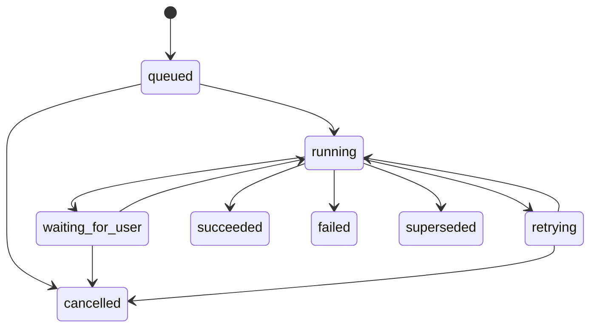

# DD-09 Workflow・Queue・Job詳細設計

## 1. 責務分担

| 要素 | 責務 |
|---|---|
| HTTP Worker | command受付、validation、Job作成、Workflow開始、即時応答 |
| D1 `jobs` | ユーザーに見せる状態・進捗・errorの正本 |
| Cloudflare Workflow | 多段処理、retry、wait、再開 |
| Queue | outbox配送、embedding、cache更新等の短い派生処理 |
| D1 `outbox_events` | 正本commitとat-least-once配送の橋渡し |

Workflow instanceの状態をAPIへ直接返さない。Jobへprojectionし、`GET /jobs/{id}`はD1だけを読む。

## 2. Job共通状態



- `waiting_for_user`は失敗ではなくユーザー入力待ち
- retry可能な一時errorだけ`retrying`とし、`next_attempt_at`を持つ
- `failed`からのretryは新`job_attempt`を作り同じJobを`queued`へ戻す
- `attempt_number`はJob全体で一意な監査用連番とし、最大attemptの判定は`job_id + step_name`単位で行う。前段stepの失敗回数を後段stepへ持ち越さない
- Workflow instance IDはoutbox event IDから導出する。同じeventの重複配送は同一instanceへ収束し、手動retryで作る新eventは新しいinstanceとして実行する
- succeeded/cancelledはterminal
- account deletionは開始後cancel不可

## 3. Step共通契約

```typescript
interface WorkflowStep<I, O> {
  name: string;
  inputSchemaVersion: string;
  execute(context: StepContext, input: I): Promise<O>;
}

interface StepContext {
  jobId: string;
  attemptNumber: number;
  correlationId: string;
  checkpoint: unknown;
  heartbeat(progress: JobProgress): Promise<void>;
  isCancelled(): Promise<boolean>;
}
```

各stepは次を満たす。

- input IDからD1正本を再読込し、payloadに大きな本文を持ち回らない
- output保存は一意な`jobId + stepName + inputHash`で冪等化する
- 外部call前後にcheckpointする
- provider request IDは`model_run_metadata`へ保存する
- stale input generationなら成功扱いno-opとし、新世代を上書きしない
- user-visible progressは最大30秒ごと、またはstep完了時に更新する

## 4. CharacterAnalysisWorkflow

### 4.1 起動

`POST /entries/{entryId}/character-understanding-runs`はentryを`submitted`へ遷移し、Jobと`CharacterAnalysisRequested` outbox eventを同一Unit of Workで作る。DispatcherがWorkflowを一度だけ開始する。`POST /entries/{entryId}/analysis-runs`は、確認済みunderstanding snapshotがあるentryの嗜好解析だけを再実行する入口とする。

### 4.2 Step

| # | step | 入力 | 保存結果 | retry |
|---:|---|---|---|---|
| 1 | `admitCapacity` | user、usage、entry | admission decision | 不可。拒否はqueued維持または429 |
| 2 | `freezeInput` | entry revision | source set version、input hash | 可 |
| 3 | `extractSources` | source revisions | fragments/extraction status | file種別により可 |
| 4 | `retrieveContext` | frozen set、scope | selected fragment IDs | 可 |
| 5 | `understandBase` | existing/base representation | base understanding candidate | provider error可 |
| 6 | `understandTarget` | target representation | target candidate | provider error可 |
| 7 | `extractCustomizationDelta` | base/target candidate | delta candidate | customのみ、provider error可 |
| 8 | `validateUnderstanding` | structured candidate | validation report、snapshot | repair上限内可 |
| 9 | `awaitUnderstandingReview` | snapshot | `waiting_for_user` | user commandまでwait |
| 10 | `analyzePreference` | confirmed snapshot、user理由 | preference candidate | provider error可 |
| 11 | `validatePreference` | candidate | assertions/evidence | repair上限内可 |
| 12 | `awaitPreferenceReview` | assertions | `waiting_for_user` | user commandまでwait |
| 13 | `activateEntry` | confirmed results | entry active、events | conflictは再読込 |
| 14 | `rebuildProfile` | owner evidence set | ProfileProjection | 可 |
| 15 | `scheduleDerivedStores` | profile generation | graph/vector outbox | 可 |

既成カスタムはstep 5と6を省略しない。まずbase characterの基本像を抽出し、その後targetとの差分を抽出する。ユーザーがbaseを指定していても、base source不足を暗黙の一般知識だけで埋めず`provisional`として表示する。

### 4.3 Review再開

review endpointはreview/correctionと`WorkflowResumeRequested` eventを同じtransactionで保存する。Workflowは再開時にreview世代と対象snapshot hashを照合する。古い画面からのreviewは409にする。

## 5. ProfileRebuildWorkflow

入力は`ownerUserId + requestedEvidenceGeneration`。

1. active entryとconfirmed/current assertionをsnapshot readする。
2. correction、archive、supersededを反映してevidence set hashを作る。
3. DD-11の決定論的集計を実行する。
4. ProfileProjectionを`building`でinsertする。
5. dimension/patternをbatch insertする。
6. hashを再確認し、旧currentをsuperseded、新projectionをcurrentへ同じUoWで切り替える。
7. GraphProjection rebuild eventを発行する。

同一userへの要求は最新generationへcoalesceする。途中で新しいevidence generationが来た場合、現在runは完了させてもcurrentへ切り替えず次runへ進む。

## 6. GraphRebuildWorkflow

1. current ProfileProjectionと関連entry/character/attributeを読む。
2. node/edgeを決定論的に構築する。
3. schema検証、dangling edge検査、件数上限を検査する。
4. D1へ世代別に保存する。
5. 大きい場合だけgzip JSONをR2へ保存する。
6. current pointerを切り替える。

上限超過時は上位dimensionと強いedgeを残したsummary projectionを作り、`meta.truncated=true`を返す。

## 7. GenerationWorkflow

| # | step | 結果 |
|---:|---|---|
| 1 | `freezeProfile` | immutable ProfileSnapshot |
| 2 | `composeBrief` | 選択、非要件、禁止事項を含むGenerationBrief |
| 3 | `validateBrief` | 矛盾・空条件・隠れた道徳補正の検査 |
| 4 | `generateCharacter` | schema準拠候補 |
| 5 | `validateCharacter` | 完全性、brief充足、理由なき改心等を検査 |
| 6 | `checkSimilarity` | name/surface/semantic/combination score |
| 7 | `repairOrRegenerate` | 最大2回。blockなら特徴組合せを変更 |
| 8 | `persistRevision` | generated revision、basis links |
| 9 | `complete` | request/character/jobをterminalへ |

部分修正は同じrequestの新Workflowで行い、parent revisionと修正対象JSON Pointerを固定する。対象外fieldはhash一致を検証する。

## 8. ExportWorkflow

1. export開始時点のuser revisionを記録する。
2. domain別にcursor pageで読み出す。
3. JSON Linesとmanifestを作成しR2へstreamする。
4. file一覧、件数、hash、schema versionをmanifestへ記録する。
5. 24時間有効のdownload情報をJob resultへ保存する。

access key digest、session digest、CSRF digest、内部rate-limit、provider secret、他ユーザーの公開catalog recordはexportしない。

## 9. DeletionWorkflow

account削除要求と同時にuserを`deleting`へし、全sessionを失効する。

| step | 冪等確認 |
|---|---|
| cancelJobs | deletion以外のnonterminal jobが0 |
| deleteVectors | owner filterで0件、またはindex世代ごとの削除完了marker |
| deleteR2 | prefix一覧が0件 |
| deleteDerivedD1 | graph/profile/generationの対象件数0 |
| deleteSourceAndAnalysis | source/assertion/entryの対象件数0 |
| deleteAuth | session/credential/consent/user、user scopeのidempotency recordを削除 |
| purgeAuditPayload | 識別可能payloadを削除 |
| complete | 非識別のoperation resultのみ記録 |

少なくとも一つ失敗したらretryし、userをactiveへ戻さない。削除jobのstatus APIは削除用one-time tokenでのみ参照可能にする。最終stepで削除jobのownerをNULLにし、対象user IDを削除operation IDへscrubしてからuser rowを削除する。

## 10. Retry policy

| error | 最大attempt | backoff | 備考 |
|---|---:|---|---|
| LLM 429/5xx/timeout | 4 | 10s, 30s, 2m, 10m + jitter | `Retry-After`優先 |
| R2/Vectorize一時error | 5 | 5s〜15m exponential | 派生処理はdead letter後再構築可 |
| D1 busy/transient | 3 | 1s, 3s, 10s + jitter | transaction全体を再実行 |
| schema invalid | repair 2 | 即時 | 以後non-retryable |
| auth/owner mismatch | 0 | なし | security event |
| capacity deferred | 制限なし | 次の日次windowまたはoperator解除 | attemptとして数えない |

同じprovider responseへのschema repairはtemperature 0相当、invalid JSONとvalidation errorだけを入力にする。機密原文をerror logへ含めない。

## 11. Queue・Outbox dispatcher

DispatcherはcronまたはQueue producerから次を行う。

1. `pending/deferred_capacity`かつ`available_at <= now`を最大50件leaseする。
2. `publishing`、lease 2分へ更新する。
3. eventをQueueへ送る、またはWorkflowを開始する。
4. 成功後publishedにする。

lease期限切れは再取得可能。Queue consumerは`deduplication_key`で処理済みを確認する。message ACK前に派生結果と処理markerをcommitする。

DLQ相当は`outbox_events.status=dead`とし、payload hash、error code、attemptだけを監視対象にする。operator再送は新eventを作らず、同じeventをpendingへ戻してauditを残す。

## 12. Cancellation・timeout

- userがcancelできるのはqueued、waiting_for_user、retrying
- running中のcancelは`cancel_requested_at`相当をcheckpointで確認し、安全なstep境界でcancelledへする
- 外部callのclient timeoutは60秒、Workflow step timeoutは5分を初期値とする
- Job全体は解析24時間、生成24時間、export24時間、削除7日で運用alertを出す
- timeout後もprovider側で処理された可能性があるため、同じidempotency key/provider request IDを使う

## 13. API progress

`GET /jobs/{jobId}`は次を返す。

```json
{
  "data": {
    "id": "job_uuid",
    "type": "character_analysis",
    "status": "waiting_for_user",
    "progress": { "current": 8, "total": 15, "step": "awaitUnderstandingReview" },
    "retryable": false,
    "error": null,
    "result": { "entryId": "entry_uuid", "reviewTargetId": "snapshot_uuid" },
    "updatedAt": "2026-08-29T12:34:56.000Z"
  },
  "meta": { "requestId": "request_uuid" }
}
```

poll intervalは2秒開始、最大10秒のexponential backoffとする。page非表示中は停止し、再表示時に即時取得する。
