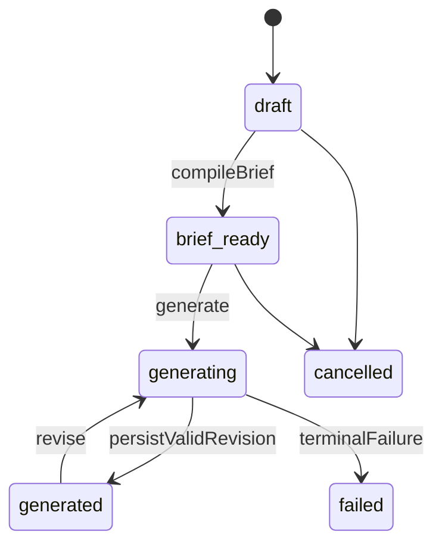

# DD-13 オリジナルキャラクター生成詳細設計

## 1. 原則

- 生成入力はcurrent profileへの可変参照ではなくProfileSnapshotで固定する
- ユーザーが選んだ嗜好だけを要件へし、profileの全項目を詰め込まない
- 好きな属性、苦手な属性、条件、response channel、value stanceを別fieldで扱う
- evil/immoral/indifferent to good、無改心、ヴィランの勝利等を有効な生成条件とする
- hidden goodness、悲劇的弁明、改心、贖罪、敗北、処罰を既定値として追加しない
- 既存characterの表面的コピーではなく、抽象化した嗜好要素を新しい組合せと文脈で実現する
- 生成結果をprofileへ自動還流しない

## 2. 生成mode

| mode | 必須/選択嗜好の扱い | 探索性 |
|---|---|---|
| `faithful` | required/includeを強く満たし、弱い項目も可能な限り維持 | 低 |
| `balanced` | requiredを満たし、includeを組合せ、少数の新要素を加える | 中 |
| `exploratory` | required/prohibitを守りつつexplore・意外な組合せを重視 | 高 |

modeはvalue policyを変更しない。`exploratory`だから悪嗜好を善へ反転させることはない。

## 3. 画面入力からRequestへの写像

| UI入力 | 保存先 |
|---|---|
| 作成目的 | `generation_requests.user_constraints_json.purpose` |
| 世界観・genre・役割・tone | `creativeContext` |
| profile項目の採否 | `generation_request_preferences.treatment` |
| 項目ごとの補足 | `override_text` |
| 必須・禁止要素 | `constraints.required/prohibited` |
| content境界 | `constraints.contentBoundaries` |
| 改心・隠れた善性の内部既定 | `valuePolicy`。利用者入力にはせず`not_required`へ固定 |
| 自由指示 | `constraints.freeInstruction` |

treatmentの意味:

| treatment | 意味 |
|---|---|
| required | 出力に明示的に現れなければvalidation失敗 |
| include | 主要要素として入れる |
| weak_include | 他条件と衝突しない範囲で入れる |
| explore | 変奏・意外な組合せを許す |
| omit | 要件へ使わない。禁止ではない |
| prohibit | 出力に入れない |

同じ項目をrequired/prohibitにしない。broader/narrower属性の衝突はbrief compile時に警告し、ユーザーの明示overrideなしで勝手に片方を選ばない。

## 4. ProfileSnapshot

生成画面開始時またはユーザーの「この内容で固定」で作成する。

```typescript
interface GenerationProfileSnapshotItem {
  id: string;
  type: "dimension" | "pattern" | "value_stance" | "negative_preference" | "condition";
  stableKey: string;
  label: string;
  positiveScore?: number;
  negativeScore?: number;
  confidence: number;
  responseChannel?: string;
  condition: object;
  evidenceSummary: { identityCount: number; workCount: number; evidenceCount: number };
}
```

snapshot後にprofileが変わっても、request上部に「生成条件はprofile世代N」と表示し、自動更新しない。ユーザーが最新profileへ切替える場合は新requestを作る。

選択UIでは同じ`itemType + stableKey`の項目を1行へまとめ、response channelと条件範囲を併記する。行のtreatmentは、その行に含まれる全`profileSnapshotItemId`へ展開してrequestへ保存する。表示をまとめても、不変snapshot itemと生成時のprovenanceは失わない。

## 5. GenerationBrief compile

正式契約は[GenerationBrief Schema](schemas/generation-brief.schema.json)とする。compile自体は決定論的application serviceで行い、LLMを必須にしない。

1. requestがownerのProfileSnapshotを参照するか確認する。
2. selection itemがsnapshotに存在するか確認する。
3. score/confidenceを表示根拠として写し、生成weightはtreatmentから決める。
4. value stanceを`valuePolicy.requiredStances`へ分離する。
5. negative preference/prohibitをconstraintsへ写す。
6. mode、creative context、user instructionを統合する。
7. non-requirementsを必ず追加する。
8. schema/semantic validation後、content hash付き不変revisionとして保存する。

treatment weight初期値:

```text
required=1.00, include=0.80, weak_include=0.45,
explore=0.55, omit=0.00, prohibit=1.00（負のconstraint強度）
```

profile scoreを掛けて要件を弱めない。ユーザー選択が最優先である。score/confidenceはrationaleと曖昧さ制御に使う。

## 6. Non-requirements

Briefには最低限、次の非要件を明示する。

```text
- characterを道徳的に善くする必要はない
- hidden goodness、悲劇的正当化、共感可能な過去を追加する必要はない
- 改心、贖罪、敗北、処罰を追加する必要はない
- heroや中心人物にする必要はなく、villain、脇役、端役、一場面限定も有効である
- 全嗜好属性を一人へ詰め込む必要はない
- ユーザーのfiction preferenceを現実の人格・行動へ関連づける必要はない
```

`valuePolicy`でprohibitedになったものは「不要」ではなく明確な禁止条件として扱う。

## 7. 生成出力

正式契約は[GeneratedCharacter Schema](schemas/generated-character.schema.json)とする。出力は説明文だけでなく次の構造を持つ。

- identity/concept/origin
- appearance
- personality
- values and morality
- motivations
- abilities and limits
- relationships
- speech
- narrative role
- character arc
- brief coverage
- uncertainties

`valuesAndMorality`にはorientation、redemption、hidden goodness、consequencesを独立fieldで必須化する。これによりProviderが暗黙に「実は優しい」「最後に改心」を追加した場合に機械検出できる。

## 8. Semantic validation

JSON Schema後に次を検査する。

| code | 条件 | 処理 |
|---|---|---|
| `REQUIRED_NOT_COVERED` | required itemのcoverageがsatisfiedでない | repair |
| `PROHIBITED_PRESENT` | prohibit itemがoutputに現れる | repair |
| `VALUE_POLICY_VIOLATION` | redemption等の方針違反 | repair |
| `UNREQUESTED_MORAL_CORRECTION` | 根拠なくhidden goodness/贖罪/処罰が追加 | repair |
| `OUT_OF_SCOPE_REVISION` | 部分修正で対象外fieldが変更 | reject |
| `POINTER_INVALID` | coverage/basis pointerが存在しない | repair |
| `EXCESSIVE_SIMILARITY` | 類似検査block | regenerate |

「作中で行為の結果が描かれること」と「罰を必ず受けさせること」を同一視しない。briefが`punishmentOrDefeat=prohibited`でも、物語上の因果や他者の反応を描くこと自体は禁止しない。

## 9. 類似検査

目的は既存characterの名前・外見・設定・特徴組合せの過度な再現を避けることであり、法的な非侵害保証ではない。

### 9.1 比較対象

- userが今回参照したCharacterIdentity/Representation
- ProfileSnapshotの根拠となったcharacter
- system catalog内の候補
- userが「似せない対象」として追加したcharacter

private characterを他userの生成比較へ利用しない。

### 9.2 Score

| check | review | block |
|---|---:|---:|
| normalized name/phonetic | 0.85以上 | 0.92以上、または完全一致 |
| segment semantic cosine | 0.82以上 | 0.90以上 |
| top trait weighted Jaccard | 0.65以上 | 0.80以上 |
| combination score | 0.76以上 | 0.86以上 |

```text
combination = 0.35 × semantic
            + 0.25 × traitJaccard
            + 0.20 × roleAndMotivationOverlap
            + 0.10 × appearanceOverlap
            + 0.10 × speechOverlap
```

一つの抽象属性、たとえばvillain、冷淡、赤い服だけでblockしない。固有名、珍しい特徴の組合せ、詳細な関係・過去の一致を重視する。

### 9.3 Regenerate

block時は一致候補の本文をProviderへ丸ごと渡さず、衝突したfeature groupだけを伝える。required preferenceを捨てず、表現、世界観、動機、関係、造形の組合せを変更する。2回で解消しなければ候補と警告をユーザーreviewへ出す。

## 10. Basis link

生成後、`briefCoverage`を検証して`generation_basis_links`へ保存する。

```typescript
interface GenerationBasisLink {
  profileSnapshotItemId: string;
  outputJsonPointer: string;
  useType: "realized" | "combined" | "contrasted" | "avoided" | "explored";
  explanation: string;
}
```

このlinkにより「どの嗜好がどこへ反映されたか」を画面表示する。LLMの説明をそのまま信用せず、pointer存在、selection一致、禁止条件をapplicationで検査する。

## 11. 部分修正

revision request:

```typescript
interface CharacterRevisionCommand {
  parentRevisionId: string;
  scope: "full" | "identity" | "appearance" | "personality" | "values" |
         "relationships" | "speech" | "story_role" | "other";
  targetPointers: string[];
  instruction: string;
  preservePointers: string[];
}
```

- parent JSON全体を保存し、修正後は新revisionにする
- `targetPointers`外はcanonical JSON hashが一致しなければ失敗
- valuesの修正時もvaluePolicy/non-requirementsを再適用
- 類似検査を毎revisionで再実行
- previous revisionを削除せず比較・復元可能にする
- 復元も過去rowをactiveにせず、同内容の新revisionを作る

## 12. Feedback

画面では総合評価と具体属性評価を分ける。

| 入力 | Profileへの扱い |
|---|---|
| 総合1〜5 | 生成品質評価。嗜好根拠にしない |
| 自由comment | 保存するが自動集計しない |
| 属性ごとのpositive/negative/mixed | 嗜好candidateにできる |
| 「嗜好候補として反映」 | 明示ONの属性だけcandidate作成 |

candidateは`explicitness=user_explicit`、evidence origin=`user_input`とするが、元ProfileSnapshotの自己増幅を避けるため`generated_feedback` flagを付ける。同じ生成系列から同じdimensionへ複数評価してもentry内同様に最大1 groupとして補正する。

feedback取消では作成assertionをsupersedeし、ProfileRebuildを起動する。

## 13. 生成状態遷移



GeneratedCharacterは`generated → accepted`または`needs_revision → generating`を持つ。GenerationRequestとGeneratedCharacterを同じstatusとして扱わない。

## 14. Idempotency

- create request: user + Idempotency-Key
- compile brief: request ID + request revision + selection hash
- generate: request ID + brief content hash
- revise: character ID + parent revision ID + command hash
- feedback: character revision ID + Idempotency-Key

同じgenerate commandは同じJob/GeneratedCharacterを返す。再試行で別candidateを欲しい場合は「別案を生成」commandとして新Idempotency-Keyとvariant numberを作る。

## 15. 失敗時UX

- Provider一時障害: retry時刻と入力が保存済みであることを表示
- schema failure: 生成失敗。raw provider outputは表示せず、briefは編集可能
- value policy violation: 「指定条件を満たせなかった」とし、ユーザー嗜好を問題扱いしない
- similarity review: 類似したfeature groupを示し、再生成またはユーザー編集を選べる
- capacity停止: brief作成・編集・snapshot保存は許可し、LLM生成だけ保留

## 16. 受入条件

- 同じProfileSnapshot/Brief/Provider replayで同じvalidation結果になる
- required/prohibit、value policy違反をfixtureで検出できる
- pure evil、善への無関心、無改心、villain victory、minor roleを理由なく善化・中心化しない
- 既存characterの固有の特徴組合せがblock thresholdを超えた場合に再生成する
- 部分修正で対象外fieldが変わらない
- 生成だけではProfileProjection generationが変わらない
- 明示feedbackの指定属性だけがProfile再集計候補になる
