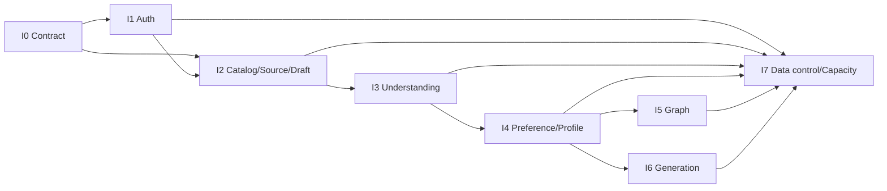

# DD-16 実装計画・トレーサビリティ

## 1. 実装方針

既存アプリケーション資産を流用せず、機械可読契約とdomain ruleから新規実装する。縦方向の機能を小さく完成させ、未完成のLLM/Cloudflare Adapterは同じPortのfake/replayで置き換える。

各incrementは次を同時に含める。

- domain/use case
- Repository/Adapter/migration
- HTTP/OpenAPI DTO
- UI/validation/accessibility
- unit/contract/integration/E2E
- metric/log/capacity rule
- export/deletionへの追随

## 2. 実装前に固定するdecision

| ADR | 決定対象 | 初期既定 | 決定期限 |
|---|---|---|---|
| ADR-001 | LLM主系model/fallback/retention | OpenAI Adapterは必須、Workers AI Adapterは選択可能、modelと主系は固定評価で選定 | LLM integration開始前 |
| ADR-002 | Embedding model/dimension | 384次元を容量試算値、model未選定 | Vectorize index作成前 |
| ADR-003 | R2 upload | presigned direct upload＋finalize HEAD検証 | Source実装開始前 |
| ADR-004 | PDF extraction | Browser PDF.js、OCRなし。外部Strategyは無効 | Source実装開始前 |
| ADR-005 | package version | 実装開始日のstableをlockfile固定 | scaffold時 |
| ADR-006 | test/production Cloudflare account分離 | 無料枠共有量を確認して決定 | preview作成前 |
| ADR-007 | backup保存先・暗号鍵・保持 | 週次encrypted export、30日 | production data投入前 |

未選定項目をdomain codeへ仮model名でhard-codeしない。

## 3. 実装increment

### I0 Contract・基盤

成果物:

- workspace、TypeScript、React/Vite、Hono、test/lint/format
- OpenAPI/JSON Schemaからのtype生成または整合CI
- error envelope、request ID、logger、Clock/IdGenerator
- D1 migration runner、Repository contract harness
- local/preview/production構成、secret validation
- `FreeValidationCapacityPolicy` skeleton

完了条件:

- 全schema/DDL/OpenAPIをCIでparseできる
- local Worker healthとempty SPAを起動できる
- fake Adapterとlocal D1 Adapterのcontract test基盤が動く

### I1 認証・account

成果物:

- public user list、create/activate/login/session/logout/key rotation
- Turnstile、Origin/CSRF、rate limit
- current auth方式の暗号入力回帰test
- settings shell、export/deletion Job skeleton

完了条件:

- UC-01/02/12のE2Eが成功
- access key/session平文が永続化・logされない
- 全private APIへowner auth middlewareを適用できる

### I2 Catalog・Source・draft

成果物:

- Work、CharacterIdentity、Representation
- R2 upload/finalize、inline text、Browser PDF extraction
- SourceDocument/Revision/Fragment/Set
- 3方式のwizardとdraft autosave
- attribute ontology v1.0 seed

完了条件:

- existing/custom/originalをdraft/submitできる
- custom base cycle/depth、source version固定を検証
- source原文/hash/locatorと削除経路が一致

### I3 キャラクター理解

成果物:

- CharacterAnalysisWorkflow前半
- RAG、CharacterUnderstanding Provider、schema/semantic validator
- `OpenAiLlmProvider`、`WorkersAiLlmProvider`、Provider factory/router、direct/AI Gateway transport
- base understanding、target understanding、CustomizationDelta
- 基本像・差分review/correction UI
- LLM replay fixture

完了条件:

- 既成は基本像が嗜好解析より先に作られる
- customはbase/target/deltaを別々に確認できる
- source不足はprovisional、unknownを捏造しない
- `LLM_PROVIDER`の変更だけでOpenAI/Workers AI/replay/fakeを切り替え、同一contract testを通過する
- local手動開発でWorkers AIが既定選択され、AI bindingだけremote、自動テストはreplay/fakeに固定される

### I4 嗜好解析・Profile

成果物:

- PreferenceAnalysis、ValueStance、review/correction
- ontology mapping/free term
- profile/v1.0.0決定論的集計
- ProfileProjection/Snapshot/history/evidence UI
- ProfileRebuildWorkflow

完了条件:

- positive/negative、channel、condition、stanceが別々に表示される
- user correctionが再解析で上書きされない
- moral valenceを変えてもscoreが変わらないtestが通る
- critical villain/evil evalが全gateを通る

### I5 Graph

成果物:

- GraphProjection mapper/API/page/cache
- Web Worker protocol、Graphology、ForceAtlas2、Sigma.js
- filter、neighbor、path、detail縮退
- table/list fallback、IndexedDB purge

完了条件:

- standard 1,000 node/5,000 edgeの性能目標
- dangling edge/page世代不一致を拒否
- keyboard/a11yとlist fallbackが利用可能

### I6 Original generation

成果物:

- GenerationRequest/ProfileSnapshot selection
- brief compiler/value policy/non-requirements
- generation/revision Provider、semantic validator
- similarity check、basis link、feedback opt-in
- GenerationWorkflow/UI

完了条件:

- required/prohibit/value policyが機械検証される
- evil/no-redemption/minor role critical fixtureを善化・中心化しない
- 部分修正で対象外field hash一致
- 生成だけではprofileが変わらない

### I7 Data control・capacity・公開gate

成果物:

- complete export、DeletionWorkflow、R2/Vector/browser purge
- usage ingestion、70/85/90%制御、reservation、capacity UI
- backup/restore/rebuild scripts
- observability/alert/runbook
- full security/a11y/performance/LLM eval

完了条件:

- UC-11と全capacity縮退E2E
- preview restore rehearsalがRPO/RTO目標内
- DD-15 release gateを全て通過
- Cloudflare公式上限を再確認し、費用設定をoperatorが承認

## 4. Dependency



I5とI6はI4完了後に並行可能。account deletionのskeletonはI1から存在させ、各incrementが自分のresource削除handlerを追加する。

## 5. Use case traceability

| UC | 画面 | API | 主table | Workflow | 主test |
|---|---|---|---|---|---|
| UC-01 create/activate | SCR-01/02 | `POST /users`, `/activate` | users, credentials, consents | - | auth E2E、crypto vector |
| UC-02 login | SCR-00 | `GET /users`, `POST /sessions`, `GET /me` | users, sessions | - | enumeration、cookie、CSRF |
| UC-03 existing解析 | SCR-10〜15 | entries、understanding、analysis | entries, sources, understanding, preferences | CharacterAnalysis | existing E2E/eval |
| UC-04 custom解析 | SCR-10〜15 | 同上＋delta review | representations, deltas | CharacterAnalysis | 全delta operation |
| UC-05 original解析 | SCR-10〜15 | 同上 | identity/representation/entry | CharacterAnalysis | original E2E |
| UC-06 訂正 | SCR-15/21 | snapshot/assertion review | reviews, corrections | resume/ProfileRebuild | stale review、supersede |
| UC-07 Profile | SCR-20〜24 | `/profile*` | profile_* | ProfileRebuild | score golden/evidence |
| UC-08 Graph | SCR-25 | `/profile/graph*` | graph_projection_* | GraphRebuild | worker/performance/a11y |
| UC-09 generate | SCR-30/31 | generation request/generate | generation_* | Generation | brief/value policy/eval |
| UC-10 revision/feedback | SCR-31 | revisions/feedback | generated revisions, feedback | Generation/ProfileRebuild | pointer保全/opt-in |
| UC-11 export/delete | SCR-41/42 | `/account/exports`, `DELETE /account` | 全owner table | Export/Deletion | 全store deletion |
| UC-12 key rotation | SCR-40 | `/account/key-rotation` | credentials, sessions | - | session全失効 |

## 6. Screen traceability

| Screen | 主component | query/command | UI stateの要点 |
|---|---|---|---|
| SCR-00 Login | `LoginPage` | users/session | Turnstile、generic auth error |
| SCR-01 Register | `RegisterPage` | create user | username/consent/idempotency |
| SCR-02 Key | `AccessKeyPage` | activate | 一度だけ表示、保存確認 |
| SCR-10 Entry list | `EntryListPage` | list/delete | status、cursor、job link |
| SCR-11 Type | `RegistrationTypeStep` | draft create | 3方式 |
| SCR-12 Target | `CharacterTargetStep` | draft patch | base/scope/custom/original |
| SCR-13 Sources | `SourceStep` | source upload/finalize | hash、抽出、権利根拠 |
| SCR-14 Preference input | `PreferenceInputStep` | draft patch/submit | 好き/苦手/channel/context |
| SCR-15 Review | `AnalysisReviewPage` | reviews/jobs | understandingとpreference分離 |
| SCR-20 Profile | `ProfileOverview` | profile | score≠確率、data quality |
| SCR-21 Dimensions | `DimensionList` | dimensions/evidence | positive/negative/condition |
| SCR-22 Patterns | `PatternList` | patterns | 因果でない表示 |
| SCR-23 Value stance | `ValueStanceList` | profile | stance/orientation分離 |
| SCR-24 History | `ProfileHistory` | history | generation差分 |
| SCR-25 Graph | `PreferenceGraph` | graph/neighbors | Worker/Sigma/list fallback |
| SCR-30 Generation | `GenerationWizard` | snapshot/request/brief | selection/value policy |
| SCR-31 Result | `GeneratedCharacterPage` | character/revision/feedback | basis/similarity/部分修正 |
| SCR-40 Settings | `SettingsPage` | me/key | session/key |
| SCR-41 Export | `ExportPage` | export/job | expiry/download |
| SCR-42 Delete | `DeleteAccountPage` | account/job | 即session失効 |
| SCR-43 Job | `JobPage` | job/retry | polling/retry/wait review |

## 7. Data ownership traceability

| Data | 正本 | 派生/補助 | Export | Account deletion |
|---|---|---|---|---|
| auth | D1 | cookie | user/status/consent、digest除外 | credential/session/user削除 |
| source | D1 metadata＋R2 original | fragments/vector | metadata＋許可本文/原本 | R2/vector/D1 |
| entry | D1 revision | UI cache | 全revision | D1/cache |
| understanding/preference | D1 | assertion vector | snapshot/evidence/review | D1/vector |
| profile | D1 projection/snapshot | graph cache | 全世代＋algorithm | D1/R2 graph/cache |
| generated character | D1、大artifact R2 | similarity vector | 全revision/basis/feedback | D1/R2/vector |
| workflow | D1 Job | Workflow state/Queue | user-visible job summary | instance/queue/D1 |

`audit_events`はsecurity最小情報だけexport対象外とし、account削除時に識別可能fieldを削除する。

## 8. Basic design requirement traceability

| 要求/原則 | 詳細設計 |
|---|---|
| 3方式登録 | DD-02 §6、DD-05 §5、DD-09 §4 |
| 既成の基本像を先にLLM抽出 | DD-09 §4、DD-10 §7 |
| customのbaseと差分 | DD-05 §8、DD-10 §7.2 |
| 累積Profile | DD-11 §§5〜16 |
| Profileからoriginal生成 | DD-13 |
| villain/端役も第一級 | DD-10 §§4,7、DD-11 §2、DD-13 §6 |
| 悪・非道徳・善への無関心を肯定的に保持 | DD-05、DD-10、DD-11、DD-13、DD-15 |
| ユーザー訂正優先 | DD-05 §11、DD-09 §4.3、DD-11 §5 |
| 自由語＋統制語彙 | DD-11 §§1〜3 |
| D1交換可能 | DD-01、DD-07 |
| Browser graph | DD-12 |
| Cloudflare Free少人数 | DD-14 |
| 現行auth方式踏襲 | DD-04 |
| export/delete | DD-03、DD-09 §§8〜9、DD-14 |

## 9. Code/module mapping

```text
src/
├─ app/
├─ features/
├─ shared/
└─ workers/graph.worker.ts

worker/
├─ entrypoints/
├─ presentation/http/
├─ application/
│  ├─ commands/
│  ├─ queries/
│  ├─ ports/
│  └─ dto/
├─ domain/
│  ├─ identity-access/
│  ├─ character/
│  ├─ preference/
│  ├─ profile/
│  └─ generation/
├─ infrastructure/
│  ├─ d1/
│  ├─ r2/
│  ├─ vectorize/
│  ├─ llm/
│  ├─ turnstile/
│  └─ capacity/
└─ schemas/

contracts/
├─ openapi/
├─ json-schema/
└─ events/
```

domain間の直接importは各moduleの公開interface/value objectだけにし、infrastructure同士を呼び合わせない。

## 10. Migration order

初期`001_initial.sql`は空DBへ一括適用する。以後:

```text
002_seed_ontology_v1
003_... expand columns/tables
004_... backfill marker/job
005_... read switch
006_... contract old columns
```

ontology seedはmigration transaction内でversion/content hashを検証する。属性追加は既存versionを書き換えず新schema versionを作る。

## 11. Pull request単位

一つのPRは原則一つのvertical sliceまたは一つのmigration段階にする。PR descriptionに次を必須とする。

- 対応UC/SCR/API/DD section
- schema/migrationの互換性
- security/privacy/内面の自由への影響
- capacity見積り
- test結果とfixture変更
- rollback/disable方法

LLM prompt/model、Profile係数、value policy、削除範囲の変更は通常code変更より強いreview対象とする。

## 12. Definition of Ready

- 対応する詳細設計と機械可読schemaが存在する
- 未決定ADRが実装を左右しない、または承認済み
- owner/認可、idempotency、state transitionが明記されている
- data retention/export/deletionが決まっている
- expected capacity costと縮退が決まっている
- happy path、failure、critical villain/value fixtureが用意されている

## 13. Definition of Done

- code、migration、OpenAPI/schema、文書が同じPRで一致
- unit/contract/integration/component/E2Eの該当testが通る
- owner isolation、CSRF、idempotency、revision競合を検証
- log/metricにprivate payloadがない
- export manifestとDeletionWorkflowに新dataが追随
- capacity counter/reservationへ新operationが追随
- accessibilityのkeyboard/error状態を確認
- LLM/profile/generation変更はDD-15 eval gate通過
- preview deployとrollback smokeが成功

## 14. Release checklist

- [ ] Cloudflare Freeの公式上限と課金設定を再確認
- [ ] active user/DAU/concurrency仮定をpreview実測で更新
- [ ] D1 query plan、rows read/write、single DB sizeを確認
- [ ] R2 lifecycle、orphan、Vector dimensionを確認
- [ ] Workflow steps、Queue operations、Outbox replayを確認
- [ ] external Providerのdata retention/費用/secretを承認
- [ ] critical LLM/generation fixtureにregressionなし
- [ ] auth方式の現行回帰vectorが一致
- [ ] export/deletion/restore rehearsal成功
- [ ] WCAG/security/performance gate成功
- [ ] warning/conservation/restricted/回復を演習
- [ ] paid planへの自動切替えが存在しない
