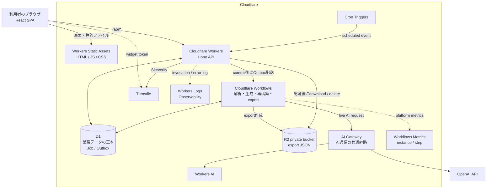
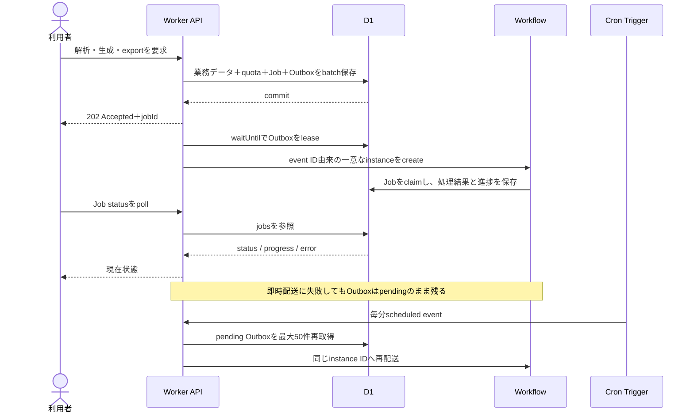
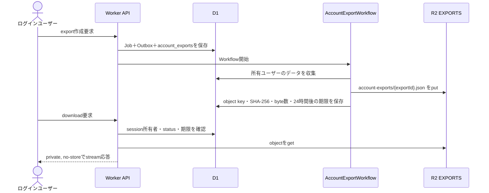
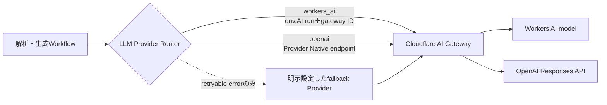

# DD-19 Cloudflareサービス利用ガイド

- 対象システム: キャラ嗜好ラボ（`character_taste_analyzer`）
- 調査基準日: 2026-09-03
- 基準: 現行の実装、`wrangler.jsonc`、baseline DDL
- 想定読者: 開発者、運用担当者、システム説明を受けるステークホルダー

## 1. この資料の読み方

本システムは、React SPAとHono APIを1つのCloudflare Workersアプリとして配信し、D1をデータの正本、Workflowsを非同期処理の実行手段、R2をアカウントエクスポートの一時保管先として使用する。キャラクター解析・生成で使うAI呼出しはAI Gatewayへ集約し、環境ごとにWorkers AIまたはOpenAIを選択する。

ここで「利用している」とは、リポジトリの現行コードまたはWrangler構成に実際の呼出し・binding・設定が存在することを指す。Cloudflare Dashboard上の最終デプロイ、secret登録、Turnstile widget、AI Gateway policy、R2 lifecycle ruleなど、アカウント側だけに存在する状態はこのリポジトリからは確認できない。

## 2. 全体構成



ポイントは次の3点である。

1. 画面とAPIは同一のWorkersデプロイにまとまっており、別のCloudflare Pagesプロジェクトではない。
2. ユーザーへ返す業務状態はD1が正本であり、Workflow instanceやR2 objectを直接公開しない。
3. API受付、重い非同期処理、AI通信、オブジェクト保存をCloudflareの各サービスへ分担している。

## 3. 利用サービス一覧

| Cloudflareサービス／機能 | 利用状態 | システム内での役割 | 主な設定・入口 |
|---|---|---|---|
| Workers | 常時利用 | Hono API、認証、認可、入力検証、Job受付、download中継、scheduled handler | `main: worker/index.ts` |
| Workers Static Assets | 常時利用 | React SPAのHTML、JS、CSS、画像を配信 | `assets.directory: ./dist/client` |
| D1 | 必須 | 認証から解析・生成結果、Job、Outboxまでの正本 | `DB` binding |
| Workflows | 非localで必須 | キャラクター解析、生成、Profile／Graph再構築、account export | 4つのWorkflow binding |
| R2 | 非localで必須 | アカウント全データのprivate JSON exportを一時保存 | `EXPORTS` binding |
| Workers AI | 環境依存 | stagingのLLM一次Provider、productionのLLM fallback。Embedding adapterも実装 | `AI` binding |
| AI Gateway | live AI利用時に必須 | Workers AIとOpenAIへの通信経路を共通化 | Gateway ID、account ID、token |
| Turnstile | productionで必須 | ユーザー登録・ログイン時のbot対策 | browser widget＋Siteverify API |
| Cron Triggers | 常時設定 | Outbox再配送と日次クリーンアップ | 毎分、毎日03:17 UTC |
| Workers Logs / Observability | 有効 | Workerのfetch／cron invocation、error、`console.error`の収集 | `head_sampling_rate: 1` |

## 4. サービスごとの使い方

### 4.1 WorkersとWorkers Static Assets

Workersは本システムの入口である。`worker/index.ts`が公開するfetchから`worker/app.ts`のHonoアプリへ接続し、`worker/routes/`の機能別ルートが`/api/v1/*`を処理する。ユーザー登録、ログイン、キャラクター登録、レビュー、Profile／Graph参照、生成、export、アカウント削除などを提供する。

Reactのbuild成果物は同じWorkersデプロイのStatic Assetsとして配信する。

```text
assets.directory           = ./dist/client
assets.not_found_handling  = single-page-application
assets.run_worker_first    = /api/*
```

- `/api/*`は先にWorker scriptへ渡す。
- 静的ファイルに一致する画面リクエストはStatic Assetsから返す。
- React Routerの画面URLに対応する物理ファイルがなくても、SPA fallbackとして`index.html`を返す。
- API responseには`Cache-Control: no-store`を付け、静的assetと業務APIのcache方針を分離する。
- Cloudflareが付与する`CF-Ray`を優先してrequest IDに使い、`X-Request-Id`として応答する。

この構成により、フロントエンド用のPagesとAPI用のWorkersを別々に管理せず、同一origin・同一deploy単位で運用する。

### 4.2 D1

D1は「失うとシステムの業務状態を復元できない正本」である。現行baselineは46テーブルで、主に次のデータを保持する。

| 分類 | 主な内容 |
|---|---|
| 認証・保護 | user、credential digest、session、CSRF digest、rate-limit bucket |
| キャラクター | Entry、revision、作品、identity、参考source |
| 解析 | 基本像snapshot、嗜好assertion、根拠、model run metadata |
| 集計・生成 | Profile、GraphProjection、生成条件、生成キャラクター |
| 非同期制御 | quota reservation、Job、Job attempt、Outbox、再構築世代 |
| データ管理 | account exportの状態、R2 object key、hash、有効期限 |

WorkerとWorkflowは`env.DB` binding経由でprepared statementを実行する。業務データ、Job、quota reservation、Outbox eventを同じ`D1Database.batch()`へ入れることで、「入力だけ保存されて非同期処理が開始されない」状態を回復可能にしている。

セッションとrate limitもD1上のアプリケーション実装である。Cloudflare Access、KV、Cloudflare Rate Limiting bindingを使っているわけではない。

### 4.3 WorkflowsとD1 Outbox

重い処理をHTTP requestの完了まで待たせず、次の4種類のWorkflowへ渡す。

| Workflow class | binding | 実行内容 |
|---|---|---|
| `CharacterAnalysisWorkflow` | `CHARACTER_ANALYSIS_WORKFLOW` | 基本像抽出または嗜好解析 |
| `GenerationWorkflow` | `GENERATION_WORKFLOW` | Profileを基にしたオリジナルキャラクター生成 |
| `ProfileRebuildWorkflow` | `PROFILE_REBUILD_WORKFLOW` | ProfileとGraphProjectionの再構築 |
| `AccountExportWorkflow` | `ACCOUNT_EXPORT_WORKFLOW` | D1のユーザーデータ収集とR2 export作成 |

現行コードでは、各Workflow classはCloudflare Workflowの`step.do()`を1回実行し、その内側で業務処理を進める。各`step.do()`は5秒間隔で最大2回retryするため、初回を含め最大3 attempt、timeoutは10分である。ユーザー向けの進捗・成功・失敗はWorkflow APIではなくD1の`jobs`と`job_attempts`へ保存する。



Outbox dispatcherは1分のleaseを使い、同じeventの重複配送を同じWorkflow instance IDへ収束させる。配送は最大10回試み、上限に達したeventを`dead`、対応Jobを`failed`にする。この経路にCloudflare Queuesは介在しない。

### 4.4 R2

R2の用途は、アカウント全データexportのprivate JSON objectに限定される。キャラクター入力、解析結果、Profile、Graph、生成結果の正本はD1であり、R2への資料uploadやGraph保存は現行機能に含まれない。



- export schema versionは`4.0`で、1つのJSON objectとして保存する。
- object keyにはusernameやキャラクター名を含めず、UUID由来のexport IDを使う。
- R2 objectのmetadataだけを認可根拠にせず、download前にD1の`owner_user_id`を必ず照合する。
- exportは作成完了から24時間有効で、日次cleanupが期限切れobjectを削除する。
- アカウント削除時は対象ユーザーのR2 objectを削除してからD1の所有データを削除する。

### 4.5 Workers AIとAI Gateway

AI処理はProvider routerで切り替える。live ProviderはWorkers AI、OpenAIともAI Gatewayを経由し、Replay／Fakeは外部通信を行わない。



AI Gatewayを通す目的は、Providerごとに散らばるAI通信を1つの観測・利用量管理・policy適用点へまとめることである。ただし、Gateway側で実際に設定されているrate limit、保持期間、alertなどはDashboardで別途確認する必要がある。

OpenAI経路は次のように実装されている。

- `https://gateway.ai.cloudflare.com/v1/{account}/{gateway}/openai/responses`を使用する。
- Embedding adapterは同じ経路の`/openai/embeddings`を使用する。
- `OPENAI_API_KEY`に加え、AI Gateway Run権限を持つ`AI_GATEWAY_TOKEN`を送る。
- `OPENAI_FLEX_ENABLED=true`の場合だけ`service_tier: "flex"`を送り、既定の`false`では項目を省略する。
- `cf-aig-collect-log-payload: false`と`cf-aig-skip-cache: true`を指定する。
- OpenAI Responsesには`store: false`を指定する。

Workers AI経路は`AI` bindingの`env.AI.run()`へmodelとGateway IDを渡す。Workers AI側のpayload loggingやcacheの実効設定は、コードだけでなく対象Gatewayの設定も確認する必要がある。

#### 環境ごとのAI routing

| 環境 | LLM一次Provider | LLM fallback | Embedding設定 |
|---|---|---|---|
| local | OpenAI `gpt-5.6-luna` | なし | OpenAI `text-embedding-3-small`、1536次元 |
| offline | Replay `replay-v1` | なし | Fake、1536次元 |
| staging | Workers AI `@cf/openai/gpt-oss-120b` | OpenAI `gpt-5.6-sol` | Workers AI `@cf/baai/bge-m3`、1024次元 |
| production | OpenAI `gpt-5.6-sol` | Workers AI `@cf/openai/gpt-oss-120b` | OpenAI `text-embedding-3-small`、1536次元 |

現在の業務コードはLLM Providerを解析・生成から呼び出す。一方、Embedding Providerはadapter、テスト、readiness検証まで実装されているが、現行の解析・生成処理から`embed()`は呼ばれておらず、vectorも永続化していない。したがって、Embeddingモデル名が設定されていても、それだけでAI利用量が発生するわけではない。

### 4.6 Turnstile

Turnstileはユーザー登録とログインの公開フォームをbotから保護する。

1. browserが`VITE_TURNSTILE_SITE_KEY`を使ってwidgetを明示renderする。
2. widgetが発行したtokenを登録またはログインrequestへ含める。
3. Workerが`TURNSTILE_SECRET`、token、`CF-Connecting-IP`をSiteverify APIへ送る。
4. `success: true`の場合だけ登録または認証処理を続ける。

productionでは`TURNSTILE_SECRET`がない構成をreadiness errorとし、実requestも503で閉じる。previewではsecretがなければ検証を省略するため、本番相当試験ではsecretとsite keyの両方が設定されていることを別途確認する。offlineのReplay／Fake環境は明示的に検証をskipする。

Turnstileは認証そのものではない。認証はUUID access key、HMAC digest、D1 session、HttpOnly cookie、CSRF token、Origin検査で別に実装される。

### 4.7 Cron Triggers

`wrangler.jsonc`には2つのCron Triggerがあり、どちらも同じWorkerの`scheduled()` handlerを起動する。

| cron | 実行時刻 | 処理 |
|---|---|---|
| `* * * * *` | 毎分 | pending／lease切れOutboxを最大50件再配送 |
| `17 3 * * *` | 毎日03:17 UTC（日本時間12:17） | Outbox再配送に加え、日次cleanup |

日次cleanupは、期限切れR2 export、長時間pendingの仮登録ユーザー、期限切れrate-limit／idempotency record、期限切れ・失効済みsessionを整理する。Cloudflare CronはUTC基準のため、運用手順やalertにもUTCとJSTを併記する。

### 4.8 Workers LogsとObservability

`observability.enabled: true`、`head_sampling_rate: 1`を設定しているため、設定上はWorker invocationを100% head samplingする。アプリケーションは予期しないerrorを`requestId`と短いerror codeへ縮約して`console.error`へ出し、access key、session token、CSRF token、入力原文、LLM response本文を意図的に記録しない。

`CF-Ray`をrequest IDに流用するため、browserへ返した`X-Request-Id`とWorker logを調査時に結び付けやすい。WorkflowsはCloudflare Dashboardのinstance／step metricsでも確認できるが、ユーザー向け状態の正本はD1のJobである。Logpush、Analytics Engine、外部APMへのexportは現行構成にない。

## 5. 環境分離

| 環境 | Worker名／入口 | D1 | R2 | Workflows | 外部AI |
|---|---|---|---|---|---|
| local | Vite＋Cloudflare plugin | local `character-taste-lab-current-local` | local、`remote: false` | local runtime | OpenAI＋AI Gateway |
| offline | `character-taste-lab-v2-offline` | local | local、`remote: false` | offline用4本 | なし（Replay／Fake） |
| staging | `character-taste-lab-staging` | `character-taste-lab-v2-staging` | `character-taste-exports-staging` | staging用4本 | Workers AI一次、OpenAI fallback |
| production | `character-taste-analyzer` | `character-taste-lab` | `character-taste-exports-production` | production用4本 | OpenAI一次、Workers AI fallback |

stagingとproductionはD1、R2、Workflow名を分け、試験データと本番データを混在させない。Static Assets、Cron、Observabilityの基本設定はtop-level構成を各named environmentが継承する。

productionの設定上のoriginは次である。

```text
https://character-taste-analyzer.toshitaka-portfolio-account.workers.dev
```

custom domain、Cloudflare DNS zone、WAF ruleの有無はリポジトリからは確認できない。

## 6. Bindingとsecret

### 6.1 Runtime binding

| binding | 種別 | 必須条件 |
|---|---|---|
| `DB` | D1 | 常時必須 |
| `EXPORTS` | R2 | staging／productionで必須 |
| `AI` | Workers AI | `workers_ai`を一次またはfallbackに選ぶ環境で必須 |
| `CHARACTER_ANALYSIS_WORKFLOW` | Workflow | staging／productionで必須 |
| `GENERATION_WORKFLOW` | Workflow | staging／productionで必須 |
| `PROFILE_REBUILD_WORKFLOW` | Workflow | staging／productionで必須 |
| `ACCOUNT_EXPORT_WORKFLOW` | Workflow | staging／productionで必須 |

### 6.2 Variable／secret

| 名前 | 取扱い | 用途 |
|---|---|---|
| `AUTH_PEPPER` | Worker secret | access key、CSRF、rate-limit key等のHMAC |
| `OPENAI_API_KEY` | Worker secret | OpenAI Provider認証 |
| `OPENAI_FLEX_ENABLED` | Wrangler variable | `true`でFlex Processingを有効化。既定`false` |
| `AI_GATEWAY_ACCOUNT_ID` | secret相当として管理 | OpenAIのGateway URL構築 |
| `AI_GATEWAY_TOKEN` | Worker secret | AI Gateway Run認証 |
| `AI_GATEWAY_GATEWAY_ID` | Wrangler variable | 利用するGateway。現行既定値は`default` |
| `TURNSTILE_SECRET` | Worker secret | server-side Siteverify |
| `VITE_TURNSTILE_SITE_KEY` | build時の公開変数 | browser widget。secretではない |
| `APP_ORIGIN` | Wrangler variable | CSRF Origin検査と環境別origin固定 |

`.dev.vars`はbuild成果物へ残さない。build scriptは`dist`を検査し、秘密artifactが残ったbuildを失敗させる。

## 7. 利用していない、または将来境界だけがあるサービス

設計書や依存package名だけを見て誤認しやすい項目を、現行実装と分けて示す。

| サービス／機能 | 現行状態 |
|---|---|
| Cloudflare Pages | 未使用。React SPAはWorkers Static Assetsとして同じWorkerへdeployする |
| Cloudflare Queues | bindingもconsumerもない。D1 OutboxからWorkflowを直接開始する |
| Vectorize | bindingなし。Embedding vectorの永続化・検索も未実装 |
| Workers KV | bindingなし。lockfile内の`@cloudflare/kv-asset-handler`はWranglerの間接依存であり、KV利用を意味しない |
| Durable Objects | bindingなし |
| Hyperdrive | bindingなし |
| Analytics Engine | bindingなし |
| R2への参考資料upload | 未実装。R2はaccount export専用 |
| Cloudflare Rate Limiting | 専用binding／ruleはコード上なし。D1の`request_rate_limits`で実装 |
| custom domain／DNS／WAF／Access | リポジトリ外のアカウント設定であり、利用有無を断定できない |

## 8. 障害時の分担

| 障害箇所 | システムの挙動 |
|---|---|
| D1 | 正本へアクセスできないためreadinessを落とす。binding切替やmigrationを停止する |
| Workflow起動 | D1 Outboxをpendingで残し、毎分Cronが再配送する |
| AI一次Provider | retryable errorかつfallback設定済みの場合だけ別Providerへ切り替える |
| Workers AIとOpenAIの両方 | Jobをretryingまたはfailedにし、入力とD1正本は維持する |
| R2 export | export Jobを失敗させ、D1の業務データは維持する |
| Profile再構築 | 古いcurrent projectionを維持し、不完全な新projectionへ切り替えない |
| Turnstile未設定 | productionのreadinessを失敗させ、登録・ログインrequestを503にする |

## 9. 運用時の確認ポイント

1. `/api/v1/health/ready`はD1の`SELECT 1`、必須binding／secretの存在、Embedding Provider factoryを検査する。R2 put/get、Workflow実行、AI推論、Turnstile Siteverifyまでlive probeするものではない。
2. release時はstagingで登録、理解確認、嗜好確認、Profile、Graph、生成、export downloadまでのsmoke testを行う。
3. AI Gatewayでpayload logging、cache、rate limit、保持期間、alertの実効設定を確認する。特にWorkers AI経路はGateway側設定も含めて判断する。
4. R2 objectはアプリが24時間後に削除するが、失敗時に備えたbucket lifecycle ruleの有無もCloudflare Dashboardで確認する。
5. `head_sampling_rate: 1`は全requestを対象にするため、traffic増加時はlog量と費用を見てsamplingを見直す。
6. repositoryのREADME末尾には「remote resourceの作成・deployは未実施」という記述が残る一方、現行`wrangler.jsonc`にはstaging／productionの具体的resource名とD1 IDが設定されている。運用資料へ「稼働中」と記載する前に、`wrangler deployments list`、D1／R2／Workflow一覧、secret一覧、Cron一覧を対象accountで確認する。

## 10. 実装根拠

| 確認対象 | リポジトリ内の根拠 |
|---|---|
| Worker、Static Assets、D1、R2、AI、Cron、Workflow、Observabilityの構成 | [`wrangler.jsonc`](../../wrangler.jsonc) |
| Worker入口、scheduled handler | [`worker/index.ts`](../../worker/index.ts) |
| API routing、共通middlewareの順序 | [`worker/app.ts`](../../worker/app.ts) |
| security header、body制限、error envelope | [`worker/middleware.ts`](../../worker/middleware.ts)、[`worker/error-handler.ts`](../../worker/error-handler.ts) |
| readiness、export download | [`worker/routes/health.ts`](../../worker/routes/health.ts)、[`worker/routes/account.ts`](../../worker/routes/account.ts) |
| 4つのWorkflow classとretry／timeout | [`worker/workflows.ts`](../../worker/workflows.ts) |
| D1 Outbox、lease、Workflow instance ID、再配送 | [`worker/services/orchestration.ts`](../../worker/services/orchestration.ts) |
| export JSON作成、R2 put/delete、24時間期限 | [`worker/services/exports.ts`](../../worker/services/exports.ts) |
| D1 session／rate limit、Turnstile Siteverify | [`worker/auth.ts`](../../worker/auth.ts) |
| Workers AI／OpenAI／AI Gateway routing | [`worker/llm/providers.ts`](../../worker/llm/providers.ts) |
| Embedding adapterと現行設定 | [`worker/embedding/providers.ts`](../../worker/embedding/providers.ts) |
| 必須binding／secretのreadiness条件 | [`worker/config.ts`](../../worker/config.ts) |
| 46テーブルの正本schema | [`database/001_initial.sql`](database/001_initial.sql) |
| build、deploy、D1 migration command | [`package.json`](../../package.json) |

Cloudflare側の仕様を確認する場合は、公式の[Workers Static Assets SPA routing](https://developers.cloudflare.com/workers/static-assets/routing/single-page-application/)、[D1 Workers Binding API](https://developers.cloudflare.com/d1/worker-api/)、[R2 Workers API](https://developers.cloudflare.com/r2/api/workers/workers-api-reference/)、[Workflows](https://developers.cloudflare.com/workflows/get-started/guide/)、[Workers AIとAI Gateway](https://developers.cloudflare.com/ai-gateway/integrations/aig-workers-ai-binding/)、[Turnstile server-side validation](https://developers.cloudflare.com/turnstile/get-started/server-side-validation/)、[Cron Triggers](https://developers.cloudflare.com/workers/configuration/cron-triggers/)、[Workers Logs](https://developers.cloudflare.com/workers/observability/logs/workers-logs/)を参照する。
